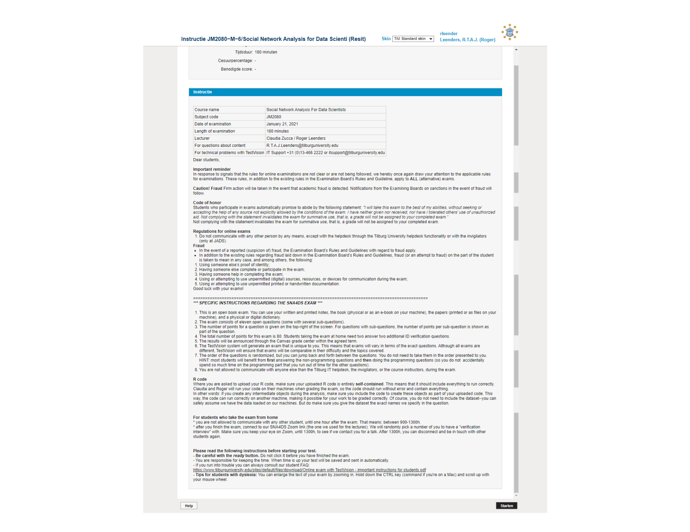
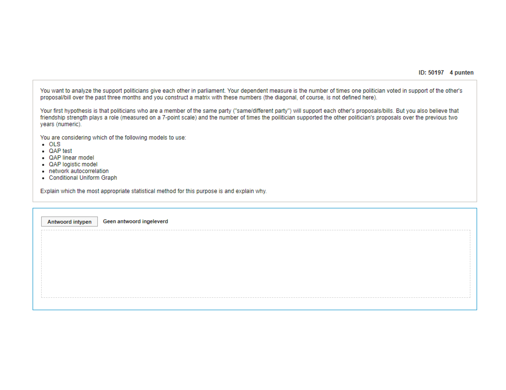
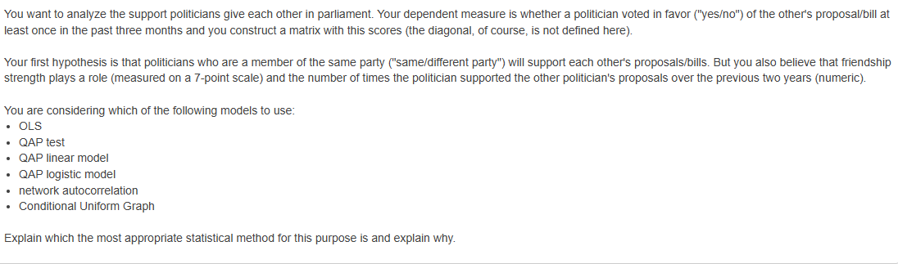
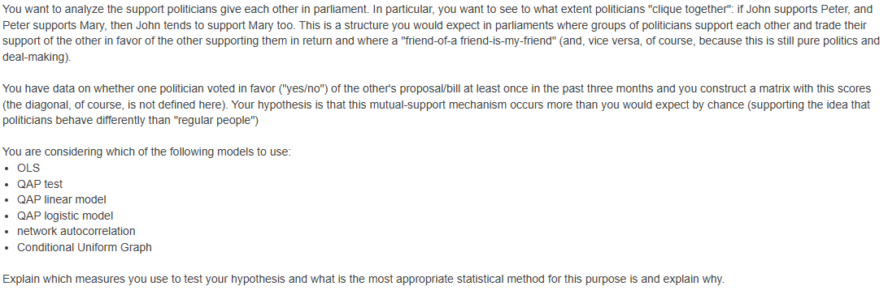
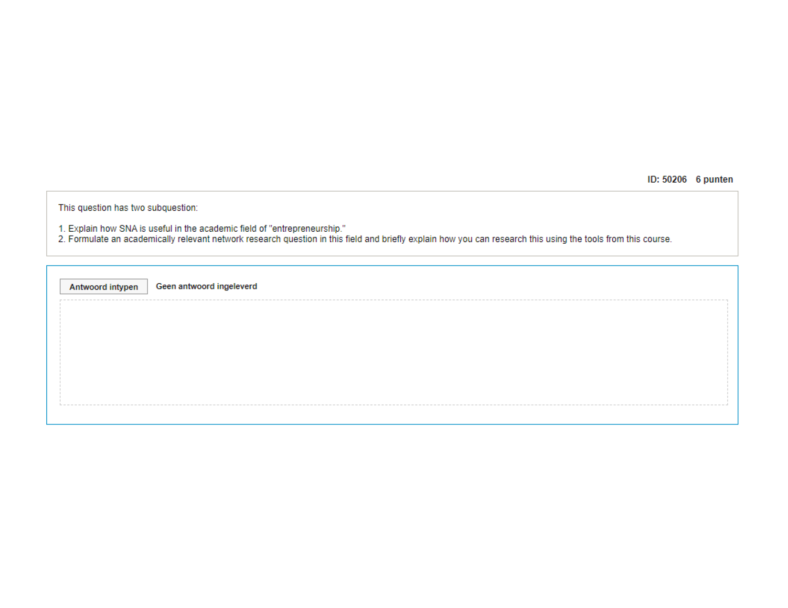
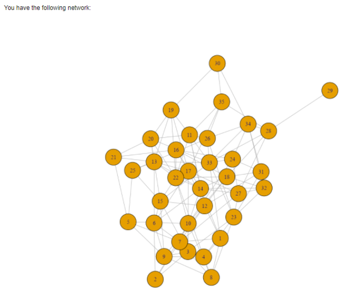
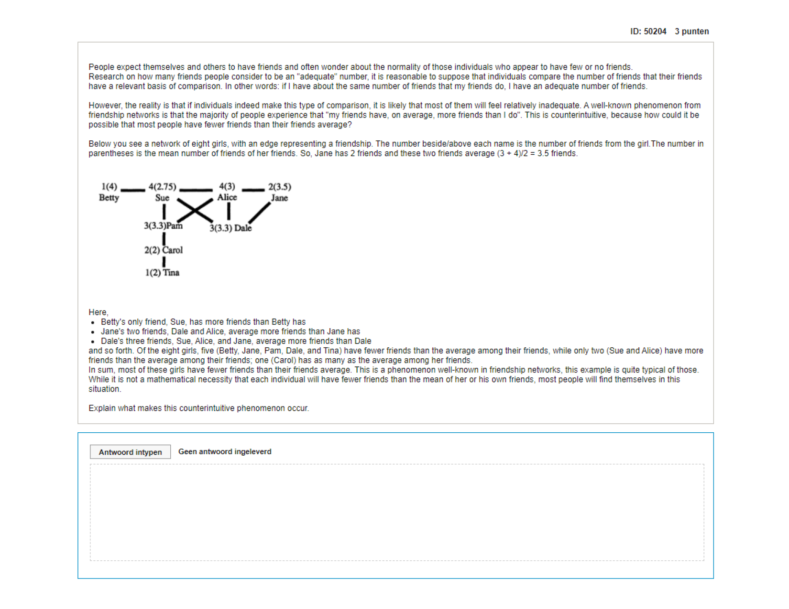

layout:false

background-image: url(assets/images/sna4ds_logo_140.png), url(assets/images/jads_logo_transparent.png), url(assets/images/network_people_7890_cropped2.png)
background-position: 100% 0%, 0% 10%, 0% 0%
background-size: 20%, 20%, cover
background-color: #000000

<br><br><br><br><br>
.full-width-screen-grey.center.fw9.font-250[
# .Orange-inline.f-shadows_into[`r rmarkdown::metadata$title`]
]

***

.full-width-screen-grey.center.fw9[.f-abel[.WhiteSmoke-inline[today's menu: ] .Orange-inline[`r rmarkdown::metadata$topic` .small-caps.font70[(lab] .font70[`r rmarkdown::metadata$lecture_no`)]]]
  ]

<br>
.f-abel.White-inline[Your lecturer: `r rmarkdown::metadata$author`]<br>
.f-abel.White-inline[Playdate: `r rmarkdown::metadata$playdate`]


<!-- setup options start -->
```{r setup, include=FALSE}
knitr::opts_chunk$set(echo = FALSE,
                  comment = "",   # otherwise '##' is added in front of each output row
                  out.width = "90%",
                  fig.height = 6,
                  fig.path = "assets/images/",
                  fig.retina = 2,
                  dev = "svg",
                  message = FALSE,
                  warning = FALSE)

knitr::opts_knit$set(global.par = TRUE)  # anders worden de margin settings niet overal doorgevoerd

data(friendship, package = "SNA4DSData")
library(btergm, warn.conflicts = FALSE, quietly = TRUE, verbose = FALSE)
load("assets/tergm_assets/model_results.RData")
```


```{r marset, include = FALSE}
par(mar = c(2,2,2,2) + .05) #it's important to have this in a separate chunk
```


```{r xaringanExtra_settings, include = FALSE}
xaringanExtra::use_xaringan_extra(c("tile_view"
                                    , "panelset"
                                    , "animate"
                                    , "tachyons"
                                    , "freezeframe"
                                    # , "broadcast"
                                    , "scribble"
                                    , "fit_screen"
                                    ))

xaringanExtra::use_webcam(200, 150)
xaringanExtra::use_editable(expires = 1)
xaringanExtra::use_search(show_icon = FALSE, case_sensitive = FALSE)
xaringanExtra::use_clipboard()
```


```{r xaringan-extra-styles, echo = FALSE}
xaringanExtra::use_extra_styles(
  hover_code_line = TRUE,         
  mute_unhighlighted_code = TRUE  
)
```

```{css echo=FALSE}
.highlight-last-item > ul > li, 
.highlight-last-item > ol > li {
  opacity: 0.5;
}

.highlight-last-item > ul > li:last-of-type,
.highlight-last-item > ol > li:last-of-type {
  opacity: 1;

.bold-last-item > ul > li:last-of-type,
.bold-last-item > ol > li:last-of-type {
  font-weight: bold;
}

.show-only-last-code-result pre + pre:not(:last-of-type) code[class="remark-code"] {
    display: none;
}
```

```{css}
.remark-inline-code {
  background: #F5F5F5;
  border-radius: 3px;
  padding: 4px;
}

.inverse-red, .inverse-red h1, .inverse-red h2, .inverse-red h3, .inverse-red a, inverse-red a > code {
	border-top: none;
	background-color: red;
	color: white; 
	background-image: "";
}

.inverse-orange, .inverse-orange h1, .inverse-orange h2, .inverse-orange h3, .inverse-orange a, inverse-orange a > code {
	border-top: none;
	background-color: orange;
	color: black; 
	background-image: "";
}

.tab{
  display: inline-block;
  margin-left: 40px;
}

.tab1{tab-size: 2;}
.tab2{tab-size: 4;}
.tab3{tab-size: 6;}
.tab4{tab-size: 8;}

```


```{r some_handy_functions, echo = FALSE}
source("assets/R/components.R")
```


```{css}
.grid-2-2 {
  display: grid;
  height: calc(80%);
  grid-template-columns: repeat(2, 1fr);
  grid-template-rows: 1fr 1fr;
  align-items: center;
  text-align: center;
  grid-gap: 1em;
  padding: 1em;
}
```

<!-- setup options end -->

---
class: bg-Black course-logo center

background-image: url(assets/images/question-2415069_1920.png)
background-size: contain
background-color: #000000

<br><br><br><br><br><br><br><br><br><br><br><br><br>
.font300.Orange-inline.f-caveat.b[Any SNA4DS-related questions?]

---
class: course-logo
layout: true

---
name: frontpage
description: exam frontpage

.scroll-box-24[
.center[]
]

---
name: best_model
description: best model

.scroll-box-24[
.center[]
]

???
netlm (QAP linear model) since the dependent network is valued
---

.scroll-box-24[
.center[]
]

???
netogit
---

.scroll-box-24[
.center[]
]

???
CUG for reciprocity and transitivity
---
name: application
description: application to a field

.scroll-box-24[
.center[]
]

---
name: walktrap
description: application to a field

.scroll-box-24[
.center[]

<br>
With this network, you determine the communities using a walktrap algorithm. Before running this algorithm, what do you already know about the community vertex 29 (the vertex in the top right of the plot) will be a member of?
]

???
The walktrap algorithm works by repeating short random walks and keep track which communities the walks tend to stay inside. Any walk from 29 will tend to dissapate into the graph and rarely come back to 29, since 29 is connected by only a single edge (to 28). As a result, 29 will end up in a community of its own (so, with only itself as a member).
---
name: friendships
description: fewer friends than my friends

.scroll-box-24[
.center[]
]

---

The basic logic can be described simply.

If there are some people with many friendship ties and others with few (which is to be expected in most friendship networks), those with many ties show up disproportionately in sets of friends. For example, those with 40 friends show up in each of 40 individual friendship networks and thus can make 40 people feel relatively deprived, while those with only one friend show up in only one friendship network and can make only that one person feel relatively advantaged. Thus, it is inevitable that individual friendship networks disproportionately include those with the most friends.

In lingo: this is due to the skewness of the degree distribution in this undirected graph.

---
name: stress
description: stress centrality

You work for a local government, in a job where you are responsible for the sewage system. In the Corona times, budgets are limited, since the government spends a considerable part of its budget to support businesses that had to close as part of the lockdowns in 2020.

Given the limited budget, you want to identify the pipes that are most likely to experience cracks or deterioration, due to the flow of the sewage water (which has also increased during the Corona epidemia). Unfortunately, you have no sensors in the sewage pipes that allow you top automatically keep track of the state of each pipe.

Rather, you realize that SNA can help you identify which pipes experience the highest strain as a result the sewage water flow. For simplicity, assume that this is the only relevant variable for now (in a actual analysis, you would also include the material the pipe is made of, it age, its angle, etc.).

Which centrality measure (discussed in the course) finds you the pipe that is likely to be most affected by sewage water flow (with respect to this single objective)? Carefully explain why.

???
Stress centrality, as that is the spot that people will pass by the most, assuming sewage water travel mostly through the shortest routes, which is a reasonable assumption). Stress centrality captures the vertex (here: a pipe) that is most visited. Here, pipes are the vertices, and the edges and the connections between them.

If pipes are seen as edges, rather than vertices, the correct answer would be "edge stress centrality."
---
name: pagerank
description: pagerank centrality

You work for a local government, in a job where you are responsible for the sewage system. In the Corona times, budgets are limited, since the government spends a considerable part of its budget to support businesses that had to close as part of the lockdowns in 2020.

Given the limited budget, you want to identify the pipes that are most likely to experience cracks or deterioration, due to the flow of the sewage water (which has also increased during the Corona epidemia). Unfortunately, you have no sensors in the sewage pipes that allow you top automatically keep track of the state of each pipe.

Rather, you realize that SNA can help you identify which pipes experience the highest strain as a result the sewage water flow. For simplicity, assume that this is the only relevant variable for now (in a actual analysis, you would also include the material the pipe is made of, it age, its angle, etc.).

Which centrality measure (discussed in the course) finds you the pipe that is likely to be most affected by sewage water flow (with respect to this single objective)? Carefully explain why.

???

This is the process that is underlying pagerank: authoritative websites point to each other, less authoritative websites also point to the authoritative websites (and to each other).
---
name: conference
description: temporal data

.panelset[

.panel[.panel-name[Conference]

.scroll-box-24[
.font90[
ataset: conference

The dataset is network data of interactions of 75 academists at a scientific conference. The actual temporal network dataset is called "conference_nw". Data were automatically collected through RFID tags (ie., wearable badges that detect the presence of other badges within 0.5 metre distance). All interactions were measured per 1/10 of a second interval (so, time = 10 means that 1 second has passed).

A [3p]
The measurement started at 8.30am.
At what time did the last interaction end? Round to the nearest quarter of an hour.

B [3p]
Which vertex represents Johnny Le (coded as "Le, Johnny")?

C [6p]
At 10:00am coffee was served in a separate meeting room. About half of the conference participants go there, including Johnny Le.
How many people does Johnny Le interact with between 10:00am and 10:30am?
How many interactions occur overall within this interval between 10:00am and 10:30am?
If everybody who goes to the coffee serving interacts with at least one other person, how many conference participants went to the coffee room?

D [8p]
Make a plot of the evolution of density of the conference network over the entire observation period. For this purpose, collapse the network into slices of 15 minutes, at 5 minute intervals (so, you plot the density of intervals 0-15, 5-20, 10-25, et cetera., all the way until the end)
]
]

]


.panel[.panel-name[R code]
```
A
max(as.data.frame(conference_nw)$terminus)/10/60/60 # 9 hours and 15 mins -> 17:45h

B # then see where Johnny is: 31
SNA4DS::extract_all_vertex_attributes(networkDynamic::network.collapse(conference_nw))

C
# How many interactions occur overall within this interval?
start <- 90*60*10
end <- 120*60*10
coffee <- networkDynamic::network.collapse(conference_nw, onset = start, terminus = end)
coffee # you can see that there were 326 edges from the output
coffee_socio <- network::as.sociomatrix(coffee)
sum(coffee_socio) # also 326

# How many people does Johnny interact with between 1000 and 1030?
rowSums(coffee_socio)[31] # he interacts with 11 people

# If everybody who goes there interacts with at least one other person, how many
# conference participants went to the coffee room?
sum(rowSums(coffee_socio) > 0) # 28 people
# or via
table(rowSums(coffee_socio))

D
plot(tsna::tSnaStats(conference_nw, snafun = "gden", time.interval = 5*60*10, aggregate.dur = 15*60*10))
```
]


]


