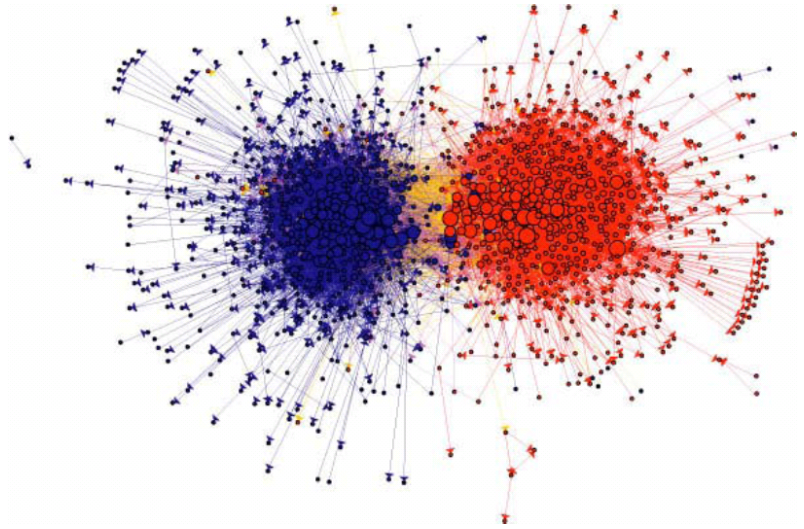
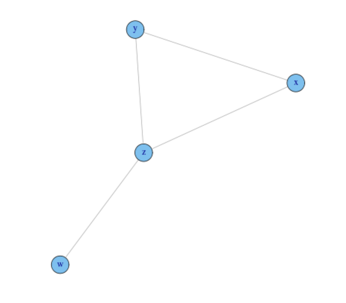
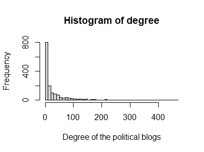
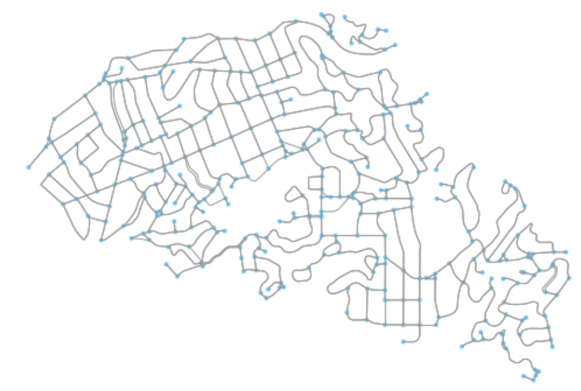
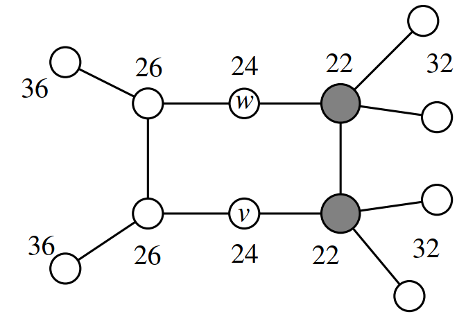
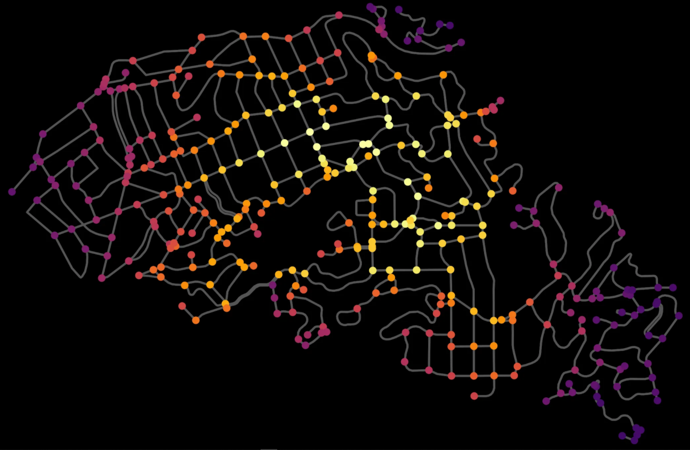

layout:false

background-image: url(assets/images/sna4ds_logo_140.png), url(assets/images/jads_logo_transparent.png), url(assets/images/network_people_7890_cropped2.png)
background-position: 100% 0%, 0% 10%, 0% 0%
background-size: 20%, 20%, cover
background-color: #000000

<br><br><br><br><br>
.full-width-screen-grey.center.fw9.font-250[
# .Orange-inline.f-shadows_into[`r rmarkdown::metadata$title`]
]

***

.full-width-screen-grey.center.fw9[.f-abel[.WhiteSmoke-inline[today's menu: ] .Orange-inline[`r rmarkdown::metadata$topic` .small-caps.font70[(lecture] .font70[`r rmarkdown::metadata$lecture_no`)]]]
  ]

<br>
.f-abel.White-inline[Your lecturer: `r rmarkdown::metadata$author`]<br>
.f-abel.White-inline[Playdate: `r rmarkdown::metadata$playdate`]


<!-- setup options start -->
```{r setup, include=FALSE}
knitr::opts_chunk$set(echo = FALSE,
                  comment = "",   # otherwise '##' is added in front of each output row
                  out.width = "90%",
                  fig.height = 6,
                  fig.path = "assets/images/",
                  fig.retina = 2,
                  dev = "svg",
                  message = FALSE,
                  warning = FALSE)
# library(htmlwidgets, quietly = TRUE, verbose = FALSE, warn.conflicts = FALSE)
library(countdown, quietly = TRUE, verbose = FALSE, warn.conflicts = FALSE)

knitr::opts_knit$set(global.par = TRUE)  # anders worden de margin settings niet overal doorgevoerd

remedy::remedy_opts$set(name = paste0(params$chunknameStart, "lab_measures_"))
```


```{r marset, include = FALSE}
par(mar = c(0,0,0,0) + .05) #it's important to have this in a separate chunk
```


```{r xaringanExtra_settings, include = FALSE}
xaringanExtra::use_xaringan_extra(c("tile_view"
                                    , "panelset"
                                    , "animate"
                                    , "tachyons"
                                    , "freezeframe"
                                    , "broadcast"
                                    , "scribble"
                                    , "fit_screen"
                                    ))

xaringanExtra::use_webcam(50 * 3.5, 50 / 4 * 3 * 3.5)
xaringanExtra::use_editable(expires = 1)
xaringanExtra::use_search(show_icon = FALSE, case_sensitive = FALSE)


htmltools::tagList(
  xaringanExtra::use_clipboard(
    button_text = "<i class=\"fa fa-clipboard\"></i>",
    success_text = "<i class=\"fa fa-check\" style=\"color: #90BE6D\"></i>",
    error_text = "<i class=\"fa fa-times-circle\" style=\"color: #F94144\"></i>"
  ),
  rmarkdown::html_dependency_font_awesome()
)
```


```{r xaringan-extra-styles, echo = FALSE}
xaringanExtra::use_extra_styles(
  hover_code_line = TRUE,         
  mute_unhighlighted_code = TRUE  
)
```

```{css echo=FALSE}
.highlight-last-item > ul > li, 
.highlight-last-item > ol > li {
  opacity: 0.5;
}

.highlight-last-item > ul > li:last-of-type,
.highlight-last-item > ol > li:last-of-type {
  opacity: 1;

.bold-last-item > ul > li:last-of-type,
.bold-last-item > ol > li:last-of-type {
  font-weight: bold;
}

.show-only-last-code-result pre + pre:not(:last-of-type) code[class="remark-code"] {
    display: none;
}
```

```{css}
.remark-inline-code {
  background: #F5F5F5;
  border-radius: 3px;
  padding: 4px;
}

.inverse-red, .inverse-red h1, .inverse-red h2, .inverse-red h3, .inverse-red a, inverse-red a > code {
	border-top: none;
	background-color: red;
	color: white; 
	background-image: "";
}

.inverse-orange, .inverse-orange h1, .inverse-orange h2, .inverse-orange h3, .inverse-orange a, inverse-orange a > code {
	border-top: none;
	background-color: orange;
	color: black; 
	background-image: "";
}
```


```{r some_handy_functions, echo = FALSE}
source("assets/R/components.R")
```


```{css}
.grid-3-1 {
  display: grid;
  height: calc(80%);
  grid-template-columns: repeat(3, 1fr);
  grid-template-rows: 1fr;
  align-items: center;
  text-align: center;
  grid-gap: 1em;
  padding: 1em;
}


.grid-3-2a {
  display: grid;
  height: calc(90%);
  grid-template-columns: repeat(3, 1fr);
  grid-template-rows: 1fr 1fr;
  align-items: center;
  text-align: center;
  grid-gap: 1em;
  padding: 1em;
}
```


<!-- setup options end -->


---
class: bg-Black course-logo

background-image: url(assets/images/chris-montgomery-smgTvepind4-unsplash-L.jpg)
background-position: 100% 0%
background-size: cover
background-color: #000000

### .White-inline.font350.b[<br>Turn your<br>cameras on!]


.footnote[[Credit](https://unsplash.com/@cwmonty)]

---
class: course-logo
layout: true

---
class: bg-JADSbrown
name: menu
description: "Menu"

.Gold-inline[
# Today's menu

1. Homeplay
1. Bridging
1. Quiz time!
1. Pagerank
]

---
layout: false
class: course-logo bg-Black

# .Gold-inline[Today's menu]

<div class="grid-3-2a">
<div class="extension-tile panelset-tile animated zoomInLeft"><div>Homeplay</div></div>
</div>

---

# The dataset

```{r read_blogosphere, echo = TRUE}
data(blogosphere, package = "SNA4DSData")
snafun::print(blogosphere)
```

.fr.w-30[

]

---
name: descriptives
description: Descriptive measures

# Some descriptives

```{r simplify}
blog1 <- igraph::simplify(blogosphere)
```

.scroll-box-20[
```{r descrs, echo = TRUE}
# mean distance
snafun::g_mean_distance(blog1)

# diameter
snafun::g_diameter(blog1)

# dyad census
snafun::count_dyads(blog1)

# reciprocity
snafun::g_reciprocity(blog1)

# transitivity
snafun::g_transitivity(blog1)

# density
snafun::g_density(blog1)
```
]

---
name: transitivity
description: Transitivity

# Transitivity

*A friend of a friend is also my friend*

This is *pure transitivity*, but it often doesn't happen that strongly.

--

Often more accurate:

> If John is friends with Susan and Susan is friends with Ali, then it is 
*more likely* that Ali and John are friends than not.

If this third edge is there, we say that Ali and John *close the triad*.

.pull-left[
```{r gfl, out.width= 250}
snafun::plot(igraph::graph_from_literal(John -- Susan -- Ali), 
                   layout = igraph::layout.grid)
```
<br>Open triad

]


.pull-right[
```{r gfl2, out.width= 250}
snafun::plot(igraph::graph_from_literal(John -- Susan -- Ali -- John), 
                   layout = igraph::layout.grid)
```

Closed triad

]


---

# Transitivity

.pull-left[
```{r gfl3, out.height= 200}
snafun::plot(igraph::graph_from_literal(John -- Susan -- Ali), 
                   layout = igraph::layout.grid)
```

```{r gfl4, out.height= 200}
snafun::plot(igraph::graph_from_literal(John -- Susan -- Ali -- John), 
                   layout = igraph::layout.grid)
```

]

.pull-right[

- John -- Susan -- Ali form a path of length 2

- A closed triad forms a cycle of length 3

- we look at each set of 3 vertices that have a path of length 2 and count the 
proportion of them that form the full cycle (ie. that are *closed*),

$Transitivity = \frac{no. closed  triads}{no. paths  of  length  2}$

(so: the proportion of friends-of-my-friend who are **also** my friend)

This is often also called the "clustering coefficient".

Transitivity = 1 implies perfect transitivity<br>
Transitivity = 0 implies no closed triads

]


---

# Transitivity

Look at this network. What is the transitivity in this network?


.pull-left[

]

--

.pull-right[

Transitivity = 0.6

Triads with a two-path in them:

+ y-x-z: closed
+ y-z-x: closed
+ x-y-z: closed
+ w-z-y: open
+ w-z-x: open

So, 3 out of 5 (= 60%) are closed.

]

--

check: 

```{r, echo = TRUE}
snafun::create_manual_graph(w--z--y--x--z) |> snafun::g_transitivity()
```


???

Can you see the similarity with reciprocity? 
There, we count the proportion of dyads with at least 1 edge that have 2 edges.

Here, we count the proportion of triads with at least 2 edges, that have 3 edges.

---

# Transitivity

Recall that 

```{r tra1, echo = TRUE}
snafun::g_transitivity(blog1)
```

What does this tell us about the network?

???

Really high. Shows strong in-crowd: I connect to my friend and my friend's 
friend is also my friend. 

---

# Transitivity

In *directed* networks, we need to take into account in which direction the 
friendship flows.

However, it is common to consider directed ties _as being undirected_ when 
determining transitivity.

`snafun::g_transitivity` and `igraph::transitivity` consider
every graph to be *undirected*.

`sna::gtrans` allows you to choose between directed or undirected.

We will come back to transitivity in directed graphs in the second half 
of the course when discussing ERGM's.

---
name: walktrap
description: "Homeplay: communities"

# walktrap communities

Back to the blogosphere.
Is the walktrap a meaningful approach for this network?

--

How many communities did you find?
Do you find that surprisingly few, surprisingly many, as-expected?

--
<br><br>
`r circle_arrow_right()` 
The walktrap algorithm tends to return more communities than alternative algorithms.
Often, you want to discard small walktrap communities.

---
class: course-logo

.scroll-box-24[

```{r lab04lab_measures_02, echo = TRUE}
walk <- snafun::extract_comm_walktrap(blog1)
igraph::sizes(walk) |> length()
igraph::modularity(walk)
igraph::sizes(walk)
```

]


---

## Modularity

A moderately useful measure of the fit of the partitioning.

<br>Partition the set of vertices into _c_ communities. 
Modularity measures how good this division is by comparing within-community edges 
with between-community edges as follows for an unweighted undirected graph:

$$Q = \sum_{i = 1}^{c} (e_{i} - a_{i}^2)$$

where $e_{ii}$ is the fraction of all edges that remain within community _i_
and $a_{i}^2$ is the fraction of all between community _i_ and other communities. 


and for a directed graph:

$$Q = \sum_{i = 1}^{c} (e_i - a_{i}^{in} * a_{i}^{out})$$


- The modularity for unweighted and undirected graphs lies in the range 
${\displaystyle [-1/2,1]}$. For unweighted and directed graphs also about this range.

- Modularity is positive if the number of edges within communities exceeds the number 
expected in a graph with the same number of vertices and where each vertex keeps 
its degree (but edges are randomly attached). 

- In practice, a value above about 0.3 tends to indicate a good community structure 
in a graph.

.font70[
Note: the computation is somewhat adapted when the edges are weighed, but the 
concept remains the same.
]


???
Wikipedia: https://en.wikipedia.org/wiki/Modularity_(networks)
Resolution limit
Modularity compares the number of edges inside a cluster with the expected number of edges that one would find in the cluster if the network were a random network with the same number of nodes and where each node keeps its degree, but edges are otherwise randomly attached. This random null model implicitly assumes that each node can get attached to any other node of the network. This assumption is however unreasonable if the network is very large, as the horizon of a node includes a small part of the network, ignoring most of it. Moreover, this implies that the expected number of edges between two groups of nodes decreases if the size of the network increases. So, if a network is large enough, the expected number of edges between two groups of nodes in modularity's null model may be smaller than one. If this happens, a single edge between the two clusters would be interpreted by modularity as a sign of a strong correlation between the two clusters, and optimizing modularity would lead to the merging of the two clusters, independently of the clusters' features. So, even weakly interconnected complete graphs, which have the highest possible density of internal edges, and represent the best identifiable communities, would be merged by modularity optimization if the network were sufficiently large.[10] For this reason, optimizing modularity in large networks would fail to resolve small communities, even when they are well defined. This bias is inevitable for methods like modularity optimization, which rely on a global null model.[11]

Multiresolution methods
There are two main approaches which try to solve the resolution limit within the modularity context: the addition of a resistance r to every node, in the form of a self-loop, which increases (r>0) or decreases (r<0) the aversion of nodes to form communities;[12] or the addition of a parameter γ>0 in front of the null-case term in the definition of modularity, which controls the relative importance between internal links of the communities and the null model.[7] Optimizing modularity for values of these parameters in their respective appropriate ranges, it is possible to recover the whole mesoscale of the network, from the macroscale in which all nodes belong to the same community, to the microscale in which every node forms its own community, hence the name multiresolution methods. However, it has been shown that these methods have limitations when communities are very heterogeneous in size.[13]
---
layout: true
class: course-logo

# Isolates

### Toss them isolates!

---
name: isolates
description: "Homeplay: toss them isolates!"

(because they form communities by themselves, creating lots of single-vertex 
communities--which is not useful)

```{r histdegree, echo = TRUE, eval = FALSE}
hist(snafun::v_degree(blog1), breaks = 50, 
     xlab = "Degree of the political blogs", main = "Histogram of degree")
```

.pull-left[
```{r pipi, out.height=350, out.width=350}

```
]

.pull-right[
There are many blogs with no connections!

```{r pipi1, echo = TRUE}
sum(snafun::v_degree(blog1) == 0)
```

```{r toss, echo = TRUE}
blog0 <- snafun::remove_isolates(blog1)
```

```{r pipi1a, echo = TRUE}
sum(snafun::v_degree(blog0) == 0)
```

]

---

How many communities did you find for the "pruned" network?
Do you find that surprisingly few, surprisingly many, as-expected?

--

.scroll-box-20[
```{r lab04lab_measures_01, echo = TRUE}
blog0 <- snafun::remove_isolates(blog1)
walk0 <- snafun::extract_comm_walktrap(blog0)
igraph::membership(walk0) |> table()
igraph::modularity(walk0)
igraph::sizes(walk0) |> length()
```
]


---
class: bg-Black course-logo
layout: false

# .Gold-inline[Today's menu]

<div class="grid-3-2a">
<div class="extension-tile panelset-tile"><div>Homeplay</div></div>
<div class="extension-tile webcam animated flipInX"><div>Homeplay<br>bonus</div></div>
</div>

---
class: course-logo
name: bonus
description: Homeplay bonus question

# Bonus question

.panelset[

.panel[.panel-name[assignment]

Continue with this smaller network. 

1. Add the group membership (which you get with `igraph::membership`) as a vertex attribute. 

2. Run `snafun::make_mixingmatrix(graph_without_isolates, "community")` and interpret the result. Does it make sense? What does this tell you about the boundaries around the communities?.

3. Extract all vertex attributes using `snafun::extract_all_vertex_attributes` and explore whether it is indeed the case that like-minded blogs tend cluster together inside the communities you found.

] # end of panel 1


.panel[.panel-name[mixing matrix]

.scroll-box-16[
```{r lab04lab_measures_01a, echo = TRUE}
blog0 <- snafun::add_vertex_attributes(blog0, "community", value = igraph::membership(walk0))
```


```{r lab04lab_measures_01ab, echo = TRUE}
# mixing matrix
snafun::make_mixingmatrix(blog0, "community")
```


]
] # end panel 2


.panel[.panel-name[table]

.scroll-box-16[
```{r lab04lab_measures_01b, echo = TRUE}
# get all attributes from the network object
all_attr <- snafun::extract_all_vertex_attributes(blog0)

table(all_attr$community, all_attr$party)
```

]

] # end panel 2


]


---
class: course-logo
layout: true

---
layout: false
class: course-logo bg-Black

# .Gold-inline[Today's menu]

<div class="grid-3-2a">
<div class="extension-tile panelset-tile"><div>Homeplay</div></div>
<div class="extension-tile webcam"><div>Homeplay<br>bonus</div></div>
<div class="extension-tile slide animated jackInTheBox"><div>Bridging</div></div>
</div>

---
name: bridge
description: Who bridges between the communities

# Who bridges between the communities?

Let's find the blogs that refer the most to blogsites in the "opposite" community.

How could we do this?

--

One strategy:

- find those edges that cross boundaries

- find which vertices are part of those edges

- look at the most active ones

---

Let us first limit ourselves to the two main communities, since the others are so small.
<br>How could we do this?

--

.panelset[

.panel[.panel-name[Approach 1]

1. identify the vertices that are in communities 1 or 3

1. take the subset of the network that only includes these vertices (and the edges between them)--this is the so-called ***induced subgraph***.

.scroll-box-14[
```{r lab04lab_measures_05, echo = TRUE}
# TRUE / FALSE: is a vertex in 1 or 3
in_1_3 <- snafun::extract_vertex_attribute(blog0, "community") %in% c(1, 3)
small_net <- snafun::extract_subgraph(blog0, v_to_keep = in_1_3)
snafun::print(small_net)
```
<br><br><br>
]

] # end of panel 1


.panel[.panel-name[Approach 2]

1. identify the vertices that are *not* in communities 1 or 3

1. remove those vertices from the network (and the orphan edges)

.scroll-box-14[
```{r lab04lab_measures_06, echo = TRUE}
# TRUE / FALSE: is a vertex in 1 or 3
not_in_1_3 <- !in_1_3
small_net2 <- snafun::remove_vertices(blog0, v = not_in_1_3)
snafun::print(small_net2)
```
<br><br><br>
]

]  # end of panel 2

]

---

<br><br><br>
Now that we only have the vertices from communities 1 and 3 left, 
how do we find the most active connectors?
<br><br>

`r circle_arrow_right()` 
There is a function called `igraph::crossing` that indicates for 
every edge whether 
it connects two communities (`TRUE`/`FALSE`).

<br><br><br>(you find this by going through the `igraph` help or 
by browsing the cheatsheet.)

---

```{r lab04lab_measures_07, include=FALSE}
not_in_1_3 <- !in_1_3
small_net2 <- snafun::remove_vertices(blog0, v = not_in_1_3)
```

.panelset[

.panel[.panel-name[Approach]
    
One approach:

- identify all "crossing" edges

- for each edge, identify the sender

- create a table of the number of times each sender occurs

- done!
    
] # end of panel 1


.panel[.panel-name[R code]
    
.scroll-box-16[
```{r lab04lab_measures_08, echo = TRUE, include=TRUE}
small_walk <- snafun::extract_comm_walktrap(small_net)
crossing <- igraph::crossing(small_walk, small_net) |> which()

senders <- igraph::ends(small_net, crossing)[, 1]

sort(table(senders), decreasing = TRUE)
```
]
    
    
] # end of panel 2


.panel[.panel-name[Gimme details!]

.font70[
```{r lab04lab_measures_09, echo = TRUE, eval=FALSE}
table_all <- sort(table(senders), decreasing = TRUE) |> names()  # table column names

snafun::extract_all_vertex_attributes(small_net)[table_all, c("label", "party", "community")]
```
]
óÓ
.scroll-box-24.font70[
```{r lab04lab_measures_10, echo = FALSE, eval = TRUE}
table_all <- sort(table(senders), decreasing = TRUE) |> 
                  names() 

tabel_all <- snafun::extract_all_vertex_attributes(small_net)[table_all, c("label", "party", "community")]
tabel_all <- cbind(id = table_all, tabel_all)


DT::datatable(tabel_all, 
              rownames = FALSE, 
              options = list(autoWidth = TRUE, pageLength = 10, scrollY = "300px")
)
```
]

<br><br><br><br>

] # end of panel 3
    
] 


---
layout: false
class: course-logo bg-Black

# .Gold-inline[Today's menu]

<div class="grid-3-2a">
<div class="extension-tile panelset-tile"><div>Homeplay</div></div>
<div class="extension-tile webcam"><div>Homeplay<br>bonus</div></div>
<div class="extension-tile slide"><div>Bridging</div></div>
<div class="extension-tile editable animated rotateIn"><div>Quiz</div></div>
</div>

---
layout: true
class: course-logo

# Facility location analysis

---
name: facility
description: Facility location analysis

__Facility location analysis__ deals finding optimal locations for
one or more facilities in a given environment. 
Location problems are classical optimization problems with applications in industry 
and economy. 

--

The spatial location of facilities often take place in the context of a given 
transportation, communication, or transmission system, which may be represented as a
network.

This is also known as a [street network](https://en.wikipedia.org/wiki/Street_network).

---

Consider a spatial network, where

  + vertices = (potential) locations

  + edges = roads/connections between locations

the distance between two locations  = geodesic between these vertices

---

## street network of Piedmont, California

.center[]

.font50[.bottom[[Boeing, 2019, Urban Street Network Analysis in a Computational Notebook, Region 6(3): 39-51.](https://openjournals.wu-wien.ac.at/region/paper_278/278.html)]]
---
class: bg-Black

<br>
## .White-inline[.center[please go to]]

## .Gold-inline[.center[www.menti.com]]

## .center[.White-inline[code:] .Gold-inline[49197653]]


```{r qr, echo = FALSE, out.width="30%"}
qrcode::qr_code("https://www.menti.com/alq2dyi2iaqa?source=voteCode") |> qrcode:::plot.qr_code()
```


---

## Situation 1


Consider the location of a _fire station_. When a fire occurs, a firetruck should 
be able to arrive to any potential fire location as soon as possible.

<br><br>
_Which centrality measure finds you an optimal location
(with respect to this single objective)?_

<br><br><br><br><br><br>
www.menti.com / code: 49197653


???

Of course, additional objectives and restrictions can be added. But that is
beyond this lecture today.

Eccentricity: this measures the longest path to any of the other locations.

This is called a __minimax__ optimization problem

---

This is called a __minimax location problem__. 

This is captured by _eccentricity_.

---

## Situation 2


Find a spot for a shopping mall, such that the entire pool of customers have a 
minimal distance to the mall.

This increases access for the general population and minimizes fuel consumption 
of customers traveling to the mall.

<br>
_Which centrality measure finds you an optimal location
(with respect to this single objective)?_


---

This is called a __minisum location problem__. 

This is captured by _closeness centrality_.

.w-70.fl[

]

--

.w-30.fr.tl[
Total distances in this network. Note that nodes _v_ and _w_ have lower eccentricity.
]

---
class: bg-black

### .Gold-inline[Piedmont, California]

.center[]

.font40[.Red-inline[https://geoffboeing.com/2018/01/urban-street-network-centrality/]]

???

Closeness centrality values

---
background-image: url("assets/images/billboard_sna4ds2.png")
background-position: bottom right
background-size: contain

## Situation 3

.w-70.fl.tl[
Consider the placement of a billboard. The best placement <br>is that point in the 
city where most cars will pass by. 

For today, assume, for simplicity, that all locations are <br>
equally attractive as (final) locations for travelers. 

<br><br>
_Which centrality measure finds you an optimal<br>
location (with respect to this single objective)?_
]

???

Stress centrality, as that is the spot that people will pass by the most, assuming
they prefer to travel the shortest routes.

---

This is called an __absolute value__ problem. 

This is captured by _stress centrality_.

Stress centrality captures the vertex that is most visited, assuming travel is 
preferred by shortest routes.

---
layout: false
class: course-logo bg-Black

# .Gold-inline[Today's menu]

<div class="grid-3-2a">
<div class="extension-tile panelset-tile"><div>Homeplay</div></div>
<div class="extension-tile webcam"><div>Homeplay<br>bonus</div></div>
<div class="extension-tile slide"><div>Bridging</div></div>
<div class="extension-tile editable"><div>Quiz</div></div>
<div class="extension-tile animate animated wobble"><div>Pagerank</div></div>
</div>

---
layout: true
class: course-logo

# .Gold-inline[PageRank]: alternative approach

---
name: Pagerank
description: Pagerank through simulation

In the tutorial, you calculated PageRank centrality based on diffusion of
importance between webpages (the vertices), through their links (=the edges).

--

An alternative approach to calculate the importance of webpages is by 
*simulating the behavior* of websurfers.

1. start at a random webpage

1. click to the next page, following the outgoing links of the page (fully
randomly)

1. continue clicking to the next pages for a while, then start over from step 1

Then: <br>

.center[*PageRank = proportion of times a specific page is visited out of all
pages visited.*]

---

## How to include damping:

1. start at a random page (all pages have the same probability)

1. with probability _damping_, follow a link to the next page (randomly picking 
one of the outgoing links from the current page)

1. with probability 1 - _damping_, jump to a random page in the network

1. PageRank = proportion of times you visit each page

1. repeat from step 1 until convergence

This simulates the behavior of a surfer getting "bored" with her current pages 
after a while and going to a different site for new inspiration/fun.

---

## Let's simulate 

1. Download the file __PageRank_SNA4DS.html__ to your computer, from 
the modules section on our Canvas page (modules, this week).

2. Save it to a location on your computer and open it from there.

---

Start a simulation by FIRST clicking __setup__ (to create a network) and then
__step__ (for a single step), or __go__ (for continuous running).
You can change the speed of the simulation using the speed slider on top.

### Exercise:

- Compare the "random-surfer" and "diffusion" methods: 
__random surfer__ is the method just explained, __diffusion__ is the method explained in the tutorial.
  + How do their results compare?
  + Which one is faster?
 
- Play with the _damping factor_ to how it affects the process and outcome. 
  + Try at least values 0, .85, 1.

- Look at the tutorial networks ("Tutorial network" and "Tutorial network 2"), 
<br>but also try the other networks. What do you notice?


```{r countdown 2}
countdown::countdown(
  minutes = 10,
  seconds = 0,
  # Fanfare when it's over
  play_sound = TRUE,
  warn_when = 30,
  color_border = "orange",
  bottom = 0,   # bottom right location
  # padding = "50px",
  margin = "5%",
  font_size = "3em"
)
```

---

Some things to notice:

--

- In the “Example 1” network, five of the pages have no inbound links. 
Did you notice the effect?

--

- The diffusion model is a lot faster than the random surfer method.
(but it has an advantage computationally for really large networks)

--

- When damping factor = 1, the methods do not always converge to the same results.

--

- When damping factor = 0, all pages get equal PageRank

---
layout: false
class: course-logo bg-Black

background-image: url(assets/images/pexels-olya-kobruseva-5428828.jpg)
background-size: contain

.font400.yellow.center-image[QUESTIONS?]


