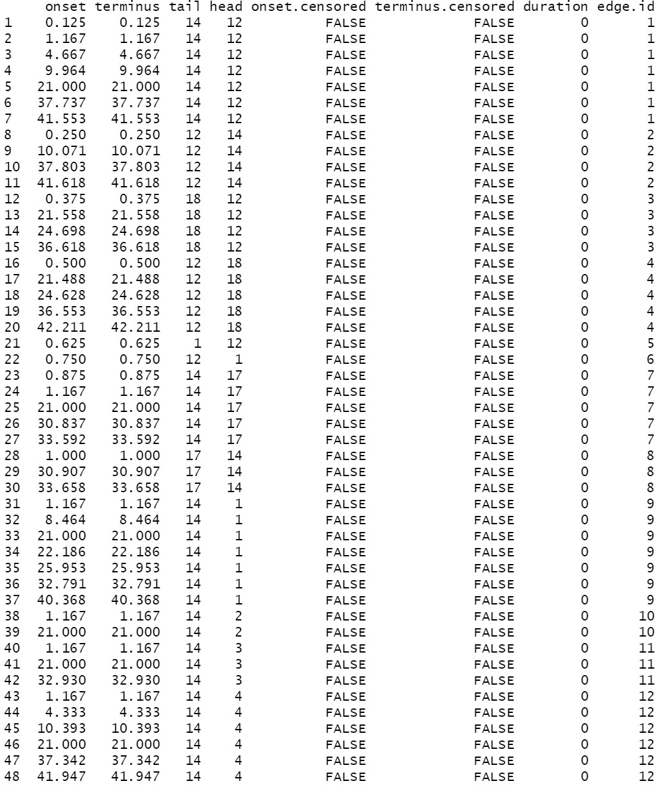

layout:false

background-image: url(assets/images/sna4ds_logo_140.png), url(assets/images/jads_logo_transparent.png), url(assets/images/network_people_7890_cropped2.png)
background-position: 100% 0%, 0% 10%, 0% 0%
background-size: 20%, 20%, cover
background-color: #000000

<br><br><br><br><br>
.full-width-screen-grey.center.fw9.font-250[
# .Orange-inline.f-shadows_into[`r rmarkdown::metadata$title`]
]

***

.full-width-screen-grey.center.fw9[.f-abel[.WhiteSmoke-inline[today's menu: ] .Orange-inline[`r rmarkdown::metadata$topic` .small-caps.font70[(lab] .font70[`r rmarkdown::metadata$lecture_no`)]]]
  ]

<br>
.f-abel.White-inline[Your lecturer: `r rmarkdown::metadata$author`]<br>
.f-abel.White-inline[Playdate: `r rmarkdown::metadata$playdate`]


<!-- setup options start -->
```{r setup, include=FALSE}
knitr::opts_chunk$set(echo = FALSE,
                  comment = "",   # otherwise '##' is added in front of each output row
                  out.width = "90%",
                  fig.height = 6,
                  fig.path = "assets/images/",
                  fig.retina = 2,
                  dev = "svg",
                  message = FALSE,
                  warning = FALSE)

knitr::opts_knit$set(global.par = TRUE)  # anders worden de margin settings niet overal doorgevoerd

data(friendship, package = "SNA4DSData")
library(btergm, warn.conflicts = FALSE, quietly = TRUE, verbose = FALSE)
load("assets/tergm_assets/model_results.RData")
```


```{r marset, include = FALSE}
par(mar = c(2,2,2,2) + .05) #it's important to have this in a separate chunk
```


```{r xaringanExtra_settings, include = FALSE}
xaringanExtra::use_xaringan_extra(c("tile_view"
                                    , "panelset"
                                    , "animate"
                                    , "tachyons"
                                    , "freezeframe"
                                    # , "broadcast"
                                    , "scribble"
                                    , "fit_screen"
                                    ))

xaringanExtra::use_webcam(200, 150)
xaringanExtra::use_editable(expires = 1)
xaringanExtra::use_search(show_icon = FALSE, case_sensitive = FALSE)
xaringanExtra::use_clipboard()
```


```{r xaringan-extra-styles, echo = FALSE}
xaringanExtra::use_extra_styles(
  hover_code_line = TRUE,         
  mute_unhighlighted_code = TRUE  
)
```

```{css echo=FALSE}
.highlight-last-item > ul > li, 
.highlight-last-item > ol > li {
  opacity: 0.5;
}

.highlight-last-item > ul > li:last-of-type,
.highlight-last-item > ol > li:last-of-type {
  opacity: 1;

.bold-last-item > ul > li:last-of-type,
.bold-last-item > ol > li:last-of-type {
  font-weight: bold;
}

.show-only-last-code-result pre + pre:not(:last-of-type) code[class="remark-code"] {
    display: none;
}
```

```{css}
.remark-inline-code {
  background: #F5F5F5;
  border-radius: 3px;
  padding: 4px;
}

.inverse-red, .inverse-red h1, .inverse-red h2, .inverse-red h3, .inverse-red a, inverse-red a > code {
	border-top: none;
	background-color: red;
	color: white; 
	background-image: "";
}

.inverse-orange, .inverse-orange h1, .inverse-orange h2, .inverse-orange h3, .inverse-orange a, inverse-orange a > code {
	border-top: none;
	background-color: orange;
	color: black; 
	background-image: "";
}

.tab{
  display: inline-block;
  margin-left: 40px;
}

.tab1{tab-size: 2;}
.tab2{tab-size: 4;}
.tab3{tab-size: 6;}
.tab4{tab-size: 8;}

```


```{r some_handy_functions, echo = FALSE}
source("assets/R/components.R")
```


```{css}
.grid-2-2 {
  display: grid;
  height: calc(80%);
  grid-template-columns: repeat(2, 1fr);
  grid-template-rows: 1fr 1fr;
  align-items: center;
  text-align: center;
  grid-gap: 1em;
  padding: 1em;
}
```

<!-- setup options end -->

---
class: bg-Black course-logo center

background-image: url(assets/images/question-2415069_1920.png)
background-size: contain
background-color: #000000

<br><br><br><br><br><br><br><br><br><br><br><br><br>
.font300.Orange-inline.f-caveat.b[Any SNA4DS-related questions?]

---
class: course-logo
layout: true

---
name: friendship_dataset
description: friendship dataset

.scroll-box-24[
.center[]
]

---
name: models
description: modeling

# Homeplay: Model I


.panelset[

.panel[.panel-name[R Code]
```{r, eval = FALSE, echo = TRUE}
model.01 <- btergm::btergm(friendship ~ edges + mutual + ttriple +
                     transitiveties + ctriple + nodeicov("idegsqrt") +
                     nodeicov("odegsqrt") + nodeocov("odegsqrt") +
                     nodeofactor("sex") + nodeifactor("sex") + nodematch("sex") +
                     edgecov(primary), R = 100)

btergm::summary(model.01)

snafun::stat_plot_gof_as_btergm(model.01,
             btergm_statistics = c(esp, dsp, geodesic, deg, triad.undirected, rocpr))
```
]


.panel[.panel-name[Summary]
.font70.scroll-box-36[
```{r, echo = TRUE, eval = TRUE}
btergm::summary(model.01)
```
]
]

.panel[.panel-name[Goodness of fit]
.font70.scroll-box-24[
```{r, eval = FALSE, echo = TRUE}
snafun::stat_plot_gof_as_btergm(model.01,
             btergm_statistics = c(esp, dsp, geodesic, deg, triad.undirected, rocpr))
```

```{r, echo = FALSE, eval = TRUE}
plot(g01)
```
]
]

]

???
Als je de gof print, dan zie je een hele serie tabellen. Bijv. voor esp.
Elke rij geeft aan het aantal esp dat in de data en/of de gesimuleerde netwerken
voorkwam. In dit geval zijn dat minimaal 0 en maximaal 19.

In de plot: de grijze boxen geven de verdeling van de % esp met een bepaalde waarde
er in de gesimuleerde netwerken voor kwam. Bijv.: bereken voor elke simulatie het
percentage edges met esp = 0. Dan geeft dan een verdeling van percentages over de
simulaties heen.
Voor de observaties staat het gemiddelde % over de de observeerde nw's vermeld (je hebt
immers meerdere tijdstippen waarop het nw is geobserveerd). Zo ook de mediaan, etc.

In de tabel: hier staan de %. Dus, het gem % edges met esp = 0 is 13.965%.

De p--waarden geven aan welk % van de gesimuleerde waarden kleiner zijn dan de geobserveerde
waarde. Dus, p = .234 voor esp = 0 betekent dat 23% van de geobserveerde netwerken
een kleiner % edges hebben met esp = 0 dan in de observatie.
Als die p erg klein is, bijv,. bij esp = 6 t/m esp = 17, dan is de waarde in het gesimuleerde
netwerk dus bijna altijd kleiner dan in de geobserveerde graaf. Ofwel: je onderschat
het effect structureel.
Bij p = 1 heb je ws die waarde nooit in de gesimuleerde gezien, terwijl die wel in de
observatie zit???

In de plot: de gestippelde lijn is de gemiddelde waarde in de observaties, de
dikke lijn de mediaan.

---

# Model II


.panelset[

.panel[.panel-name[R Code]
```{r, eval = FALSE, echo = TRUE}
model.02 <- btergm::btergm(friendship ~ edges + mutual + ttriple +
                     transitiveties + ctriple + nodeicov("idegsqrt") + nodeicov("odegsqrt") +
                     nodeocov("odegsqrt") + nodeofactor("sex") + nodeifactor("sex") +
                     nodematch("sex") + edgecov(primary) + delrecip +
                     memory(type = "stability"), R = 100)

btergm::summary(model.02)

snafun::stat_plot_gof_as_btergm(model.02,
             btergm_statistics = c(esp, dsp, geodesic, deg, triad.undirected, rocpr))
```
]


.panel[.panel-name[Summary]
.font70.scroll-box-36[
```{r, echo = TRUE, eval = TRUE}
btergm::summary(model.02)
```
]
]

.panel[.panel-name[Goodness of fit]
.font70.scroll-box-24[
```{r, eval = FALSE, echo = TRUE}
snafun::stat_plot_gof_as_btergm(model.02,
             btergm_statistics = c(esp, dsp, geodesic, deg, triad.undirected, rocpr))
```

```{r, echo = FALSE, eval = TRUE}
plot(g02)
```
]
]

]

---

# Model III: predict the next network


.panelset[

.panel[.panel-name[R Code]
```{r, eval = FALSE, echo = TRUE}
model.03 <- btergm::btergm(friendship[1:3] ~ edges + mutual + ttriple +
                     transitiveties + ctriple + nodeicov("idegsqrt") + nodeicov("odegsqrt") +
                     nodeocov("odegsqrt") + nodeofactor("sex") + nodeifactor("sex") +
                     nodematch("sex") + edgecov(primary) + delrecip() +
                     memory(type = "stability"), R = 100)

gof.03 <- btergm::gof(model.03, nsim = 100, target = friendship[[4]],
              formula = friendship[3:4] ~ edges + mutual + ttriple +
                transitiveties + ctriple + nodeicov("idegsqrt") +
                nodeicov("odegsqrt") + nodeocov("odegsqrt") + nodeofactor("sex") +
                nodeifactor("sex") + nodematch("sex") + edgecov(primary) +
                delrecip + memory(type = "stability"), coef = coef(model.03),
              statistics = c(esp, dsp, geodesic, deg, triad.undirected, rocpr))

nw <- simulate(model.03, nsim = 10, index = 4)
```
]


.panel[.panel-name[Simulated nw's]
.font70.scroll-box-24[
```{r, echo = TRUE, eval = TRUE}
for (net in nw) print(net)
```
]
]

.panel[.panel-name[GOF of simulated nw's]
.font70.scroll-box-24[
```{r, eval = TRUE, echo = FALSE}
plot(gof.03)

# print AUCROC
print("Area under the ROC curve")
gof.03$`Tie prediction`$auc.roc

# print AUCPR
print("Area under the PR curve")
gof.03$`Tie prediction`$auc.pr
```


]
]

]


---
name: interpret
description: interpret function

# What does this mean for edge probabilities?


.panelset[

.panel[.panel-name[dyad]
```{r, eval = TRUE, echo = TRUE}
btergm::interpret(model.03, type = "dyad", i = 10, j = 15, t = 2)
btergm::interpret(model.03, type = "dyad", i = 10, j = 15)
```
]


.panel[.panel-name[node]
.font70.scroll-box-24[
```{r, echo = TRUE, eval = TRUE}
btergm::interpret(model.03, type = "node", i = 10, j = 13:15, t = 2)
```
]
]


]


<!-- --- -->
<!-- name: exploration -->
<!-- description: temporal exploratory analysis -->


<!-- # Temporal exploratory analysis -->

<!-- Using the `tsna` and `networkDynamic` packages. -->


<!-- ```{r} -->
<!-- data(McFarland_cls33_10_16_96, package = 'networkDynamic') -->
<!-- classroom <- cls33_10_16_96 -->
<!-- rm(cls33_10_16_96) -->
<!-- ``` -->


<!-- .font70.scroll-box-24[ -->
<!-- ```{r, echo = TRUE, eval = FALSE} -->
<!-- data(McFarland_cls33_10_16_96, package = 'networkDynamic') -->
<!-- classroom <- cls33_10_16_96 -->
<!-- rm(cls33_10_16_96) -->
<!-- as.data.frame(classroom) -->
<!-- ``` -->

<!-- .center[] -->

<!-- ] -->

<!-- --- -->

<!-- ### How do you extract the interactions that occur between seconds 50 and 100? -->

<!-- -- -->

<!-- The interactions are coded per minute, so adjust accordingly: -->

<!-- .font70.scroll-box-24[ -->
<!-- ```{r, echo = TRUE} -->
<!-- networkDynamic::network.extract(classroom, onset = 50/60, terminus = 100/60) |> -->
<!--   as.data.frame() |> # only needed if you want to convert to dataframe -->
<!--   sort() -->
<!-- ``` -->
<!-- ] -->

<!-- --- -->
<!-- class: inverse bg-Black -->

<!-- <br><br><br><br><br> -->


<!-- .font300.b.f-abel.Orange-inline.center[For what research questions can you use -->
<!-- these these temporal tools?] -->

---
name: SNA4DS exam
description: SNA4DS exam

# SNA4DS exam

### STRUCTURE

* A series of (largely) open questions, focused on both you conceptual understanding of the material and your ability to conduct appropriate analyses on a dataset

* several questions include a dataset for you to run analyses on

* we use Testvision

* you run analyses on the Tilburg university PC's, using `r rproj()`

---

### What do you need to know & be able to do?

* apply all of the models to real data

* **substantively** and **conceptually** interpret the results of analyses (your own results, or output offered by us)

* use `r rproj()` for actual analyses

* understand all of the theoretical and conceptual concepts and be able to describe them

* find appropriate `r rproj()` code in the slides, tutorials, book, you own notes, et cetera

* this is an *open book* exam: you can have your notes, articles, and the book with you

* we may refer to any of the material, so please make sure you have access to all of it during the exam

* you are tested for understanding and ability to apply the methods, not for memory of terms or lists

---

`r slides_from_images("assets/images/exam_qs", regexp = "jpg$", class = "")`

---

# How to prepare for the exam?

- If you did all the required work throughout the semester (ie. studied the book
and additional materials, took the tutorials, actively followed the lectures and
tutorials, and actively participate in the team project), you do not need to prepare
anything (except perhaps a quick diagonal scan as a refresher).

- If you fell behind on some of these elements, please study them carefully now.
Again, study for understanding of the concepts and ability to apply them in real research,
do not waste time learning definitions or stupid lists.

<!-- --- -->
<!-- class: bg-Black course-logo center -->

<!-- background-image: url(assets/images/question-mark-1872634_1920.jpg) -->
<!-- background-position: 70% 30% -->
<!-- background-size: contain -->
<!-- background-color: #000000 -->

<!-- <br><br><br><br><br> -->
<!-- .font300.Orange-inline.f-caveat.b[Any remaining questions?] -->

<!-- --- -->

<!-- background-image: url(assets/images/gratisography-bath-snorkeling-free-stock-photo.jpg) -->
<!-- background-position: 100% 0% -->
<!-- background-size: cover -->
<!-- background-color: #000000 -->


<!-- .footnote[https://gratisography.com/photo/snorkels-man-water/] -->
