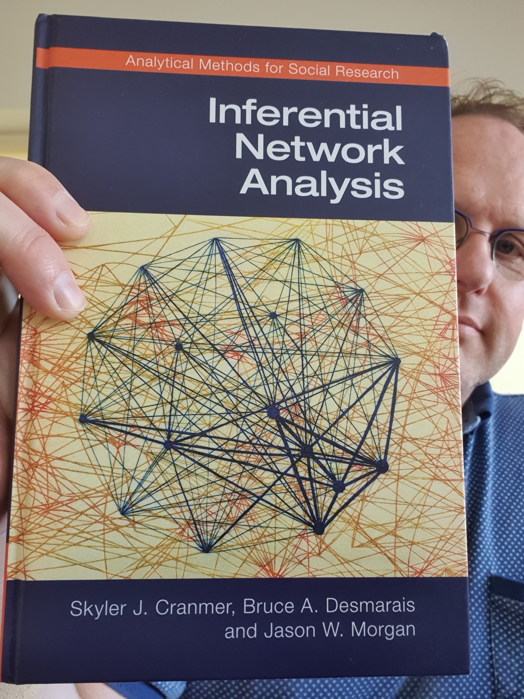
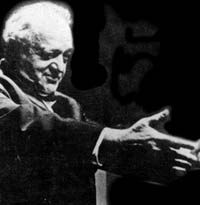
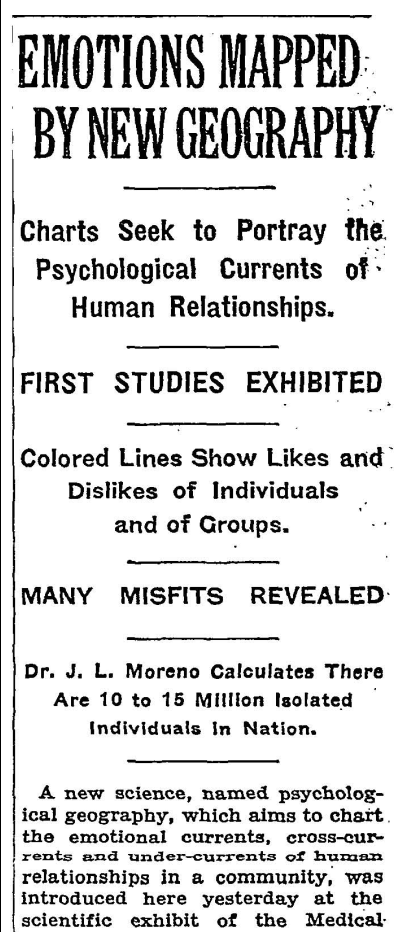
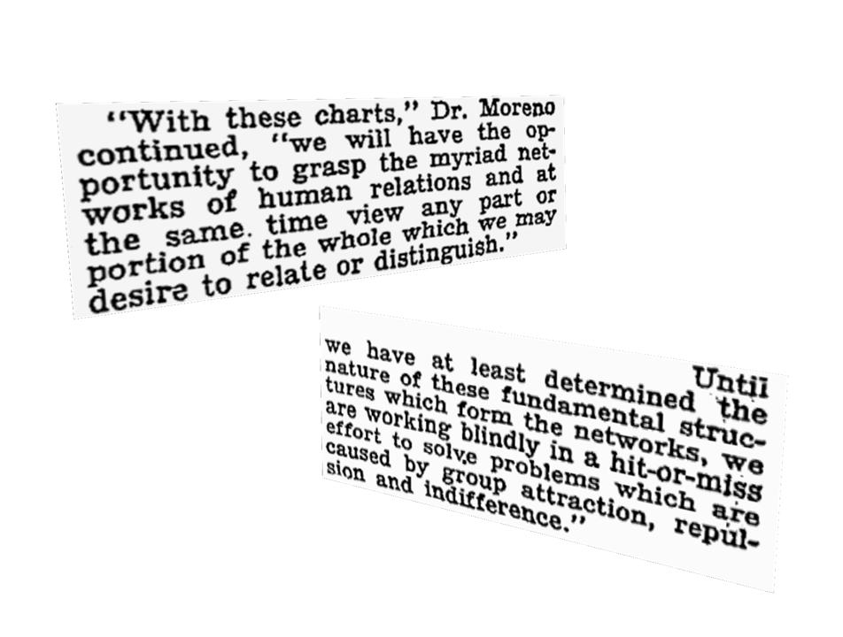

layout:false

background-image: url(assets/images/sna4ds_logo_140.png), url(assets/images/jads_logo_transparent.png), url(assets/images/network_people_7890_cropped2.png)
background-position: 100% 0%, 0% 10%, 0% 0%
background-size: 20%, 20%, cover
background-color: #000000

<br><br><br><br><br>
.full-width-screen-grey.center.fw9.font-250[
# .Orange-inline.f-shadows_into[`r rmarkdown::metadata$title`]
]

***

.full-width-screen-grey.center.fw9[.f-abel[.WhiteSmoke-inline[today's menu: ] .Orange-inline[`r rmarkdown::metadata$topic` .small-caps.font70[(lecture] .font70[`r rmarkdown::metadata$lecture_no`)]]]
]

<br>
.f-abel.White-inline[Your lecturer: `r rmarkdown::metadata$author`]<br>
.f-abel.White-inline[Playdate: `r rmarkdown::metadata$date`]


<!-- setup options start -->
```{r setup, include=FALSE}
knitr::opts_chunk$set(
                  echo = FALSE,
                  out.width = "90%",
                  fig.height = 6,
                  fig.path = "assets/images/",
                  fig.retina = 2,
                  dev = "svg",
                  message = FALSE,
                  warning = FALSE,
                  fig.show = TRUE,
                  hiline = TRUE)

knitr::opts_knit$set(global.par = TRUE)  # anders worden de margin settings niet overal doorgevoerd
```

```{r, include = FALSE}
par(mar = c(0,0,0,0) + .05) #it's important to have this in a separate chunk
```

```{r xaringanExtra_settings, include = FALSE}
xaringanExtra::use_xaringan_extra(c("tile_view"
                                    , "panelset"
                                    , "animate"
                                    , "tachyons"
                                    , "freezeframe"
                                    # , "broadcast"
                                    , "scribble"
                                    , "fit_screen"
                                    ))

xaringanExtra::use_webcam(300 * 1, 300 / 4 * 3 * 1)
xaringanExtra::use_editable(expires = 1)
# xaringanExtra::use_search(show_icon = TRUE, case_sensitive = FALSE, 
#                           position = "bottom-right", auto_search = FALSE)
```

```{r xaringan-extra-styles, echo = FALSE}
xaringanExtra::use_extra_styles(
  hover_code_line = TRUE,
  mute_unhighlighted_code = TRUE
)
```

```{css echo=FALSE}
.highlight-last-item > ul > li,
.highlight-last-item > ol > li {
  opacity: 0.5;
}

.highlight-last-item > ul > li:last-of-type,
.highlight-last-item > ol > li:last-of-type {
  opacity: 1;

.bold-last-item > ul > li:last-of-type,
.bold-last-item > ol > li:last-of-type {
  font-weight: bold;
}

.show-only-last-code-result pre + pre:not(:last-of-type) code[class="remark-code"] {
    display: none;
}
```

```{r some_handy_functions, echo = FALSE}
source("assets/R/components.R")
```

<!-- setup options end -->


---
name: CourseTeam
description: Your instructors
class: bg-black course-logo split-three 

# Your instructors

.column[
<br><br><br><br><br><br>
.font150.DarkOrange-inline[<b>Roger Leenders</b>]


.font70.DarkOrange-inline[[https://www.tilburguniversity.edu/staff/r-t-a-j-leenders](https://www.tilburguniversity.edu/staff/r-t-a-j-leenders)]

.font70.DarkOrange-inline[`r htmlent$envelope` Email: SNA4DS@jads.nl]

]


.column[
<br><br><br><br><br><br>
.font150.DarkOrange-inline[<b>Claudia Zucca</b>]


.font70.DarkOrange-inline[[https://www.tilburguniversity.edu/staff/c-zucca](https://www.tilburguniversity.edu/staff/c-zucca)]

.font70.DarkOrange-inline[`r htmlent$envelope`Email: SNA4DS@jads.nl]

]


.column[
<br><br><br><br><br><br>
.font150.DarkOrange-inline[<b>Gergő Bocsárdi</b>]


.font70.DarkOrange-inline[[https://www.jads.nl/researcher/gergo-bocsardi/](https://www.jads.nl/researcher/gergo-bocsardi)]

.font70.DarkOrange-inline[`r htmlent$envelope`Email: SNA4DS@jads.nl]
]


---
class: course-logo

# Getting in touch

<br><br><br>
- Speak with us during/around lectures/labs/group meetings

- Speak with us during our office hours

- Get in touch with us through **SNA4DS@jads.nl**

--
  
<br><br><br>

`r triangle_exclamation(fill = "red")` ***DO NOT email us on our university email addresses***

`r triangle_exclamation()` ***DO NOT message us through Canvas***

---
layout: false
class: course-logo

# The main book



--
  
<br><br><br><br><br><br>
.w-30.fr.tr[
  Additional literature is provided on Canvas
]


---
name: complex-systems
description: Complex systems
class: animated fadeIn course-logo

# Complex systems

We are surrounded by systems that are hopelessly complicated.

Consider, for example,

- **communications infrastructures** that integrate billions of cell phones
with computers and satellites;

--

- our ability to reason and comprehend our world
requires the coherent activity of billions of **neurons** in our brain;

--

- our biological existence is rooted in seamless interactions
between thousands of **genes and metabolites within our cells**;

--

- **markets** that revolve around thousands of organizations doing business
with each other;

--

- **soccer matches** are characterized by 22 actors constantly moving and
interacting (passing, giving directions, giving support/criticism) in
time and space.

--
  
`r chevron_right()` These systems are collectively called .hl-orange[complex systems] and can
(partly/largely) be understood as **networks**.


---

<br><br>
The various networks we meet in nature or society vary widely:
  
- the nodes of the **metabolic network** are tiny molecules
and the links are chemical reactions
governed by the laws of chemistry and quantum mechanics;
- the nodes of the **WWW** are web documents and the links are URLs
guaranteed by computer algorithms;
- the nodes of **social networks** are individuals or groups of individuals,
and the links represent family, professional, friendship,
and acquaintance ties.

---

<br><br>
The processes that generated these networks also differ
greatly:
  
- **metabolic** networks were shaped by billions of years
of evolution;
- the **WWW** is built on the collective actions of
millions of individuals and organizations;
- **social networks** are
shaped by social norms whose roots go back thousands of
years.

---


# However

a key discovery of network science is that the ***architectures*** of
networks emerging in such varying domains are surprisingly similar to each other,
and are governed by ***similar organizing principles***.

--
  
.right-column.f-marker.Blue-inline.font150[.w-60[
Consequently, we can use <br>a common set of <br>mathematical and statistical tools<br>
to explore these systems
]]


---
layout: false
name: start_of_sna
description: Start of SNA
class: course-logo

# How did the field of .Blue-inline[SOCIAL] networks start?

--

.pull-left[
.animated.fadeIn[]
]

.pull-right.tl[
.small-caps[[Jacob L. Moreno](https://en.wikipedia.org/wiki/Jacob_L._Moreno)]

May 18, 1889 – May 14, 1974

His 1934 book [Who Shall Survive?](https://archive.org/details/whoshallsurviven00jlmo)
contains some of the earliest graphical depictions of social networks.

]

---
class: bg-White course-logo

.pull-left.w30[
.center[]
]


.pull-right.w65[
.center[]

.tr[New York Times<br>
      April 3, 1933]
]


---
class: bg-Black course-logo

# An SNA Classic: Windsurfers on the beach


--


.footnote.DarkOrange-inline[source: https://unsplash.com/photos/qxbxq96BpXc]

---
class: bg-Black course-logo

# Windsurfer interactions over time

.center[
```{r, fig.align='center'}
knitr::include_url("assets/html/windsurfers.html", height = "520px")
```
]
          


---
class: course-logo

# Formal notation

The most common model of a network in network analysis is that of a _graph_. We
will use these terms interchangeably.

A graph consists of
+ nodes / actors / vertices
+ links / ties / edges / relationships / connections

Formally: $Graph = \{Vertices, Edges\}$

---
name: examples-of-actors
description: Examples of vertices
class: course-logo

# Examples of actors (vertices)

--


.w-40.fl.tl[
- people
- organizations
- countries
- teams
- animals
- bacteria
- trainstations, airports
- electricity stations
- knowledge repositories
- political parties
]


.w-50.fr.tl[
.can-edit[
- scientific articles
- chapters in a book
- variables in a model
- words
- products
- plants, flowers
- pieces of land
- ...
]]


---
name: examples-of-relations
description: Examples of edges
class: course-logo


# Examples of relationships (edges)

--


.w-40.fl.tl[
  - giving advice
- friendship
- selling a product
- passing on a virus
- voting along
- passing a ball to
- praising
- collaboration
]


.w-50.fr.tl[
.can-edit[
  - co-occurrence
- sitting next to
- be in war with
- stealing from
- giving orders
- ...
- ...
- ...
]]


---
  
# Some examples


.w-40.fl.tl[
- Networks of international diplomacy

- Collaboration between musical artists

- Songs listened to on Spotify

- Terrorist cells

- Drugs trafficking networks

- Users (and bots) on internet forums

- Playing strategy in soccer or basketball

- Book ratings on amazon

- Coffee percolation

]

.w-40.fr.tl[
- JADS students' social life (eating, drinking, studying)

- Interaction and murder in Game of Thrones

- Migrant movement between countries

- Social movements

- Political debates

- Collaboration in Software development

- Beer rating networks

- Co-authorships between academists
]

---
class: animated fadeIn hide-count center-full course-logo
name: SNA4DS_topics
description: SNA4DS topics
layout: false

# Social Network Analysis for Data Scientists

## What is this course about?

---
class: course-logo

`r slides_from_images("assets/images/SNA4DS_topic", regexp = "JPG$", class = "")`


---
class: animated fadeIn hide-count center-full course-logo
name: class
description: SNA4DS setup
layout: false

background-image: url(assets/images/kaleidico-26MJGnCM0Wc-unsplash.jpg)
background-size: cover

.f-marker.Orange-inline.font400[What happens in class?]

---
class: course-logo


# Each week

<br>

`r chevron_right()` Labs (mostly on Tuesdays) are online (Zoom)
 
`r chevron_right()` Lectures (mostly on Wednesdays) are in the attic

`r chevron_right()` Project progress meetings are at JADS

<br><br><br>

--

- read the book chapter (or other readings) listed on canvas for that week

- do the tutorial on the `snaverse`

- do the *homeplay*

- Come prepared! It will make your life easier and you'll learn so much more :)

---
class: course-logo

# Assessment

- Group project (write a report) - 40%
- Exam - 60%

<br>

## Exam

- Questions and problem sets (with real datasets)

- Similar to the Bootcamp Exam<br>
(but you'll need the full three hours)

---
class: course-logo

# Project (1)

With your group, pick a topic related to one of these application fields:
- Political science
- Organizations
- Internet
- Social influence
- Marketing
- Sport
- Text analysis
- Recommender systems
- Crime & Safety
- other (discuss it with Roger or Gergő)

---
class: course-logo


# Project (2)

- Identify or collect appropriate and relevant data 
- Formulate network-based research questions that can be answered with that data
- Formulate appropriate hypotheses
- Run analyses using the models we will learn in class
- Write a report (about 4500 words)

Details will soon be posted on Canvas, including the intermediate deadlines for the various project milestones.

---
class: bg-Black course-logo


background-image: url(assets/images/lets_break.png)
background-size: contain
background-position: 80% 60%
background-repeat: no-repeat

# Let's break!

