layout:false

background-image: url(assets/images/sna4ds_logo_140.png), url(assets/images/jads_logo_transparent.png), url(assets/images/network_people_7890_cropped2.png)
background-position: 100% 0%, 0% 10%, 0% 0%
background-size: 20%, 20%, cover
background-color: #000000

<br><br><br><br><br>
.full-width-screen-grey.center.fw9.font-250[
# .Orange-inline.f-shadows_into[`r rmarkdown::metadata$title`]
]

***

.full-width-screen-grey.center.fw9[.f-abel[.WhiteSmoke-inline[today's menu: ] .Orange-inline[`r rmarkdown::metadata$topic` .small-caps.font70[(lecture] .font70[`r rmarkdown::metadata$lecture_no`)]]]
]

<br>
.f-abel.White-inline[Your lecturer: `r rmarkdown::metadata$author`]<br>
.f-abel.White-inline[Playdate: `r rmarkdown::metadata$date`]


<!-- setup options start -->
```{r setup, include=FALSE}
knitr::opts_chunk$set(
                  echo = FALSE,
                  out.width = "90%",
                  fig.height = 6,
                  fig.path = "assets/images/",
                  fig.retina = 2,
                  dev = "svg",
                  message = FALSE,
                  warning = FALSE,
                  fig.show = TRUE,
                  hiline = TRUE)

knitr::opts_knit$set(global.par = TRUE)  # anders worden de margin settings niet overal doorgevoerd
```

```{r, include = FALSE}
par(mar = c(0,0,0,0) + .05) #it's important to have this in a separate chunk
```

```{r xaringanExtra_settings, include = FALSE}
xaringanExtra::use_xaringan_extra(c("tile_view"
                                    , "panelset"
                                    , "animate"
                                    , "tachyons"
                                    , "freezeframe"
                                    # , "broadcast"
                                    , "scribble"
                                    , "fit_screen"
                                    ))

xaringanExtra::use_webcam(300 * 1, 300 / 4 * 3 * 1)
xaringanExtra::use_editable(expires = 1)
# xaringanExtra::use_search(show_icon = TRUE, case_sensitive = FALSE, 
#                           position = "bottom-right", auto_search = FALSE)
```

```{r xaringan-extra-styles, echo = FALSE}
xaringanExtra::use_extra_styles(
  hover_code_line = TRUE,
  mute_unhighlighted_code = TRUE
)
```

```{css echo=FALSE}
.highlight-last-item > ul > li,
.highlight-last-item > ol > li {
  opacity: 0.5;
}

.highlight-last-item > ul > li:last-of-type,
.highlight-last-item > ol > li:last-of-type {
  opacity: 1;

.bold-last-item > ul > li:last-of-type,
.bold-last-item > ol > li:last-of-type {
  font-weight: bold;
}

.show-only-last-code-result pre + pre:not(:last-of-type) code[class="remark-code"] {
    display: none;
}
```

```{r some_handy_functions, echo = FALSE}
source("assets/R/components.R")
```

<!-- setup options end -->


---
name: CourseTeam
description: Your instructors
class: course-logo

# Your instructors

.pull-left[

.font150[<b>Roger Leenders</b>]


.font70[[https://www.tilburguniversity.edu/staff/r-t-a-j-leenders](https://www.tilburguniversity.edu/staff/r-t-a-j-leenders)]

.font70[`r htmlent$envelope` Email: SNA4DS@jads.nl]

]


.pull-right[
.font150[<b>Claudia Zucca</b>]


.font70[[https://www.tilburguniversity.edu/staff/c-zucca](https://www.tilburguniversity.edu/staff/c-zucca)]

.font70[`r htmlent$envelope`Email: SNA4DS@jads.nl]

]

---
class: bg-Black course-logo animated fadeIn

# me: Roger Leenders

```{r wordcloud_inlezen, echo=FALSE, include = FALSE}
load("assets/data/freq.RData")
```


```{r wordcloud_maken, echo = FALSE, include = TRUE, out.height="80%", fig.align = 'center'}
wordcloud2::wordcloud2(freq, size = .7,
           color = "random-light", backgroundColor = "black")
```

---
class: course-logo

# Getting in touch

<br><br><br>
- Speak with us during/around lectures/labs/game/group meetings

- Get in touch with us through **SNA4DS@jads.nl** 

- Speak with us during our office hours

--

<br><br><br>

`r triangle_exclamation(fill = "red")` ***DO NOT email us on our university email addresses***

`r triangle_exclamation()` ***DO NOT message us through Canvas***

---
layout: false
class: course-logo

# The main book

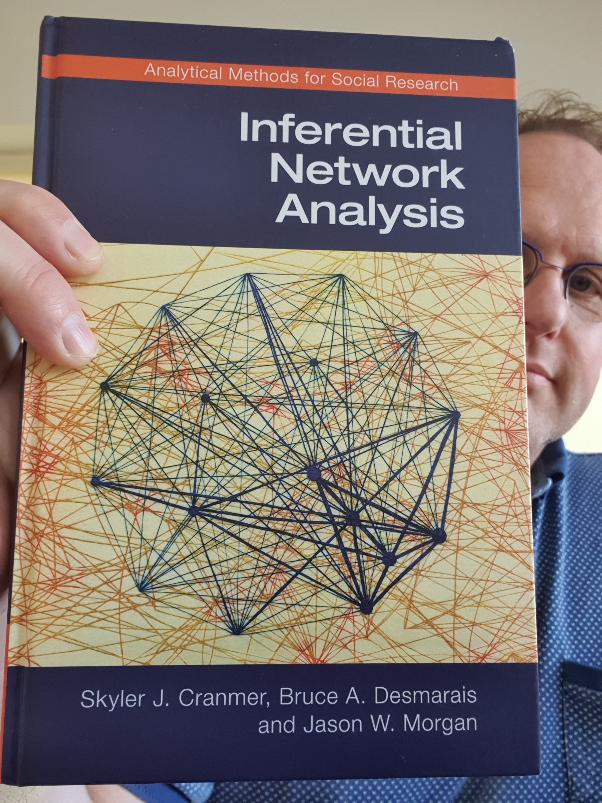

--

<br><br><br><br><br><br>
.w-30.fr.tr[
Additional literature can be found on Canvas
]


---
name: complex-systems
description: Complex systems
class: animated fadeIn course-logo

# Complex systems

We are surrounded by systems that are hopelessly complicated.

Consider, for example,

- **communications infrastructures** that integrate billions of cell phones 
with computers and satellites;
- our ability to reason and comprehend our world
requires the coherent activity of billions of **neurons** in our brain;
- our biological existence is rooted in seamless interactions
between thousands of **genes and metabolites within our cells**;
- **markets** that revolve around thousands of organizations doing business
with each other;
- **soccer matches** are characterized by 22 actors constantly moving and
interacting (passing, giving directions, giving support/criticism) in
time and space.

--

These systems are collectively called .hl-orange[complex systems] and can 
(partly/largely) be understood as **networks**.

---
class: course-logo

.left-column[
### The American COIN (Counter-Insurgency) operation in the Afghan war in 2009

.footnote[source: [NBC News World Blog, 2009](https://web.archive.org/web/20100217011353/http://worldblog.msnbc.msn.com/archive/2009/12/02/2140281.aspx)]
]

.right-column[

.center[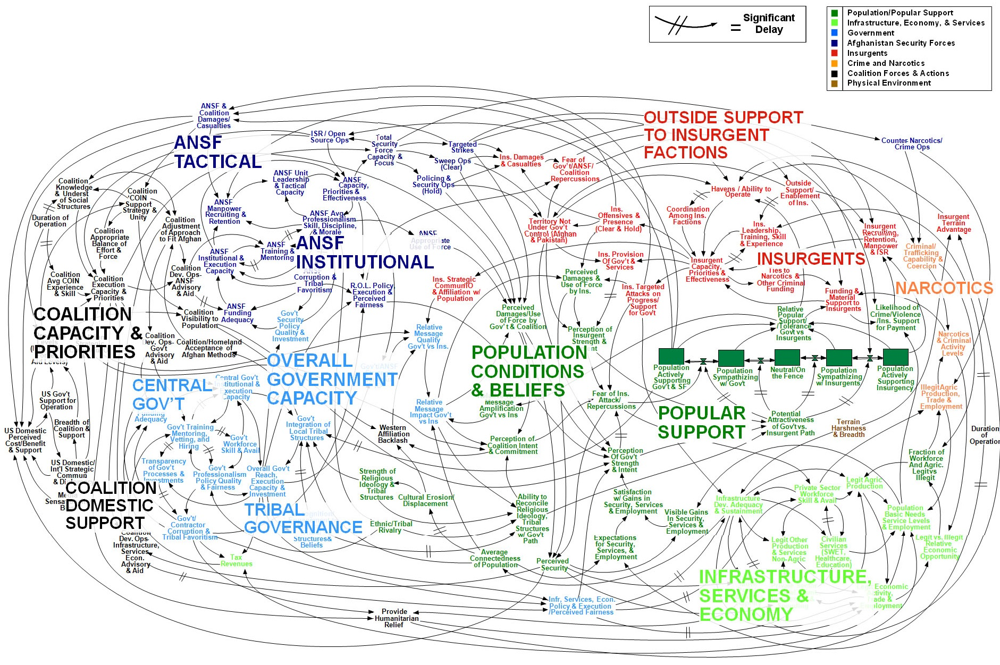]

]

---
class: bg-Black course-logo

.center[
```{r, fig.align='center'}
knitr::include_url("assets/html/RedBull.html", height = "620px")
```
]


---

The various networks we meet in nature or society vary widely:

- the nodes of the **metabolic network** are tiny molecules
and the links are chemical reactions
governed by the laws of chemistry and quantum mechanics;
- the nodes of the **WWW** are web documents and the links are URLs
guaranteed by computer algorithms;
- the nodes of **social networks** are individuals or groups of individuals,
and the links represent family, professional, friendship,
and acquaintance ties.

---

The processes that generated these networks also differ
greatly:

- **metabolic** networks were shaped by billions of years
of evolution;
- the **WWW** is built on the collective actions of
millions of individuals and organizations;
- **social networks** are
shaped by social norms whose roots go back thousands of
years.

---

A key discovery of network science is that the ***architectures*** of
networks emerging in such varying domains are surprisingly similar to each other,
and are governed by ***similar organizing principles***.

--

.right-column.f-marker.Blue-inline.font150[.w-60[Consequently, we
can use a common set of mathematical tools to explore these
systems.]]

---
layout: false
class: course-logo
name: networks_and-us
description: Networks and us

# Networks and us

<br>
 .Blue-inline[We live inside networks]

We work with others, we study with others, we have family, we have friends, we take part in internet communities, et cetera.

--

 .Blue-inline[We are shaped by our networks]

Find information, get advice, receive friendship, sanction/punish behavior, create (conditions for) trust, et cetera.

--

 .Blue-inline[We shape our networks]

We make friends, give advice, get new jobs, join clubs, we show trustworthiness, et cetera.

---
class: course-logo

# Some very recent history

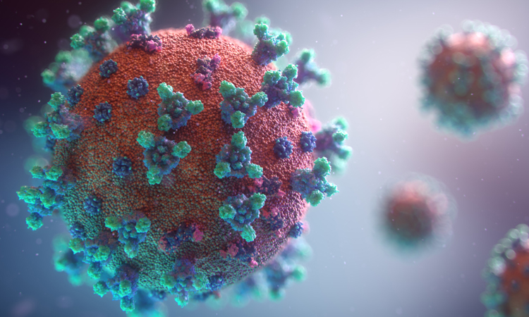

.footnote[
source: https://www.drugtargetreview.com/wp-content/uploads/CoVid-19_1080p_c_NW.jpg
]

---
class: hide-count course-logo
name: JustOneFriend
description: Just one friend
layout: false


.panelset[

<!-- start panel 1 -->
.panel[.panel-name[Social Distancing]

.font70[200 households with a mean of 15 contacts each]

.center[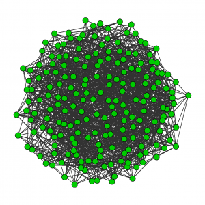]

.font70[The network consists of one giant component, containing all households.

.fn[source: http://statnet.org/COVID-JustOneFriend]
]

] # end panel 1


<!-- start panel 2 -->
.panel[.panel-name[Essential jobs]

.font70[10% essential households (in .Blue[.font50[blue]])]

.center[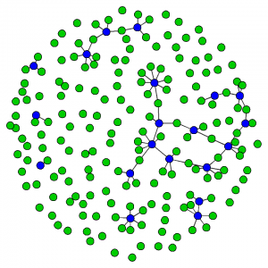]

.font70[
Most households are isolated. The largest cluster contains just 26% of
households. The vast majority of households are shielded from the Corona virus.

.fn[source: https://www.washington.edu/news/2020/04/13/just-one-friend-covid-19/]
]

] # end panel 2


<!-- start panel 3 -->
.panel[.panel-name[Just 1 friend]
.font70[Each household is allowed to interact with one friend]

.center[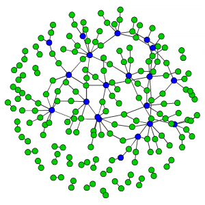]

.font70[
Most households (71%) are in one large cluster. A single COVID case in one of these households can spread to 3/4 of the families in this community.

.fn[source: https://www.washington.edu/news/2020/04/13/just-one-friend-covid-19/]
]
] # end of panel 3


<!-- start panel 4 -->
.panel[.panel-name[Try it]

<br><br>.center[.font180[[Interactive application](https://steve-hood.shinyapps.io/OneFriend/)]]

<!-- <br><br><center>.font180[[Interactive application](https://steve-hood.shinyapps.io/OneFriend/)]</center> -->
] # end of panel 4

]
<!-- end of panel set -->


---
layout: false
name: start_of_sna
description: Start of SNA
class: course-logo

# How did .Blue-inline[SOCIAL] networks start?

--

.pull-left[
.animated.fadeIn[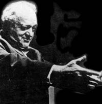]
]

.pull-right.tl[
.small-caps[[Jacob L. Moreno](https://en.wikipedia.org/wiki/Jacob_L._Moreno)]

May 18, 1889 – May 14, 1974

His 1934 book [Who Shall Survive?](https://archive.org/details/whoshallsurviven00jlmo)
contains some of the earliest graphical depictions of social networks.

]

---
class: bg-White course-logo

.pull-left.w30[
.center[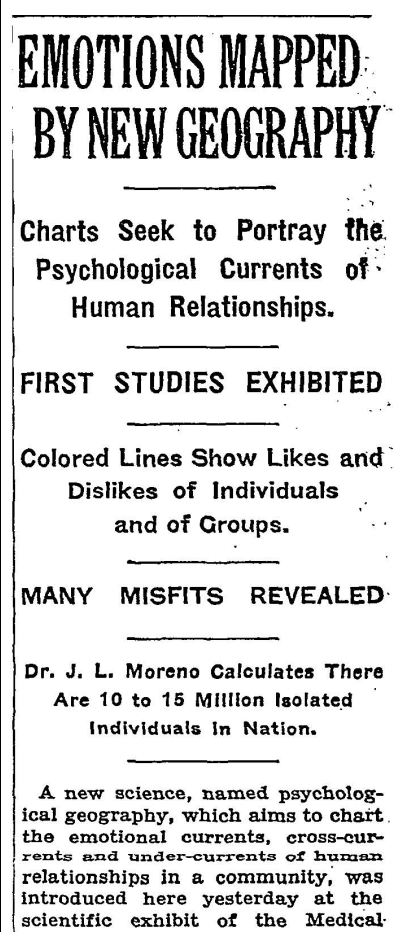]
]


.pull-right.w65[
.center[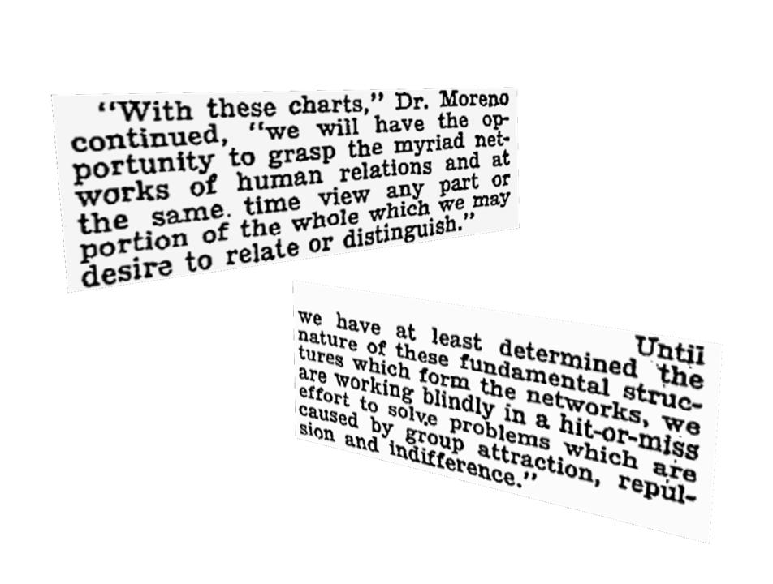]

.tr[New York Times<br>
April 3, 1933]
]

---
class: bg-Black course-logo

# An SNA Classic: Windsurfers on the beach


--


.footnote.DarkOrange-inline[source: https://unsplash.com/photos/qxbxq96BpXc]

---
class: bg-Black course-logo

# Windsurfer interactions over time

.center[
```{r, fig.align='center'}
knitr::include_url("assets/html/windsurfers.html", height = "520px")
```
]


---
class: course-logo

# Formal notation

The most common model of a network in network analysis is that of a graph. We
will use these terms interchangeably.

A graph consists of
+ nodes / actors / vertices
+ links / ties/ edges / relationships / connections

Formally: $Graph = \{Vertices, Edges\}$

---
name: examples-of-actors
description: Examples of vertices
class: course-logo

# Examples of actors (vertices)

--


.w-30.fl.tl[
- people
- organizations
- countries
- teams
- animals
- bacteria
- trainstations, airports
- electricity stations
- knowledge repositories
- political parties
]


.w-30.fr.tl[
.can-edit[
- ...
- ...
]]


.w-30.fr.tl[
.can-edit[
- scientific articles
- chapters in a book
- variables in a model
- words
- products
- plants, flowers
- pieces of land
- ...
]]


---
name: examples-of-relations
description: Examples of edges
class: course-logo

# Examples of relationships (edges)

--


.w-40.fl.tl[
- giving advice
- friendship
- selling a product
- passing on a virus
- voting along
- passing a ball to
- praising
- collaboration
]


.w-40.fr.tl[
.can-edit[
- co-occurrence
- sitting next to
- be in war with
- stealing from
- giving orders
- ...
- ...
- ...
]]


---
name: examples-of-networks-internet
description: Examples: internet
class: course-logo

# Example of networks

.center[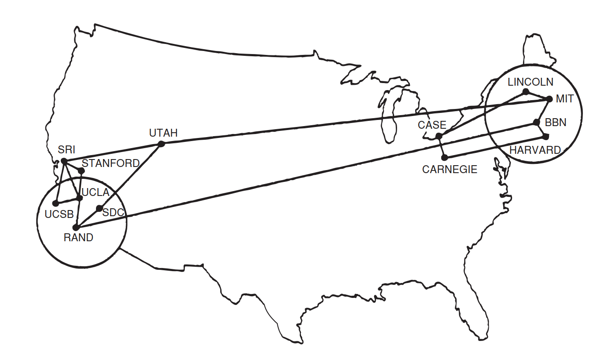]

--

The internet in December 1970.

.fn[source: http://som.csudh.edu/fac/lpress/history/arpamaps/f7dec1970.jpg]


---
name: examples-of-networks-HPlab
description: Examples: HP Lab
class: course-logo

# Example of networks

.center[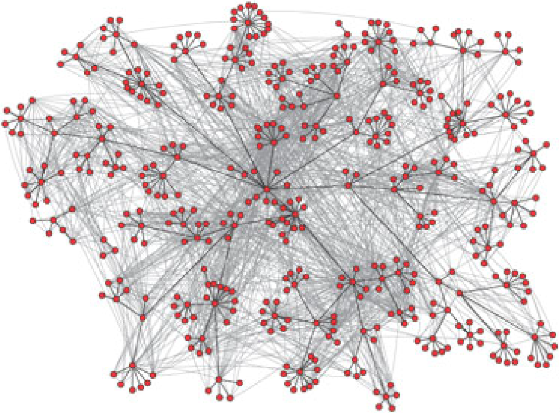]


E-mail communication among 436 employees of Hewlett Packard Research Lab

.fn[source: https://slideplayer.com/slide/6066377/]

---
name: examples-of-networks-blogosphere
description: Examples: Blogosphere
class: course-logo

# Example of networks

.center[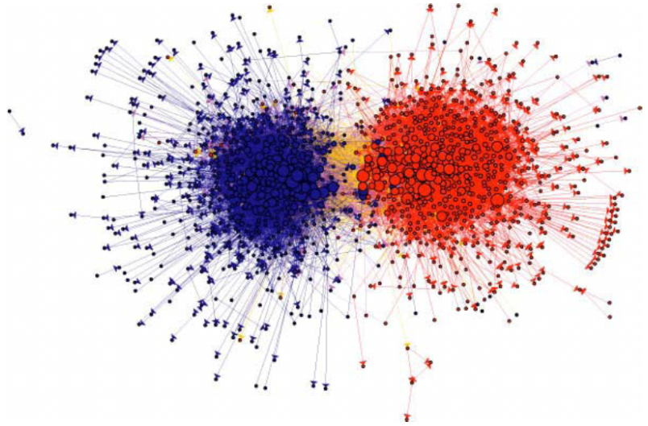]

The network structure of political blogs prior to the 2004 U.S. Presidential
election. The network  reveals two natural and well-separated clusters.

.fn[source:http://www.ramb.ethz.ch/CDstore/www2005-ws/workshop/wf10/AdamicGlanceBlogWWW.pdf]

---

# Some more examples


.w-40.fl.tl[
- Networks of international diplomacy

- Collaboration between musical artists

- Songs listened to on Spotify

- Terrorist cells

- Drugs trafficking networks

- Users (and bots) on internet forums

- Player performance in soccer or basketball

- Book ratings on amazon / recommender systems
]

.w-40.fr.tl[
- JADS students' social life (eating, drinking, studying)

- Interaction and murder in Game of Thrones

- Migrant movement between countries

- Social movements

- Political debates

- Collaboration in Software development

- Beer rating networks

- Co-authorships between academists
]

---
class: animated fadeIn hide-count center-full course-logo
name: SNA4DS_topics
description: SNA4DS topics
layout: false

# Social Network Analysis for Data Scientists

## What is this course about?

---
class: course-logo

`r slides_from_images("assets/images/SNA4DS_topic", regexp = "JPG$", class = "")`

---
class: class: animated zoomInRight bg-White course-logo

# Let's break!

.animated.wobble.center[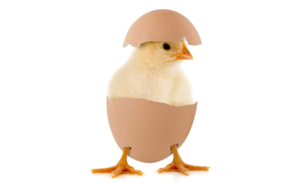]


