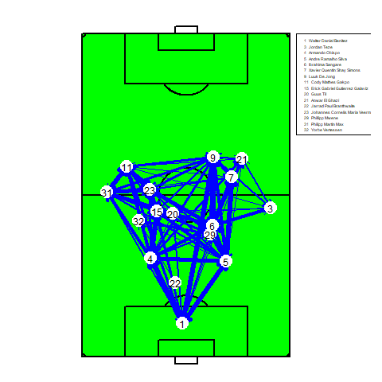
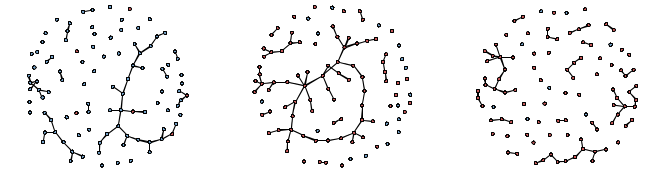
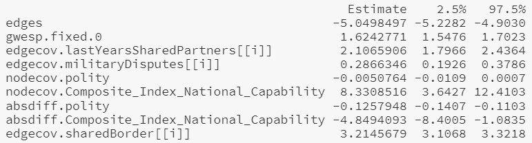
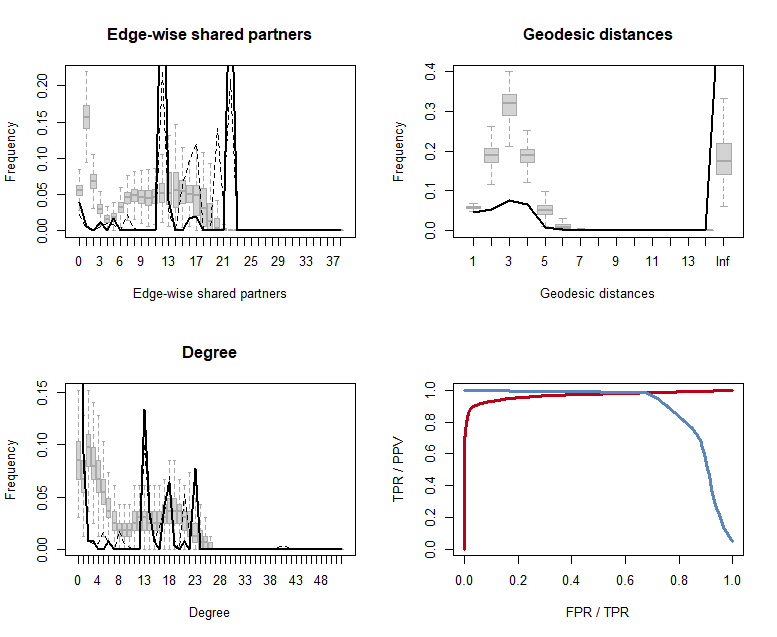
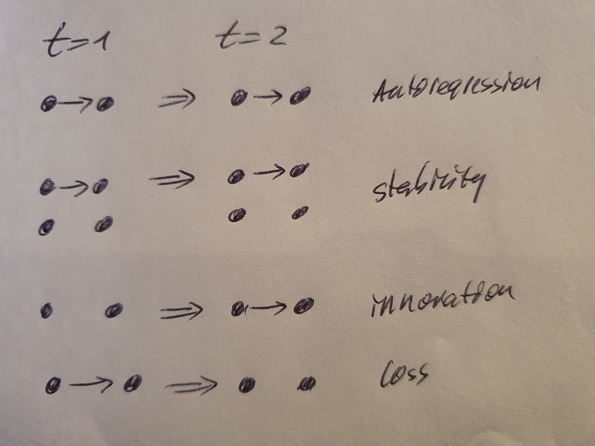
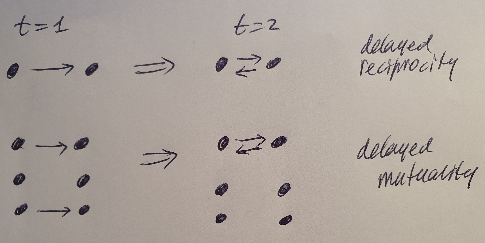
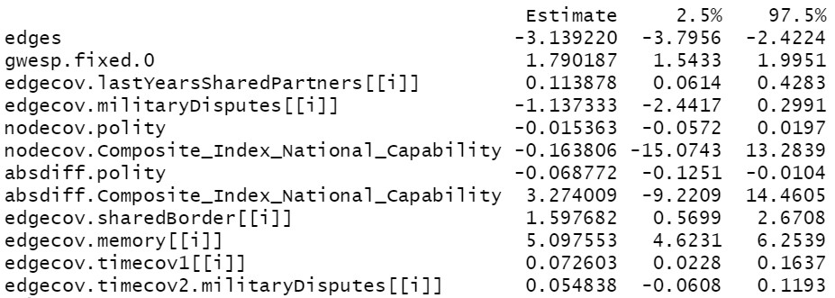
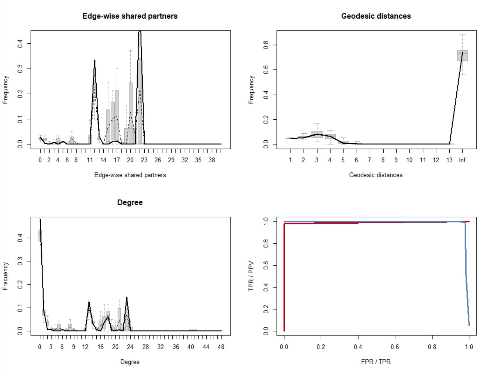

layout:false

background-image: url(assets/images/sna4ds_logo_140.png), url(assets/images/jads_logo_transparent.png), url(assets/images/network_people_7890_cropped2.png)
background-position: 100% 0%, 0% 10%, 0% 0%
background-size: 20%, 20%, cover
background-color: #000000

<br><br><br><br><br>
.full-width-screen-grey.center.fw9.font-250[
# .Orange-inline.f-shadows_into[`r rmarkdown::metadata$title`]
]

***

.full-width-screen-grey.center.fw9[.f-abel[.WhiteSmoke-inline[today's menu: ] .Orange-inline[`r rmarkdown::metadata$topic` .small-caps.font70[(lecture] .font70[`r rmarkdown::metadata$lecture_no`)]]]
  ]

<br>
.f-abel.White-inline[Your lecturer: `r rmarkdown::metadata$author`]<br>
.f-abel.White-inline[Playdate: `r rmarkdown::metadata$playdate`]


<!-- setup options start -->
```{r setup, include=FALSE}
knitr::opts_chunk$set(echo = FALSE,
                  comment = "",   # otherwise '##' is added in front of each output row
                  out.width = "90%",
                  fig.height = 6,
                  fig.path = "assets/images/",
                  fig.retina = 2,
                  dev = "svg",
                  message = FALSE,
                  warning = FALSE)
# library(htmlwidgets, quietly = TRUE, verbose = FALSE, warn.conflicts = FALSE)
# library(countdown, quietly = TRUE, verbose = FALSE, warn.conflicts = FALSE)

knitr::opts_knit$set(global.par = TRUE)  # anders worden de margin settings niet overal doorgevoerd
```


```{r marset, include = FALSE}
par(mar = c(0,0,0,0) + .05) #it's important to have this in a separate chunk
```


```{r xaringanExtra_settings, include = FALSE}
xaringanExtra::use_xaringan_extra(c("tile_view"
                                    , "panelset"
                                    , "animate"
                                    , "tachyons"
                                    , "freezeframe"
                                    , "broadcast"
                                    , "scribble"
                                    , "fit_screen"
                                    ))

xaringanExtra::use_webcam(50 * 3.5, 50 / 4 * 3 * 3.5)
xaringanExtra::use_editable(expires = 1)
xaringanExtra::use_search(show_icon = FALSE, case_sensitive = FALSE)
# xaringanExtra::use_clipboard()

htmltools::tagList(
  xaringanExtra::use_clipboard(
    button_text = "<i class=\"fa fa-clipboard\"></i>",
    success_text = "<i class=\"fa fa-check\" style=\"color: #90BE6D\"></i>",
    error_text = "<i class=\"fa fa-times-circle\" style=\"color: #F94144\"></i>"
  ),
  rmarkdown::html_dependency_font_awesome()
)
```

```{r xaringan-extra-styles, echo = FALSE}
xaringanExtra::use_extra_styles(
  hover_code_line = TRUE,         
  mute_unhighlighted_code = TRUE  
)
```

```{css echo=FALSE}
.highlight-last-item > ul > li, 
.highlight-last-item > ol > li {
  opacity: 0.5;
}

.highlight-last-item > ul > li:last-of-type,
.highlight-last-item > ol > li:last-of-type {
  opacity: 1;

.bold-last-item > ul > li:last-of-type,
.bold-last-item > ol > li:last-of-type {
  font-weight: bold;
}

.show-only-last-code-result pre + pre:not(:last-of-type) code[class="remark-code"] {
    display: none;
}
```

```{css}
.remark-inline-code {
  background: #F5F5F5;
  border-radius: 3px;
  padding: 4px;
}

.inverse-red, .inverse-red h1, .inverse-red h2, .inverse-red h3, .inverse-red a, inverse-red a > code {
	border-top: none;
	background-color: red;
	color: white; 
	background-image: "";
}

.inverse-orange, .inverse-orange h1, .inverse-orange h2, .inverse-orange h3, .inverse-orange a, inverse-orange a > code {
	border-top: none;
	background-color: orange;
	color: black; 
	background-image: "";
}
```


```{r some_handy_functions, echo = FALSE}
source("assets/R/components.R")
```


```{css}
.grid-3-1 {
  display: grid;
  height: calc(80%);
  grid-template-columns: repeat(3, 1fr);
  grid-template-rows: 1fr;
  align-items: center;
  text-align: center;
  grid-gap: 1em;
  padding: 1em;
}
```

```{r btergms_01, echo = FALSE}
load("assets/data/btergm_lecture.RData")
remedy::remedy_opts$set(name = paste0("btergms", "_"))
```

<!-- setup options end -->

---
layout: true
class: course-logo

---
name: soccer
description: ball passing network in soccer


# Ball passing network in soccer

### Ajax - PSV = 1 - 2 (Nov. 2022)


.center[
```{r btergm_wedstrijd, fig.align='center'}
knitr::include_url("assets/html/ajax_psv.html", height = "1080px")
```
]

---

.fl.w-60.tl[

]


.fr.w-40.tl[

Passing network for the game

.font70[
```{r btergms_05, echo = FALSE, eval = TRUE}
pm2
```
]
]

---

# Surprising observations

.fl.w-50.tl[

]

.fr.w-50.tl[
Some unexpected observations:

- no edge between 23 (Veerman) and 20 (Til)

although their geographic distance is low.

How can this be explained?

]

---
class: bg-Black

.center-image.font200.Orange.f-abel.vertical-center[Other examples of temporal networks?]

---
class: highlight-last-item
name: learnt_sofar
description: Can we use what we have learnt sofar?

# Can we use what we have learnt sofar?

<br><br>
- YES! 
  + if the overall network is stable enough / in an equilibrium, then consolidated networks are informative
  + if change is slow (e.g., company mergers), network snapshots are meaningful

--

- NO!
  + "traditional" measures assume that all paths are viable/informative
  + when networks are in constant flux, static measures might lose their meaning
  + discards information in the data
  + you might prefer temporal versions of your favorite network statistics

---
class: highlight-last-item
name: characteristics
description: Characteristics of temporal networks

# Characteristics of temporal networks

<br><br>
- edges have a start and an end (or they are instantaneous)

--

- edge attributes may vary over time

--

- vertices join and leave the network

--

- vertex attributes may vary over time

--

- (strengths of) effects may change over time

---
layout: true
class: course-logo

# How do you analyze temporal networks?
<br>

---
name: how_analyze
description: How do you analyze temporal networks

## Collapse the network into a static (valued) network

- OK if the network is quite stable & if the temporal order is (deemed) irrelevant
- very often done

<br><br><br>
`r arrow_right()` You can now use all of the tools you learned in this course.

---

## Collapse temporal slices of the network

Then analyze each slices as a static network.

- OK if the slices are meaningful by themselves & if enough data per slice

This is automatically the case when you have repeated observations of a network 
.font50[(we will focus on these in this lecture)]

Note that the width of time slices is often arbitrary.
.font50[(You *can* estimate these widths, but that is beyond this course)]

`r arrow_right()` You can now use all of the tools you learned in this course on each slice separately.


```{r btergms_03, echo = FALSE, fig.align = 'center', out.width = "40%"}

```

---
layout: false
class: course-logo

background-image: url("assets/images/kwartieren.jpg")
background-size: contain

Some events:

*23"* 0 - 1 (#9, de Jong)

*50"* 0 - 2 (#17, Gutierrez)

*62"* In: #3 (El Ghazi), out: #23 (Veerman)

*62"* In: #21 (Teze), out: #31 (Max)

*81"* In: #32 (Vertessen), out: #9 (de Jong)

*81"* In: #20 (Til), out: #7 (Simons)

*83"* 1 - 2 (#18, Luca)

*87"* In: #22 (Branthwaite), out: #11 (Gakpo)

<br>
The networks are different for each
<br>quarter. Often, soccer analysts 
<br>analyze the networks per quarter
<br>using the desciptive tools 
<br>discussed in this course.

.footnote.font50[(in some plots, you only see 10 players. 
This happens due to overplotting, 
when two players occupied almost exactly 
the same position)]

---
layout: true
class: course-logo

# How do you analyze temporal networks?
<br>

---

## Take the order of events into account

This discards the exact timing, but allows you to analyze what happens first, 
what next, et cetera. This captures patterns that involve ordering.

--

- helps to see/uncover ordering
- allows to uncover temporal motifs
- discards time within the sequence
- statistically fairly straightforward

`r arrow_right()` Descriptive network analysis with this type of data is 
the focus of the last tutorial.

---

## Take the time stamps of events into account

This is the most informative approach. 

However, it requires quite advanced statistical methods.

--

- helps to study exactly "how long it takes before..."
- can always be reduced to simpler models
- allows for extremely informative and detailed models and hypothesis testing
- methods are still very much in development

---
layout: false
class: course-logo

background-image: url(assets/images/goal.png)
background-position: 100% 100%
background-size: 40%

# Data structure
<br>
The network slice that led to the 0 - 1 goal by Luuk de Jong

```{r btergms_04, echo = FALSE, eval = TRUE}
goal = data.frame(
  onset    = c(1318.04, 1324.58, 1327.84, 1332.34, 1333.65),
  terminus = c(1320.92, 1325.60, 1328.74, 1332.43, 1334.00),
tail = c("Benitez (#1)", "Max (#31)", "Veerman (#23)",
         "Gakpo (#11)", "De Jong (#9)"),
head = c("Max (#31)", "Veerman (#23)",
         "Gakpo (#11)", "De Jong (#9)", "Goal"))
goal$duration = goal$terminus - goal$onset
goal
```

In this network, it is useful to add location as well and edge *type*.

The full passing path took  `r sum(goal$duration)` seconds (from start to goal scored).

Edges have start and end times. So can vertices.

---
layout: true
class: course-logo

---
name: analysis_overview
description: Analysis of temporal network data in this course

# Analysis of temporal network data

- repeated observations of a network

&nbsp;&nbsp;&nbsp;&nbsp;&nbsp;&nbsp;&nbsp;&nbsp;&nbsp;&nbsp;&nbsp;`r arrow_right()` TERGM (Temporal ERGM): the focus of this lecture

<br>
- network data with starting and ending times of edges and vertices

&nbsp;&nbsp;&nbsp;&nbsp;&nbsp;&nbsp;&nbsp;&nbsp;&nbsp;&nbsp;&nbsp;`r arrow_right()` Descriptive and exploratory analysis: the focus of the tutorial

&nbsp;&nbsp;&nbsp;&nbsp;&nbsp;&nbsp;&nbsp;&nbsp;&nbsp;&nbsp;&nbsp;`r arrow_right()` Statistical and deep learning models: part of advanced SNA course

---
name: tergms
description: The TERGM

# TERGM's

<br>
The ERGM (for a single network) is as follows:

$P(N, \theta) = \frac{exp(\theta' h(N))}{c(\theta)}$

--

<br>
If a network depends on K networks before it, then


$P(N^t | N^{t-K},...,N^k, \theta) = \frac{exp(\theta' h(N^t, N^{t-1}, ..., N^{t-K}))}{c(\theta, N^t, N^{t-1}, ..., N^{t-1})}$


--

<br>
and the joint probability of the entire sequence of networks becomes:

$P(N^{K+1},...,N^T|N^1,...,N^K,\theta) = \prod_{t=K+1}^T P(N^t|N^t, N^{t-1}, ..., N^{t-1}, \theta)$

--

<br>
### This is the .i[TERGM] .font70[(very similar to the ERGM, as you can see)]

In fact: it is so similar, that you can just think of it as an ERGM and apply 
what you already learnt.

---
name: btergm
description: The `btergm` package

# The `btergm` package

You experienced the speed of the ERGM....it is slow because 
it uses MCMC-LE.

--

Now imagine running an ERGM model with 5, 10, 20, or 50 networks 
that depend on each other. <br>
How fast would that run?

--

This is why we prefer to use MPLE instead of MCMC-LE. 
MPLE is much, much, much faster than MCMC-LE. <br>
But because it underestimates uncertainty in the model, 
the standard errors are too small.<br>

--

This can largely be corrected with .b[bootstrapping]. 
This slows the goodness-of-fit calculations down, 
but that is OK since MPLE is fast for the rest.

This is implemented in the `btergm` package.

---

# The `btergm` package

The `btergm` package is fully compatible with the 
`ergm` package:

- you can use the same terms

- you can use the same network objects (but now a .i[list] of networks,
instead of a single network)

---
name: example
description: International alliances (example)

# Example: International alliances

.w-65.fl.tl[
.scroll-box-24[
```{r btergms_22, echo = TRUE}
data("alliances", package = "SNA4DSData")
class(allianceNets)
allianceNets
```
]
]

.w-25.fr.tl[
These are 20 networks, each as a `network` object, 
packaged together as a list.<br>
The first element is the observed network at .i[t] = 1 (1981), 
the second is the observed network at .i[t] = 2 (1982), etc.
]

---

# Plotting the last three networks 

```{r btergms_23, echo = TRUE, fig.align = 'center', out.width = "50%"}
par(mfrow = c(1, 3), mar = c(0, 0, 1, 0))
for (i in (length(allianceNets) - 2):length(allianceNets)) {
  plot(allianceNets[[i]], main = paste("t =", i))
}
```

---

# How to include attributes

.panelset[
.panel[.panel-name[Procedure]
```{r btergms_24}
df <- as.data.frame(matrix(ncol = 2, nrow = 3))
df[1,] <- c("Time-varying dyadic covariates", "Either as a list of networks or matrices")
df[2,] <- c("Constant dyadic covariates", "Single network or matrix")
df[3,] <- c("Node level attributes", "As vertex attributes inside the observed network objects")

colnames(df) <- c("What", "How to store")
knitr::kable(df)
```
]

.panel[.panel-name[Application]
```{r btergms_25}
df <- as.data.frame(matrix(ncol = 3, nrow = 6))
df[1,] <- c("Composite_Index_National_Capability", "Node level attribute", "vertex attribute")
df[2,] <- c("polity", "Node level attribute", "vertex attribute")
df[3,] <- c("year", "Node level attribute", "vertex attribute")

df[4,] <- c("sharedBorder", "Constant dyadic covariate", "matrix")

df[5,] <- c("lastYearsAdjacency", "Time-varying dyadic covariate", "list of 20 matrices")
df[6,] <- c("lastYearsSharedPartners", "Time-varying dyadic covariate", "list of 20 matrices")
df[7,] <- c("militaryDisputes", "Time-varying dyadic covariate", "list of 20 matrices")


colnames(df) <- c("Name", "What", "Stored how?")
knitr::kable(df)
```
]

.panel[.panel-name[The networks]
.scroll-box-24[
```{r btergms_26, echo = TRUE}
allianceNets
```
]
]

.panel[.panel-name[sharedBorder]
.scroll-box-24[
```{r btergms_27, echo = TRUE}
class(sharedBorder)
dim(sharedBorder)
sharedBorder
```
]
]

.panel[.panel-name[lastYearsAdjacency]
.scroll-box-24[
```{r btergms_28, echo = TRUE}
class(lastYearsAdjacency)
length(lastYearsAdjacency)
lastYearsAdjacency
```
]
]


.panel[.panel-name[lastYearsSharedPartners]
.scroll-box-24[
```{r btergms_29, echo = TRUE}
class(lastYearsSharedPartners)
length(lastYearsSharedPartners)
lastYearsSharedPartners
```
]
]


.panel[.panel-name[militaryDisputes]
.scroll-box-24[
```{r btergms_30, echo = TRUE}
class(militaryDisputes)
length(militaryDisputes)
militaryDisputes
```
]
]

]

---

# First model

.panelset[

.panel[.panel-name[Model]
.scroll-box-24[
```{r btergms_31, echo = TRUE, eval = FALSE}
p0 <- Sys.time()
model_1 <- btergm::btergm(allianceNets ~ edges + 
                             gwesp(0, fixed = TRUE) +
                             edgecov(lastYearsSharedPartners) + 
                             edgecov(militaryDisputes) + 
                             nodecov("polity") +
                             nodecov("Composite_Index_National_Capability") + 
                             absdiff("polity") + 
                             absdiff("Composite_Index_National_Capability") +
                             edgecov(sharedBorder), 
                           R = 100, # number of bootstraps
                           parallel = "snow", ncpus = 4  # optional line
                           )
Sys.time() - p0  # 41 secs on my computer
```
]
]

.panel[.panel-name[Result]

```{r btergms_32, echo = TRUE, eval = FALSE}
btergm::summary(model_1)
```

```{r btergms_33, echo = FALSE, eval = TRUE}

```
]

.panel[.panel-name[Interpretation]
.fl.w-60.tl[
```{r btergms_34, echo = FALSE, eval = TRUE}

```
]

.fr.w-35.tl.font70[
Some results:

- There is a tendency towards "friend-of-a-friend"

- The more previous shared partners, the more likely is an alliance now

- Countries with higher .i[cinc] have more allies and countries prefer to ally with others with similar *cinc*

- Shared borders matter
]
]


.panel[.panel-name[GoF (numbers)]
```{r btergms_35, echo = TRUE, eval = FALSE}
p0 <- Sys.time()
model_1_gof <- snafun::stat_plot_gof_as_btergm(model_1, silent = TRUE)
Sys.time() - p0  # 6min 40sec on my machine
```

\>\>\> bunch of intermediate info skipped <<<

.scroll-box-24.font70[
```{r btergms_36, echo = TRUE, eval = TRUE}
model_1_gof
```
]
]

]

???
In de tabel staan de verdelingen van de statistics. Aangezien er niks is meegegeven
aan de functie zijn dat de default stats, in volgorde: Edge-wise shared partners, 
Geodesic distances, Degree.
In de eerste 4 kolommen staat hoevaak die waarde voorkomt in de data. Dus, bij degree 
is dat hoe vaak degree == 0 voorkomt (gemiddeld over de datasets), het mediane
aantal keer dat 0 voorkomt in de datasets, het minimale en maximale aantal keren 
over de datasets heen. 
Daarna staat dat voor de gesimuleerde netwerken. 
De laatste kolom (P) geeft, vermoed ik, de P van de toets of ze gelijk zijn. 
Als p <= .05 (bijv.), dan zijn ze erg gelijkend, je wilt dus kleine p's voor een
goed fittend model, maar heel nuttig vind ik deze kolom niet omdat ie afhangt van 
alle gesimuleerde netwerken en alle variatie daarin, terwijl overall in het plaatje 
de box voldoende past bij de zwarte lijn


---

# gof plot for this model

.fl.w70.tl[
<br>

]

.fr.w30.tl[
<br>
Legend:
- grey boxes: gof simulations

- thick line: median from the 20 observed networks

- dashed line: mean from the 20 observed networks

- bottom right: .red.b[red] line is the ROC curve, 
the .blue.b[blue] line the Precision-Recall curve.
 
<br>

.b.i[That fit is terrible!!! Why?<br>How can we improve the model?]
]

???
That's terrible! Why? There really is little time effect included

ROC: 
x-axis: FPR (False Positive Rate) = false alarm rate = % of 0's where a 
1 is predicted. 
y-axis: TPR (True Positive Rate) = sensitivity = recall = %1's that are 
correctly predicted.
Best model: bow to the top left corner.
Poor model: diagonal


PR-curve: 
x-axis: TPR (True Positive Rate) = sensitivity = recall = %1's that are 
correctly predicted.
y-axis: Positive Predictive Value/Rate = precision = % of predicted 1's that 
are correct
PR-curve is esp useful when there are few 1's and many 0's. In this case, it 
is mainly important to model the 1's well. The PR-curve only focuses on 
how well you do when you predict a 1.
--> in sparse networks, the PR is more relevant than the ROC.

Best model: bow to the top right corner.
Poor model: horizontal line (y-value = %of 0's in the data)


Extract the AUC as follows:
> model_1_gof$`Tie prediction`$auc.roc
[1] 0.9671936
> model_1_gof$`Tie prediction`$auc.pr
[1] 0.877952

The horizontal line for the PR graph is at:
> > model_1_gof$`Tie prediction`$auc.pr.rgraph
[1] 0.04941555
That is correct, because the average density is 
> mean(sna::gden(allianceNets))
[1] 0.04921068

---
name: memory
description: Time effects (Memory)

# Time effects

### Memory

.w60.fl[

]

.fl.w40[
- .b[positive autoregression] `r htmlent$triangle_right` Previous existing edges persist in a next network

- .b[Dyadic stability] `r htmlent$triangle_right` Both previous existing and non-existing ties are carried over to the current network

- .b[Edge innovation] `r htmlent$triangle_right` A non-existing previous tie becomes existent in the current network

- .b[Edge loss] `r htmlent$triangle_right` An existing previous tie is lost in the current network
`
]


???
Picasso would be jealous
---

# Time effects

### Memory

- .b[positive autoregression] `r htmlent$triangle_right` Previous existing edges persist in a next network

&nbsp;&nbsp;&nbsp;&nbsp;&nbsp;&nbsp;&nbsp;&nbsp;&nbsp;&nbsp;&nbsp;`btergm::memory(type = "autoregression", lag = 1)`

- .b[Dyadic stability] `r htmlent$triangle_right` Both previous existing and non-existing ties are carried over to the current network

&nbsp;&nbsp;&nbsp;&nbsp;&nbsp;&nbsp;&nbsp;&nbsp;&nbsp;&nbsp;&nbsp;`btergm::memory(type = "stability", lag = 1)`

- .b[Edge innovation] `r htmlent$triangle_right` A non-existing previous tie becomes existent in the current network

&nbsp;&nbsp;&nbsp;&nbsp;&nbsp;&nbsp;&nbsp;&nbsp;&nbsp;&nbsp;&nbsp;`btergm::memory(type = "innovation", lag = 1)`

- .b[Edge loss] `r htmlent$triangle_right` An existing previous tie is lost in the current network

&nbsp;&nbsp;&nbsp;&nbsp;&nbsp;&nbsp;&nbsp;&nbsp;&nbsp;&nbsp;&nbsp;`btergm::memory(type = "loss", lag = 1)`

---
name: reciprocity
description: Time effects (Delayed reciprocity)

# Time effects

### Delayed reciprocity

.w60.fl[

]


.fl.w40[
- .b[reciprocity] `r htmlent$triangle_right` if node *j* is tied to node *i* 
at *t* = 1, does this lead to a reciprocation of that tie back from 
*i* to *j* at *t* = 2?

- .b[mutuality] `r htmlent$triangle_right` if node *j* is tied to node *i* 
at *t* = 1, does this lead to a reciprocation of that tie back from 
*i* to *j* at *t* = 2 .b[AND] if *i* is not tied to *j* at *t* = 1, 
will this lead to *j* not being tied to *i* at *t* = 2?
This captures a trend *away from asymmetry*.

]

???
Reciprocity ONLY tests whether ties where i -> j will next time be reciprocated i <-> j

Mutuality is more encompassing and checks if ties at t are mutual at t, this means that
NULL ties remain NULL and that Asymmetrics become either NULL or MUTUAL (both are 
good, no pref is given to pure reciprocity)

---
# Time effects

### Delayed reciprocity

- .b[reciprocity] `r htmlent$triangle_right` if node *j* is tied to node *i* 
at *t* = 1, does this lead to a reciprocation of that tie back from 
*i* to *j* at *t* = 2?

&nbsp;&nbsp;&nbsp;&nbsp;&nbsp;&nbsp;&nbsp;&nbsp;&nbsp;&nbsp;&nbsp;`btergm::delrecip(mutuality = FALSE, lag = 1)`


- .b[mutuality] `r htmlent$triangle_right` if node *j* is tied to node *i* 
at *t* = 1, does this lead to a reciprocation of that tie back from 
*i* to *j* at *t* = 2 .b[AND] if *i* is not tied to *j* at *t* = 1, 
will this lead to *j* not being tied to *i* at *t* = 2?
This captures a trend *away from asymmetry*.

&nbsp;&nbsp;&nbsp;&nbsp;&nbsp;&nbsp;&nbsp;&nbsp;&nbsp;&nbsp;&nbsp;`btergm::delrecip(mutuality = TRUE, lag = 1)`

---
name: covariates
description: Time effects (Covariates)

# Time effects

### Time covariates

- Test for a specific trend (linear or non-linear) for edge formation

&nbsp;&nbsp;&nbsp;&nbsp;&nbsp;&nbsp;&nbsp;&nbsp;&nbsp;&nbsp;&nbsp;`btergm::timecov()` (for a linear trend)

&nbsp;&nbsp;&nbsp;&nbsp;&nbsp;&nbsp;&nbsp;&nbsp;&nbsp;&nbsp;&nbsp;`btergm::timecov(transform = sqrt)` (for a geometrically decreasing trend)

--

- This can be combined with a covariate to create an interaction effect 
to test whether the importance of a covariate increases or decreases over time.

&nbsp;&nbsp;&nbsp;&nbsp;&nbsp;&nbsp;&nbsp;&nbsp;&nbsp;&nbsp;&nbsp;`btergm::timecov(militaryDisputes)` (for a linear trend of `militaryDisputes` 
over time)

&nbsp;&nbsp;&nbsp;&nbsp;&nbsp;&nbsp;&nbsp;&nbsp;&nbsp;&nbsp;&nbsp;`btergm::timecov(militaryDisputes, transform = sqrt)`


???
sqrt() geeft afnemene meeropbrengst, dus een monotoon stijgende lijn die 
steeds verder afvlakt: de stijging wordt dus steeds kleiner, maar de 
lijn blijft wel steeds stijgen
---

# Model 2

.panelset[

.panel[.panel-name[Model]
.scroll-box-24[
```{r btergms_37, echo = TRUE, eval = FALSE}
p0 <- Sys.time()
model_2 <- btergm::btergm(allianceNets ~ edges + 
                    gwesp(0, fixed = TRUE) +
                    edgecov(lastYearsSharedPartners) + 
                    edgecov(militaryDisputes) + 
                    nodecov("polity") +
                    nodecov("Composite_Index_National_Capability") + 
                    absdiff("polity") + 
                    absdiff("Composite_Index_National_Capability") +
                    edgecov(sharedBorder) +
                    memory(type = "stability") +
                    timecov() + 
                    timecov(militaryDisputes), 
                  R = 100
                  , parallel = "snow", ncpus = 16  # optional line
                  )
Sys.time() - p0   # 167 secs on my machine
```
]
]

.panel[.panel-name[Result]

```{r btergms_38, echo = TRUE, eval = FALSE}
btergm::summary(model_2)
```

```{r btergms_39, echo = FALSE, eval = TRUE}

```
]

.panel[.panel-name[Interpretation]
.fl.w-60.tl[
```{r btergms_40, echo = FALSE, eval = TRUE}

```
]

.fr.w-35.tl.font70[
Some results: 

- There is a tendency towards "friend-of-a-friend"

- Shared borders matter

- There is a preference for stability over time (alliances tend not to start or 
dissolve much)

- There is a slightly positive trend in creating alliances

]
]


.panel[.panel-name[GoF (numbers)]
```{r btergms_41, echo = TRUE, eval = FALSE}
p0 <- Sys.time()
model_2_gof <- snafun::stat_plot_gof_as_btergm(model_2, silent = TRUE)
Sys.time() - p0  # 6min 58 secs on my machine
```

\>\>\> (note, this takes several minutes or so on your machine) <<<

.scroll-box-24[
```{r btergms_42, echo = TRUE, eval = TRUE}
model_2_gof
```
]
]

]

---

# gof plot for this model

.fl.w70.tl[
<br>

]

.fr.w30.tl[
<br>
Legend:
- grey boxes: simulations

- thick line: median from the 20 observed networks

- dashed line: mean from the 20 observed networks
 
<br><br> 
.b.i[That fit is wonderful!]
]


---
name: nextlab
description: What happens in the lab

# Next Monday: final lab

This was the last lecture of the course.

Next week: the last lab (online).

In the lab, we'll address:

- your homeplay assignment
- some more discussion of how to analyze temporal network data
- what to expect in the exam regarding temporal networks
- what to expect in the exam in general
- any questions you may have left
