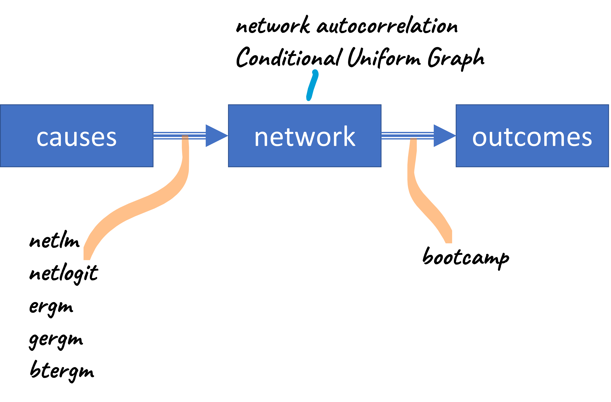

layout:false

background-image: url(assets/images/sna4ds_logo_140.png), url(assets/images/jads_logo_transparent.png), url(assets/images/network_people_7890_cropped2.png)
background-position: 100% 0%, 0% 10%, 0% 0%
background-size: 20%, 20%, cover
background-color: #000000

<br><br><br><br><br>
.full-width-screen-grey.center.fw9.font-250[
# .Orange-inline.f-shadows_into[`r rmarkdown::metadata$title`]
]

***

.full-width-screen-grey.center.fw9[.f-abel[.WhiteSmoke-inline[today's menu: ] .Orange-inline[`r rmarkdown::metadata$topic` .small-caps.font70[(lecture] .font70[`r rmarkdown::metadata$lecture_no`)]]]
  ]

<br>
.f-abel.White-inline[Your lecturer: `r rmarkdown::metadata$author`]<br>
.f-abel.White-inline[Playdate: `r rmarkdown::metadata$playdate`]


<!-- setup options start -->
```{r setup, include=FALSE}
knitr::opts_chunk$set(echo = FALSE,
                  comment = "",   # otherwise '##' is added in front of each output row
                  out.width = "90%",
                  fig.height = 6,
                  fig.path = "assets/images/",
                  fig.retina = 2,
                  dev = "svg",
                  message = FALSE,
                  warning = FALSE)
# library(htmlwidgets, quietly = TRUE, verbose = FALSE, warn.conflicts = FALSE)
# library(countdown, quietly = TRUE, verbose = FALSE, warn.conflicts = FALSE)

knitr::opts_knit$set(global.par = TRUE)  # anders worden de margin settings niet overal doorgevoerd

remedy::remedy_opts$set(name = paste0("lecture_stats", "_"))


edge_data <- c("a", "c", 
               "a", "d", 
               "a", "b", 
               "b", "c", 
               "b", "d", 
               "c", "e", 
               "d", "e", 
               "e", "f", 
               "f", "g", 
               "f", "h", 
               "g", "i", 
               "g", "j", 
               "h", "i", 
               "h", "j", 
               "i", "j")

el <- matrix(edge_data, ncol = 2, byrow = T)
net_igraph <- igraph::graph.edgelist(el, directed = F)
net_sna <- snafun::to_network(net_igraph)
net_mat <- network::as.matrix.network.adjacency(net_sna)
net_mat[order(rownames(net_mat)), order(rownames(net_mat))]
diag(net_mat) <- 0
```


```{r marset, include = FALSE}
par(mar = c(0,0,0,0) + .05) #it's important to have this in a separate chunk
```


```{r xaringanExtra_settings, include = FALSE}
xaringanExtra::use_xaringan_extra(c("tile_view"
                                    , "panelset"
                                    , "animate"
                                    , "tachyons"
                                    , "freezeframe"
                                    # , "broadcast"
                                    , "scribble"
                                    , "fit_screen"
                                    ))

# xaringanExtra::use_webcam(50 * 3.5, 50 / 4 * 3 * 3.5)
xaringanExtra::use_editable(expires = 1)
xaringanExtra::use_search(show_icon = FALSE, case_sensitive = FALSE)
# xaringanExtra::use_clipboard()

htmltools::tagList(
  xaringanExtra::use_clipboard(
    button_text = "<i class=\"fa fa-clipboard\"></i>",
    success_text = "<i class=\"fa fa-check\" style=\"color: #90BE6D\"></i>",
    error_text = "<i class=\"fa fa-times-circle\" style=\"color: #F94144\"></i>"
  ),
  rmarkdown::html_dependency_font_awesome()
)
```


```{r xaringan-extra-styles, echo = FALSE}
xaringanExtra::use_extra_styles(
  hover_code_line = TRUE,         
  mute_unhighlighted_code = TRUE  
)
```

```{css echo=FALSE}
.highlight-last-item > ul > li, 
.highlight-last-item > ol > li {
  opacity: 0.5;
}

.highlight-last-item > ul > li:last-of-type,
.highlight-last-item > ol > li:last-of-type {
  opacity: 1;

.bold-last-item > ul > li:last-of-type,
.bold-last-item > ol > li:last-of-type {
  font-weight: bold;
}

.show-only-last-code-result pre + pre:not(:last-of-type) code[class="remark-code"] {
    display: none;
}
```

```{css}
.remark-inline-code {
  background: #F5F5F5;
  border-radius: 3px;
  padding: 4px;
}

.inverse-red, .inverse-red h1, .inverse-red h2, .inverse-red h3, .inverse-red a, inverse-red a > code {
	border-top: none;
	background-color: red;
	color: white; 
	background-image: "";
}

.inverse-orange, .inverse-orange h1, .inverse-orange h2, .inverse-orange h3, .inverse-orange a, inverse-orange a > code {
	border-top: none;
	background-color: orange;
	color: black; 
	background-image: "";
}


.tab{
  display: inline-block;
  margin-left: 40px;
}

.tab1{tab-size: 2;}
.tab2{tab-size: 4;}
.tab3{tab-size: 6;}
.tab4{tab-size: 8;}

```


```{r some_handy_functions, echo = FALSE}
source("assets/R/components.R")
```


```{css}
.grid-3-1 {
  display: grid;
  height: calc(80%);
  grid-template-columns: repeat(3, 1fr);
  grid-template-rows: 1fr;
  align-items: center;
  text-align: center;
  grid-gap: 1em;
  padding: 1em;
}
```

<!-- setup options end -->

---
class: course-logo
layout: true

---
class: bg-Black
name: menu
description: "Menu"

.Gold-inline[
# Today's menu

1. Statistical Models for Networks
1. Social Influence modeling
]

---

# The course sofar

We have performed descriptive and exploratory analysis:

- vertex level indices (betweenness, closeness, pagerank, etc.)

--

- graph level indices (centralization, components/subgroups, et cetera)

--

- Getting to know R with `snafun`, `network`/`sna`, and `igraph`

---
# From exploration to estimation and testing

- You found *betweenness centralization* of .2. Is this high? Low? Expected? 
Unexpected? Statistically significant?

--

- You found a 4 communities in the graph. Is this high? Low? Expected? 
Unexpected? Statistically significant?

--

- You found that more central companies innovate more. But is this expected? 
Unexpected? Statistically significant?

--

- You found a .4 correlation between friendship and advice-giving. 
Statistically significant?

--

- How to conclude if friendship promotes advice giving?

--

<br><br><br>
.Blue-inline[`r arrow_right("blue")` we need statistics: *parameter estimation* and *hypothesis testing*.]

---
name: assumption
description: Our assumptions from here on out

# We assume

- you can easily calculate the appropriate vertex-level and graph-level indices

--

- you are comfortable with the basics of statistics (see: .i[bootcamp]):

  + linear regression

  + logistic regression

  + null-hypothesis testing

---
class: bg-Black center
name: role
description: The role of statistics

background-image: url("assets/images/math_scroll.gif")
background-size: cover

<br><br><br><br><br>
.Blue-inline.f-caveat.b[.center[.font400[<b>causes <font face="Symbol">&#222;</font>
network <font face="Symbol">&#222;</font> outcomes</b>]]]

---
class: center
name: models_in_course
description: Overview of the statistical models in this course




---
class: clear bg-GoldenRod middle center

background-image: url("assets/images/airport_waitingline.jpg")
background-size: cover

---
class: clear bg-GoldenRod

background-image: url("assets/images/Whyte.jpg")
background-size: cover


.footnote.white[Whyte, 1954]
---
class: bg-Black
name: toblerslaw
description: Tobler's First Law

# Network statistics: Social Influence

## Tobler's first law of Geography

--

<br><br>
.f-marker.center.White-inline.font200[Everything is related to everything else, <br>but near things are more related<br>than distant things.]

---
class: bg-Black

# Tobler's first law of Geography (2m59s video)

.center[
```{r lecture_stats_01, fig.align='center'}
knitr::include_url("assets/html/toblers_law_1920.html", height = "1080px")
```
]

.footnote[[Source](https://www.youtube.com/watch?v=Ck7yVhvSdGM)]

---
background-image: url("assets/images/Tobler_Waldo-R.jpg")
background-size: 30%
background-position: 100% 0%


# Tobler's first law

The law basically says two things:

- You interact more often/strongly with whom is "near"

--

- Near things are more alike than distant things

???
Waldo Tobler (1930 - 2018)
---
# Tobler's first law of Geography

<br><br>
.f-caveat.center.font200.b[Everything is related to everything else, 
<br>but near things are more related<br>than distant things.]


<br><br><br><br>
`r arrow_right()` This is the idea that social network models of social influence are built upon.

---
class: bg-Black

background-image: url("assets/images/network_colored.png")
background-size: contain

# Social influence on a network

---
name: socinf
description: Social influence on a network

# Social influence on a network

## Network autocorrelation model
<br>
.font200[$$y = \rho Wy + X\beta + \epsilon$$]

---

background-image: url("assets/images/nam_y.png")
background-size: cover


<br><br><br><br><br><br><br><br><br><br><br><br><br>
Here, $y$ is one's preference for a political decision, how much one 
likes his job, appreciation of a course, liking of a movie, 
propensity to buy a new model phone, 
the amount of CO2 one is OK with, et cetera.
<br>It is a numeric vector with a value for every actor.

---

background-image: url("assets/images/nam_y_x.png")
background-size: cover


<br><br><br><br><br><br><br><br><br><br><br><br><br><br>
$X\beta$ is one's .b[intrinsic opinion], the one you would hold without 
any social influence.

---

background-image: url("assets/images/nam_y_x_w.png")
background-size: cover

<br><br><br><br><br><br><br><br><br><br><br><br><br><br><br><br><br>
$\rho Wy$ captures social influence, it moves people away from their 
intrinsic positions.

---

background-image: url("assets/images/nam_x.png")
background-size: cover


<br><br><br><br><br><br><br><br><br><br><br><br><br><br>
This is the well-known OLS model, without any network effect (so, when: $\rho = 0$).
---
name: nam
description: Network autocorrelation model

# Social influence on a network

## Network autocorrelation model


$$y = \rho Wy + X\beta + \epsilon$$
--
<br>

$${y}_1 = \rho ({W}_{12} {y}_2 + {W}_{13} {y}_3 + {W}_{14} {y}_4 + ... + {W}_{1g} {y}_g) + {X}_{11} {\beta}_1 + {X}_{12} {\beta}_2 + ... + + {X}_{1k} {\beta}_k + {\epsilon}_1$$
$${y}_2 = \rho ({W}_{21} {y}_1 + {W}_{23} {y}_3 + {W}_{24} {y}_4 + ... + {W}_{2g} {y}_g) + {X}_{21} {\beta}_1 + {X}_{22} {\beta}_2 + ... + + {X}_{2k} {\beta}_k + {\epsilon}_2$$
$$\vdots$$
$${y}_g = \rho ({W}_{g1} {y}_2 + {W}_{g3} {y}_3 + {W}_{g4} {y}_4 + ... + {W}_{g-1,2} {y}_g) + {X}_{g1} {\beta}_1 + {X}_{g2} {\beta}_2 + ... + + {X}_{gk} {\beta}_k + {\epsilon}_g$$
$g$ is the number of actors in the network, $X$ a matrix of $k$ 
explanatory variables, $\rho$ a scalar comparable to a correlation coefficient.

---
name: weightmatrix
description: Weight matrix

# Weight matrix $W$

The matrix *W* captures the social influence process you want to test.

Cell (*i*, *j*) captures the weight of the influence that *i* receives from *j*. 

The weight matrix is usually (but not necessarily) __row-normalized__ 
so each row adds to 1 exactly.

--

What does row normalization mean *substantively* here?

--

Mathematically, row or column normalization has the advantages of making the 
eigenvalues behave nicely, so the likelihood become nice and smooth.

It also restricts $rho$ to the $(-1, 1)$ interval, making it easy to interpret.

---
# Tobler's first law

<br><br>
.f-caveat.center.font200.b[Everyone is related to everyone else, <br>but those 
who are near persons are more related<br>than those who are distant from each other.]


<br><br><br><br>
`r arrow_right()` What is "near" in a social network?

---

## Two views on how people influence each other:

* communication

* comparison

---
# Small example network

```{r influence_example_graph, echo = FALSE,  out.height = 500}
igraph::plot.igraph(net_igraph, vertex.color = c("red", "blue", "blue", "red", "black", "black", "green", "green", "orange", "orange"), 
     vertex.label.color = "white", 
     layout = igraph::layout_with_fr(net_igraph))
```

---
name: communication
description: Communication


# Communication

<br><br>
*Communication* refers to social influence through the **direct contact** between ego 
and alter.

- The more frequent and vivid the communication between ego and alter,
the more likely it is that ego will adopt alter’s ideas and beliefs. 

- Through discussing matters with alter, ego
comes to an understanding of an issue and adds new information to his own, which 
may cause ego to develop similar attitudes and understandings.


---
name: comparison
description: Comparison


# Comparison

<br><br>

- Ego compares himself to those alters whom he considers **similar** to
him in relevant respects, asking himself ‘what would that other person 
do if he were in my shoes?’ 


- Ego perceives (or assesses) alter’s behavior and assumes that behavior to be the
‘correct’ behavior for ‘a-person-like-me’ or for 
‘a-person-in-a-position-like-mine’.

<br><br><br>
This is the world of "influencers" and "role models"<br>.font50[(whether they are 
aware of having this role or not)]

???

Niet vergeten: reclame!
Of de winkel naast je

---

# Operationalizing .small-caps.b[communication]


--

* The most straightforward weight matrix is based on the adjacency matrix: 
you are influenced by those you are tied to directly.


.w-50.fl.tl.font80[
```{r net_mat1, out.height = 300, echo = TRUE, eval = TRUE}
net_mat
```
]

.w-50.fr.tl.font80[
```{r net_mat2, out.height = 300, echo = TRUE, eval = TRUE}
round(net_mat / rowSums(net_mat), digits = 2)
```
]

---

# Operationalizing .small-caps.b[communication]

There are many alternatives, such as:

* are you members of the same component/subgroup?

* number of two-paths between two people


Here, you assume that being in the same work component, 
advice-sharing component, collaboration component, course team, 
sitting at the same table, et cetera, makes it more likely that people 
communicate directly.

---

# Operationalizing .b.small-caps[comparison]

--

<br><br?<br>
How would you operationalize whom a network actor would compare 
himself/herself to?

---
name: structuralequivalence
description: Structural equivalence

# structural equivalence

One mathematical way to measure how similar the other person is to you--
in a "social network sense", is through 
*structural equivalence*.


.pull-left.font80[
Two nodes are structurally equivalent if they have **precisely** 
the same relations across all other nodes in the network.
<br><br>
Compare a and b (in red) with e and f (in black). 
Which pairs are more strongly structurally equivalent?
]

.pull-right[
```{r structequiv, echo = FALSE,  out.widtht = 500}
igraph::plot.igraph(net_igraph, vertex.color = c("red", "blue", "blue", "red", "black", "black", "green", "green", "orange", "orange"), 
     vertex.label.color = "white", 
     layout = igraph::layout_with_fr(net_igraph))
```
]

???

The idea is that people who are cognitively similar will end up occupying similar 
positions in society

Also: ppl who are structurally equivalent are subject to the same "conditions" 
and will have similar needs and require similar strategies and solutions

---
name: sedist
description: snafun::d_structural_equivalence

# Structural equivalence

```{r stats_1_01_NOEVAL, echo = TRUE, eval = FALSE}
distances <- snafun::d_structural_equivalence(net_sna)
distances
```


```{r stats_1_01, echo = FALSE, eval = TRUE}
snafun::d_structural_equivalence(net_sna)
```


THis measure runs between (-1, 1), with 1 showing two vertices having perfectly 
identical edges and -1 showing exactly opposite positions. 


???

De negatieve strucdist tussen a en j komt omdat a ties heeft met alters waar j juist geen relaties mee heeft en omgekeerd. Maar de corr is niet -1 omdat er ook alters zijn waarmee ze allebei GEEN relatie hebben. Dat verhoogt juist weer hun equiv.

NB: dit betekent ook dat strucdist minder informatief is naarmate het network groter wordt. Immers, omdat je dan steeds meer 'null relaties' gemeenschappelijk zult hebben, zul je weinig sterk negatieve relaties zien en omdat je weinig niet-null ties gemeenschappelijk zult hebben met de meesten is de struct equiv laag. 
Inderdaad, als je netwerk size laat toenemen terwijl je de dichtheid gelijk houdt, gaat structeq steeds meer naar 0 en wordt de verdeling smaller.


```{r notrun}

par(mfrow = c(2, 2))

snafun::d_structural_equivalence(net_sna) |> matrix(ncol = 1) |> hist(main = "net_sna", xlab = "se")

snafun::d_structural_equivalence(snafun::create_random_graph(50, "gnp", p = .1)) |> matrix(ncol = 1) |> hist(main = "nv = 50", xlab = "se")


snafun::d_structural_equivalence(snafun::create_random_graph(250, "gnp", p = .1)) |> matrix(ncol = 1) |> hist(main = "nv = 250", xlab = "se")


snafun::d_structural_equivalence(snafun::create_random_graph(500, "gnp", p = .1)) |> matrix(ncol = 1) |> hist(main = "nv = 500", xlab = "se")

par(mfrow = c(1, 1))

```


---
name: lnam
description: stat_nam function

# Running the autocorrelation model

$$y = \rho Wy + X\beta + \epsilon$$

```r
snafun::stat_nam(y ~ x, W = NULL, model = "lag")
```

Here, *y* is the dependent variable (a vector), *X* is the matrix with 
exogenous variables, and $W$ is the weight matrix.

---
<br><br>

### The model implemented in `snafun::stat_nam`

$$
\begin{aligned}
y &= \rho_1 W y + X\beta + \epsilon\\
\epsilon &= \rho_2 W_2\epsilon + \nu
\end{aligned}
$$

--
<br><br><br><br>
What does the model represent if you use $W_2$ and set $W$ to 0?

---
<br><br><br>
You run the models as follows:


```{r table2, echo = FALSE, message = FALSE, warnings = FALSE, results = 'asis'}
tabl <- "
| Code         | Model          |
|---------------|:--------------|
| `snafun::stat_nam(y ~ x, W = NULL, model = 'lag')`    | W = W, W2 = 0 |
| `snafun::stat_nam(y ~ x, W = NULL, model = 'error')`      | W = 0, W2 = W2  |
| `snafun::stat_nam(y ~ x, W = NULL, model = 'combined')` | W = W, W2 = W2  |
"
cat(tabl) # output the table in a format good for HTML/PDF/docx conversion
```

---

# Running the autocorrelation model

```{r stats_setup, echo = FALSE, eval = TRUE}
load("assets/data/trust.RData")
diag(trust_net) <- 0
w_adj <- trust_net / rowSums(trust_net)

strucequiv <- snafun::d_structural_equivalence(trust_net)
diag(strucequiv) <- 0
w_equiv <- strucequiv / rowSums(strucequiv)
```


.panelset[

.panel[.panel-name[Data]

- 100 people read a piece of information 
and share their thoughts with others through a chatboard about how trustworthy 
they consider the information

- after the discussion, they each score the trustworthiness of the information 
on a continuous scale between 0 and 10

- Explanatory variables:
  + political preference
  + proportion of waking time spent on social media
  + expertise on the topic
  + agreeableness (personality trait)
]


.panel[.panel-name[R code]
```{r stats_1_02_noeval, echo = TRUE, eval = FALSE}
# communication: direct ties
# trust_net is the adjacency matrix of the communication
diag(trust_net) <- 0
w_adj <- trust_net / rowSums(trust_net)

nam <- snafun::stat_nam(trust_y ~ ., W = w_adj, data = trust)
summary(nam)
```
]

.panel[.panel-name[Output]
.font70.scroll-box-24[
```{r stats_1_02, echo = FALSE, eval = TRUE}
# communication: direct ties
diag(trust_net) <- 0
w_adj <- trust_net / rowSums(trust_net)

nam <- snafun::stat_nam(trust_y ~ ., W = w_adj, data = trust)
summary(nam)
```
]
]

]

---
class: bg-Black

background-image: url('assets/images/question_mark_4.jpg')
background-size: contain

<br><br><br><br><br><br><br><br><br>
&nbsp;&nbsp;&nbsp;&nbsp;&nbsp;&nbsp;&nbsp;&nbsp;&nbsp;&nbsp;&nbsp;&nbsp;&nbsp;&nbsp;&nbsp;&nbsp;&nbsp;&nbsp;&nbsp;&nbsp;&nbsp; .orange.f-marker.font200[QUESTIONS?]


