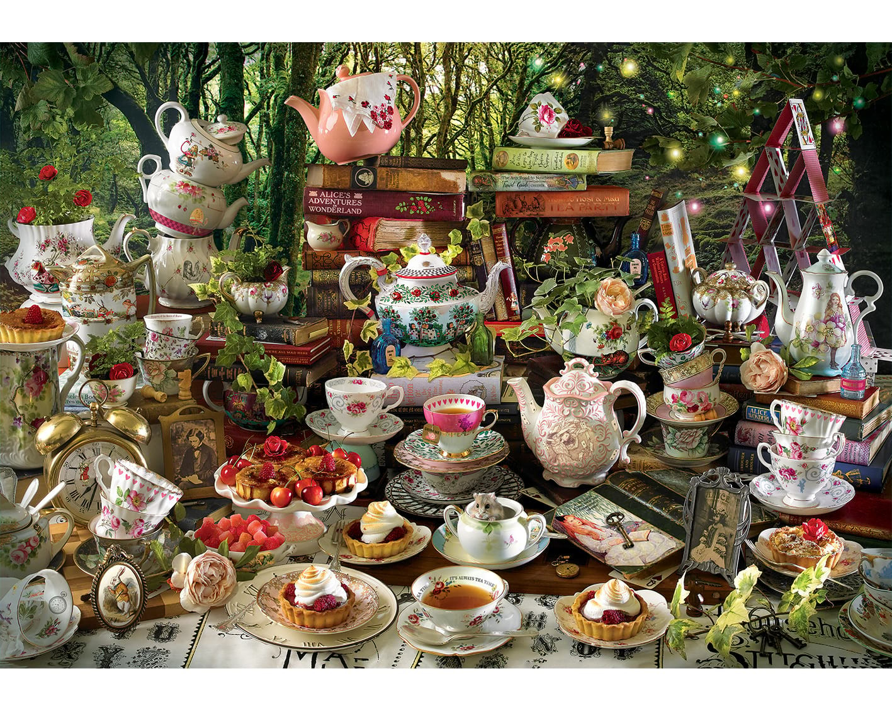

layout:false

background-image: url(assets/images/sna4ds_logo_140.png), url(assets/images/jads_logo_transparent.png), url(assets/images/network_people_7890_cropped2.png)
background-position: 100% 0%, 0% 10%, 0% 0%
background-size: 20%, 20%, cover
background-color: #000000

<br><br><br><br><br>
.full-width-screen-grey.center.fw9.font-250[
# .Orange-inline.f-shadows_into[`r rmarkdown::metadata$title`]
]

***

.full-width-screen-grey.center.fw9[.f-abel[.WhiteSmoke-inline[today's menu: ] .Orange-inline[`r rmarkdown::metadata$topic` .small-caps.font70[(lecture] .font70[`r rmarkdown::metadata$lecture_no`)]]]
  ]

<br>
.f-abel.White-inline[Your lecturer: `r rmarkdown::metadata$author`]<br>
.f-abel.White-inline[Playdate: `r rmarkdown::metadata$playdate`]


<!-- setup options start -->
```{r setup, include=FALSE}
knitr::opts_chunk$set(echo = FALSE,
                  out.width = "90%",
                  fig.height = 6,
                  fig.path = "assets/images/",
                  fig.retina = 2,
                  dev = "svg",
                  message = FALSE,
                  warning = FALSE)
# library(htmlwidgets, quietly = TRUE, verbose = FALSE, warn.conflicts = FALSE)
# library(countdown, quietly = TRUE, verbose = FALSE, warn.conflicts = FALSE)

knitr::opts_knit$set(global.par = TRUE)  # anders worden de margin settings niet overal doorgevoerd
```


```{r lecture_measures_01, include = FALSE}
par(mar = c(0,0,0,0) + .05) #it's important to have this in a separate chunk
```


```{r xaringanExtra_settings, include = FALSE}
xaringanExtra::use_xaringan_extra(c("tile_view"
                                    , "panelset"
                                    , "animate"
                                    , "tachyons"
                                    , "freezeframe"
                                    # , "broadcast"
                                    , "scribble"
                                    , "fit_screen"
                                    ))

# xaringanExtra::use_webcam(300 * 3.5, 300 / 4 * 3 * 3.5)
xaringanExtra::use_editable(expires = 1)
# xaringanExtra::use_search(show_icon = FALSE, case_sensitive = FALSE)
xaringanExtra::use_clipboard()

# htmltools::tagList(
#   xaringanExtra::use_clipboard(
#     button_text = "<i class=\"fa fa-clipboard\"></i>",
#     success_text = "<i class=\"fa fa-check\" style=\"color: #90BE6D\"></i>",
#     error_text = "<i class=\"fa fa-times-circle\" style=\"color: #F94144\"></i>"
#   ),
# rmarkdown::html_dependency_font_awesome()
# )
```


```{r xaringan-extra-styles, echo = FALSE}
xaringanExtra::use_extra_styles(
  hover_code_line = TRUE,         
  mute_unhighlighted_code = TRUE  
)
```

```{css echo=FALSE}
.highlight-last-item > ul > li, 
.highlight-last-item > ol > li {
  opacity: 0.5;
}

.highlight-last-item > ul > li:last-of-type,
.highlight-last-item > ol > li:last-of-type {
  opacity: 1;

.bold-last-item > ul > li:last-of-type,
.bold-last-item > ol > li:last-of-type {
  font-weight: bold;
}

.show-only-last-code-result pre + pre:not(:last-of-type) code[class="remark-code"] {
    display: none;
}
```


```{r some_handy_functions, echo = FALSE}
source("assets/R/components.R")
```


```{css}
.remark-inline-code {
  background: #F5F5F5;
  border-radius: 3px;
  padding: 4px;
}

.inverse-red, .inverse-red h1, .inverse-red h2, .inverse-red h3, .inverse-red a, inverse-red a > code {
	border-top: none;
	background-color: red;
	color: white; 
	background-image: "";
}

.inverse-orange, .inverse-orange h1, .inverse-orange h2, .inverse-orange h3, .inverse-orange a, inverse-orange a > code {
	border-top: none;
	background-color: orange;
	color: black; 
	background-image: "";
}

.tab{
  display: inline-block;
  margin-left: 40px;
}

.tab1{tab-size: 2;}
.tab2{tab-size: 4;}
.tab3{tab-size: 6;}
.tab4{tab-size: 8;}

```


```{css}
.grid-3-2a {
  display: grid;
  height: calc(90%);
  grid-template-columns: repeat(3, 1fr);
  grid-template-rows: 1fr 1fr;
  align-items: center;
  text-align: center;
  grid-gap: 1em;
  padding: 1em;
}
```

<!-- setup options end -->


---
class: course-logo
layout: true
---
background-image: url(assets/images/stepbystep.jpg)
background-size: 350px
background-position: 85% 55%
# Goal for today:
<br>
## Introducing Exponential Random Graph models

These models are going to stay with us for a while

yes, they are in the exam

yes, you MUST use them in the project

## Today we cover 

- what the model is (for)
- theory

So that we make sure that you create a solid connection :)

In the following weeks we will touch data, R package, code, so on and so forth

---
# Disclaimer!

.center[]

.footnote[It seems weird, but when you get used to it, it is just another animal :)]
---
# Menu' for today

<br>

1. Causal Inference Mindset
2. A matter of outcome variable
3. Evolving toward the ERGM
4. A matter of predictors
5. How the model works 
6. More about the predictors
7. Let's observe a case!
8. Software info


 
---
<br> 
<br> 
<br> 
<br> 
<br> 
<br> 
# 1. Causal Inference Mindset


---
background-image: url(assets/images/meter.jpg)
background-size: 350px
background-position: 95% 55%

# NETWORKS

### We
    
    observed them 

    conceptualized them

    described them 

    analyzed their parts and components

### STILL

### Are we truly understanding them? 

### Is a description always enough?

## WE CAN DO MORE

---
# Understanding Networks

<br>
### .center[Why is a network the way it is?]
<br>

- Networks conceptualize relationships of many different kinds
- Relationships are not random

    you don't have random friends
    
    you don't marry someone at random
    
    two atoms are not connected at random
    
    streets don't connect random parts of the city
   
### Describing these relationships is not enough. 
### What causes this specific connections? 

---
# Causal Inference for networks
<br>

## Do you remember .red[causal inference]?

You had a class with Claudia in the .red[Bootcamp]! 

### .center[Prediction VS Inference]


## Inference = Deducing 

<br>

### You already know that you can deduce the causes that generated a network

You had a class with Roger in .red[SNA4DS] --- statistical models for networks!

### .center[Inductive VS Deductive]


---
name: Causal_inference_recap
description: Causal inference models we did so far
# Causal inference RECAP


- for IID data (non network)
    
    OLS
    
    T-test
    
    GLM -- Logistic regressions

- for networks 

    NetLogit
    
    MRQAP
    
    LNAM 

Today we add ERGMs to the list

.red[ERGMs are a class of network models for causal inference]

.red[They are a class of models to deduce the cause of an observed relational phenomenon that we observe/conceptualize as a network.]

---
name: Causal_inference_recap2
description: Causality
# Causal inference RECAP 2a

## Correlation and causation RECAP
<br>
### 2 variables: body weight, gender
<br>
- correlation: body weight & gender (order does not matter)
- causation 
 .center[formula for option 1: body weight ~ gender]
 .center[formula for option 2: gender ~ body weight]

<br>
### Which one makes sense? 

---
name: Causal_inference_recap3
description: Causality explanation of example
# Causal inference RECAP 2b

If 0 is male and 1 is female
## gender ~ body weight

our hypothesis is: 

- If a pregnant woman eats a lot is going to give birth to a girl
<br>
.red[You do realize that this makes no sense, right?]
<br> 
 
## body weight ~ gender

Our model can only test the other hypothesis: 

- Men tend to be bigger than women
<br> 
.red[OBVIOUSLY the only Hypothesis you can test here]


## Causality Matters!


---
<br>
<br>
<br>
<br>
<br>
<br>
# 2. A matter of outcome variable


---
# Explaining network structure
<br>

## ERGMS, as any other statistical model, work with the hypothesis testing (causal) mindset and have:

<br>
### .red[Outcome variable] <- what do we want to explain

### .red[Predictors] <- what we believe could explaining it

<br>
The hypothesis is a sentence that explains how you believe that predictor affects the outcome

We are explaining network structure, right? 

### .red[Our outcome variable MUST be a network]

---
name: conceptualizing_ergm_outcome_var
description: ergm outcome variable is always a network, it can be seen as a dummy variable
# How do you put a network as an outcome variable?
<br>
## A network describes two things
<br>
### relationship --- edge [1] 

### no relationship  --- no edge [0]

<br>

## Does this sound familiar to you? 


---
# How do you put a network as an outcome variable?
<br>
## A network describes two things
<br>
### relationship --- edge [1] 

### no relationship  --- no edge [0]

<br>

## Does this sound familiar to you? 

A logistic regression


---
# Statistical Mindset RECAP 2.0
<br>

- In  non-network regression models (OLS, GLM, ...) we test whether one or more covariates/predictors predict the outcome variable (coef, p-value).
- This is intended to test whether an hypothesized causal relationships exists 
- Did the predictor(s) affect the outcome? (first: theory; second: math)
- Our p-value is the probability that we can exclude that a certain effect is random 
- Our p-value is NOT a probability of the hypothesis being true, it is the conditional probability of being able to reject the null hypothesis given the data
  - We repeat the experiment 1000 times. 
  - We compare our real data to the 1000 experimental results 
  - If real data = 1000 repetitions it happened by chance
  - If real data != 1000 repetitions we can exclude that what we observe happened by chance in our data. 

---
# Statistical Mindset - Moving on
<br>
### It seems the same thing that we are doing here, right?
<br>
### Can we use a Logistic regression for networks? 

---
# Statistical Mindset - Moving on
<br>
### It seems the same thing that we are doing here, right?
<br>
### Can we use a Logistic regression for networks? 
<br>
<br>
# NO 


---
# Assumption Violation

<br>
<br>
## Observations must be Independent and Identically Distributed (IID for friends)
<br>
## If you use a non network model your errors estimations will be incorrect!
<br>
...explaining a network takes more work than explaining a regular variable!

---
background-image: url(assets/images/SPmachine.jpg)
background-size: 450px
background-position: 50% 50%


# We need a new solving problem machine! 
<br>
<br>
<br>
<br>
<br>
<br>
<br>
<br>

# The ERGM

---
<br>
<br>
<br>
<br>
<br>
<br>
# 3. Evolving toward the ERGM

---
background-image: url(assets/images/erdos_renyi.png)
background-size: 350px
background-position: 85% 75%
# Erdos Renyi Game
<br>

## they introduced the "game" of creating random network given fixed parameters

- N - number of nodes
- E - number of edges (or probability of edge formation)


---
name: Erdos_Renyi
description: Erdos Renyi model
# A very simple ERGM
<br>
## Looking at the structure of the network

### What is the probability that we observe a network with that specific connections out of all the possible combinations?

In probability terms this is: 

$log P_{ij} (0/1) = λ_{ij}$

Where 

- $P_{ij} (0, 1)$ is the probability of having or not having an edge between each pair of nodes.
- $λ_{ij}$ a parameter that expresses a rate for edge propagation (in our case N of edges)


We compare an observed network against random networks generated with the same parameters.

---
name: Erdos_Renyi1
description: Erdos Renyi model example

## Research design
<br>
### General example

RQ: Given the number of nodes in my network, how likely it is that my number of edges is random? 

H1: The number of edges I observe is not random

H0: The number of edges is random

### Specific example

RQ: Given that in this class there are 80 students, how likely it is that they are friends with anyone? 

H1: I observe THIS number of friendships between pairs of students given by the fact that they get along

H0: I observe THIS number of friendships between pairs of students and there is no reason for it


---
background-image: url(assets/images/Hack_Day.jpg)
background-size: 200px
background-position: 90% 10%
# More complex example
<br>
### Consider all the students at JADS as nodes 

## Let's say that JADS organizes an Hackathon with 5K euros at stake 

## You have to form groups to work together every day

### If you study together there is an edge between each pair of you

### I map down the study-together dynamics two days before the Hackathon


.red[If I compare that network to random ones, do you think my observed one will show some particular features?]

---
background-image: url(assets/images/Hack_Day.jpg)
background-size: 200px
background-position: 90% 10%
# More complex example
<br>
### Consider all the students at JADS as nodes 

## Let's say that JADS organizes an Hackathon with 5K euros at stake 

## You have to form groups to work together every day

### If you study together there is an edge between each pair of you

### I map down the study-together dynamics two days before the Hackathon


.red[If I compare that network to random ones, do you think my observed one will show some particular features?]

Yes. Connections will be different than random, they are driven by a purpose (e.g., everyone wants to connect with good coders etc...)


---
background-image: url(assets/images/Instagram_logo_2016.svg.png)
background-size: 450px
background-position: 90% 50%
name: P1_model
description: P1 model
# Let's use more predictors (P1 model)

Let's do something a little more juicy, shall we? 

### We have a directed network such as Instagram followers. 

You might follow me, but i might not follow you. 

We can observe: 

- senders (followers) A --> B
- receivers (followed) A <-- B
- mutual (followers & receivers together)  A <--> B

P(0, 0) = no edge 

P(1, 0) = send an edge

P(0, 1) = receive an edge 

P(1, 1) = mutual


---
# This model in math [P1 model]
<br>

$log P_{ij} (1/0) = λ_{ij} + α_i + β_j + α_j + β_i + 2θ + ρ_{ij}$

<br>

$λ_{ij}$ probability of the density (N of edges) ER

$α_i$ sender i

$β_j$ receiver j

$α_j$ sender j

$β_i$ receiver i

$2θ + ρ_{ij}$ mutual 

We want to observe these parameters and see whether they are or not random in the network


---
# Expanding our horizons

If we can measure density, sender, receiver, and mutual, 

Why not the rest?

## You know how to measure networks


Dyad Census

Triad Census

...

Are these effects random or are these effect driven by some reason? 


In the ERGM we can estimate the probability of particular descriptive measures that we extract from the network to be non-random (reject the null) 

-- we still don't know the cause, but we can assume it is a good one.


---
<br>
<br>
<br>
<br>
<br>
<br>

# 4. A matter of predictors
---
background-image: url(assets/images/storm2.png)
background-size: 750px
background-position: 85% 85%
name: Predictors
description: Exogeneous and Endogeneous effects
# Two main Different types of predictors 

<br>
## Exogenous: Outside

## Endogenous: Inside


---
# Endogenous 
<br>
## Effects occurring within the outcome network of interest
<br>
(what happens inside the house in the picture -- inside the network)
<br>
### We already saw

- edge
- sender
- receiver
- mutual 
- ...
- other measures of interest

---
# Exogenous
<br>
## Effects occurring outside of the outcome network 

(like the hurricane)

<br>

### Intuitively, this type of variables correspond to the extra information that is not naturally embedded in the network - They are outside of the network

For example:


If we want to explain the reason why JADS students might play football together using the variable "How much do you like football" 1-5 might already help, right? 

 


---
<br>
<br>
<br>
<br>
<br>
<br>

# 5. How the model works


---
name: ergm_math
description: Mathematical model of the ERGM
# Exponential Random Graph Model (P*)

<br>

## $P(N,\theta) = \frac{exp\{\theta^T h(N)\}}{\sum_{N^*\in \mathcal{N}} exp\{\theta^T h(N^*) \}^T}$

---
# Exponential Random Graph Model (P*)

<br>

## $P(N,\theta) = \frac{exp\{\theta^T h(N)\}}{\sum_{N^*\in \mathcal{N}} exp\{\theta^T h(N^*) \}^T}$

- $P(N,\theta)$ - Probability of observing this real Network, with these coefficients

---
# Exponential Random Graph Model (P*)

<br>

## $P(N,\theta) = \frac{exp\{\theta^T h(N)\}}{\sum_{N^*\in \mathcal{N}} exp\{\theta^T h(N^*) \}^T}$

- $P(N,\theta)$ - Probability of observing this real Network, with these coefficients
- $h(N)$ - Using a combination of network statistics taken from the observed network


---
# Exponential Random Graph Model (P*)

<br>

## $P(N,\theta) = \frac{exp\{\theta^T h(N)\}}{\sum_{N^*\in \mathcal{N}} exp\{\theta^T h(N^*) \}^T}$

- $P(N,\theta)$ - Probability of observing this real Network, with these coefficients
- $h(N)$ - Using a combination of network statistics taken from the observed network
- $\theta^T$ - Estimating this/these parameter(s)

---
# Exponential Random Graph Model (P*)

<br>

## $P(N,\theta) = \frac{exp\{\theta^T h(N)\}}{\sum_{N^*\in \mathcal{N}} exp\{\theta^T h(N^*) \}^T}$

- $P(N,\theta)$ - Probability of observing this real Network, with these coefficients
- $h(N)$ - Using a combination of network statistics taken from the observed network
- $\theta^T$ - Estimating this/these parameter(s)
- $N^*$ - Confronting the real network with all the permutations that are possible
---
# Exponential Random Graph Model (P*)

<br>

## $P(N,\theta) = \frac{exp\{\theta^T h(N)\}}{\sum_{N^*\in \mathcal{N}} exp\{\theta^T h(N^*) \}^T}$

- $P(N,\theta)$ - Probability of observing this real Network, with these coefficients
- $h(N)$ - Using a combination of network statistics taken from the observed network
- $\theta^T$ - Estimating this/these parameter(s)
- $N^*$ - Confronting the real network with all the permutations that are possible
- $\sum_{N^*\in \mathcal{N}} exp\{\theta^T h(N^*) \}^T$ normalizing coefficient: Exponential function of the summation of all possible permutation weighted for all the coefficients estimated with the given data 


---
# Exponential Random Graph Model (P*)

<br>

## $P(N,\theta) = \frac{exp\{\theta^T h(N)\}}{\sum_{N^*\in \mathcal{N}} exp\{\theta^T h(N^*) \}^T}$

- $P(N,\theta)$ - Probability of observing this real Network, with these coefficients
- $h(N)$ - Using a combination of network statistics taken from the observed network
- $\theta^T$ - Estimating this/these parameter(s)
- $N^*$ - Confronting the real network with all the permutations that are possible
- $\sum_{N^*\in \mathcal{N}} exp\{\theta^T h(N^*) \}^T$ normalizing coefficient: Exponential function of the summation of all possible permutation weighted for all the coefficients estimated with the given data 

*Permutation: check all the possible combination that exist between each pair of nodes 
---
<br>
<br>
<br>
<br>
<br>
<br>
# 6. More about the predictors

---
name: ergm_effects
description: intuitive idea of ergm effects within the model
# Model Terms or Effects
<br>
## IID linear model (GLM): We can test hypotheses with predictors and controls 

<br>

You get an .red[estimate] and check whether the outcome variable

.red[increases] or .red[decreases]

When predictor/control variates

These predictors/controls are always information about something

## You already saw that, but with ERGMs we can be more flexible. 

## .red[We can customize model terms as much as we like! including both information (exogenous) and network structure (endogenous)]


---
# Plug in effects in the equation
<br>
<br>
## Many things that you can observe in a network can be inserted in an ERGM

## $h(N)$ - Using a combination of network statistics
<br>
## We can plug in effects in the equation here (see the full equation above).

---
background-image: url(assets/images/reciprocity.png)
background-size: 550px
background-position: 85% 85%
# Example: Mutual
<br> 
### In the P1 model we already saw the mutual term 

### .red[Reciprocity]: If I follow you on Instagram, what is the probability that you will follow me back?
<br> 
<br>
### In Math

### $h = \sum_{i<j} N_{ij} N_{ji}$

---
# ERGM with Reciprocity effect
<br> 
substititute the reciprocity formula in the generic parameter $h(N)$
<br> 
<br>
## $P(N,\theta) = \frac{exp\{\theta^T (\sum_{i<j} N_{ij} N_{ji})\}}{\sum_{N^*\in \mathcal{N}} exp\{\theta^T (\sum_{i<j} N_{ij}^* N_{ji}^*)\}^T}$

<br> 

If you insert more than one effect you keep adding them up - here it is edges + mutual

## $P(N,\theta) = \frac{\exp\{\theta^T (\sum_{i \neq j} N_{ij} + \sum_{i<j} N_{ij} N_{ji})\}}{\sum_{N^*\in \mathcal{N}} \exp\{\theta^T (\sum_{i \neq j} N^*_{ij} + \sum_{i<j} N^*_{ij} N^*_{ji})\}^T}$


---
background-image: url(assets/images/tailor.jpg)
background-size: 350px
background-position: 85% 55%
name: ergm_theory
description: How to theoretically approach an ergm

<br>
<br>
<br>
## What you ultimately want is to reconstruct <br> a list of parameters that explain in the best <br> possible way what is going on with your data.

<br>
<br>
Same as tailors with their client!

---
# Sim city
<br>

.center[]

<br>
<br>

### In other words, it is like playing Sim City. It's just that you don't see the graphic interface, but model parameters :)


---
name: ergm_recap
description: ergm model features
# Recap

Outcome variable: Always a .red[Network]

Predictors: Exogenous and Endogenous 

Effects: for both kind of predictors, several effects to look at

Prediction: Linear Model

Specification: Theory driven (Research question, hypothesis testing)

How it works: 

- We specify a model that we believe generates the synthetic reality we care for

- The model expresses a probability distribution that generate networks that behave as the observed one

- We compare real data to the generated data 

- We can make some conclusions on what caused the relationships observed in the network (test the hypothesis)

How does this run? We will talk about the algorithm to estimate these models in the following lessons. 

---
<br>
<br>
<br>
<br>
<br>
<br>
# 7. Let's observe a case!

---
background-image: url(assets/images/school_ergm.jpg)
background-size: 350px
background-position: 85% 55%
name: ergm_reasoning_example
description: How to approach a research design with ergms
# Data
<br>
We collected network data in a school since we are interested in understanding the dynamics of friendship.
<br>
We have three nodal attributes

- their gender
- their age
- who is a smoker


---
# Questions and Hypothesis 
<br>
## (thinking in regressions mindset -- causal mindset)
<br>
RQ: What are the drivers of friendship in this school?
<br>
After doing some research we believe that young people are 


- more likely to make friends with people of the same gender
- more likely to make friends with people closer to their age
- smokers are more likely to be friends with other smokers

---
# Questions and Hypothesis 
<br>
## (thinking in regressions mindset -- causal mindset)
<br>
RQ: What are the drivers of friendship in this school?
<br>
After doing some research we believe that young people are 

- more likely to make friends with people of the same gender
- more likely to make friends with people closer to their age
- smokers are more likely to be friends with other smokers


## These hypotheses all refer to exogenous predictors!

---
# Exogenous effects 
<br>
- more likely to make friends with people of the same gender

.red[HOMOPHILY]

---
# Exogenous effects 
<br>
- more likely to make friends with people of the same gender

.red[HOMOPHILY]

- more likely to make friends with people closer to their age

.red[ABSOLUTE DIFFERENCE IN AGE]

---
# Exogenous effects 
<br>
- more likely to make friends with people of the same gender

.red[HOMOPHILY]

- more likely to make friends with people closer to their age

.red[ABSOLUTE DIFFERENCE IN AGE]

- smokers are more likely to be friends with other smokers

.red[HOMOPHILY]

---
# Questions and Hypothesis (thinking ergm)

<br>

We know that friendship in a school does not have homogeneous patterns (== to random)

- There are some people that are more popular than others 
- There are some people that are more social than others

---
# Questions and Hypothesis (thinking ergm)
<br>
We know that friendship in a school does not have homogeneous patterns (== to random)

- There are some people that are more popular than others 
- There are some people that are more social than others

## These hypotheses all refer to endogenous predictors!

---
# Endogenous effects 
<br>
- There are some people that are more popular than others

.red[POPULARITY] -- preferential attachment (Barabasi and Albert)

Receiving ties

---
# Endogenous effects 
<br>
- There are some people that are more popular than others

.red[POPULARITY] -- preferential attachment (Barabasi and Albert)

Receiving ties

- There are some people that are more social than others

.red[SOCIALITY]

Sending ties 

---
# Model specification
<br>
After we did this research design we would know what to insert in our model 

In PROTO-CODE, the model would be something like that

<br>

school ~ .red[HOMOPHILY] (Gender) + .red[ABSOLUTE DIFFERENCE] (Age) + .red[HOMOPHILY] (Smokers) + .red[POPULARITY] + .red[SOCIALITY]

<br>

For this round I leave the math to you since this starts to be quite long :)

---
<br>
<br>
<br>
<br>
<br>
<br>
# 8. Software info


---
background-image: url(assets/images/statnet.png)
background-size: 450px
background-position: 85% 85%
name: statnet
description: Introducing statnet

# statnet


### Suite of R packages for the management, exploration, statistical analysis, simulation and visualization of network data. 


http://statnet.org/


<br>

<br>

<br>

It takes objects of class `networks`

It does NOT take objects of class `igraph`

---
# And now it is time for tea!

.center[]


