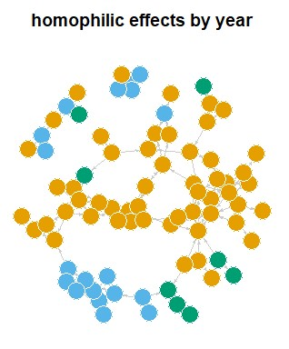
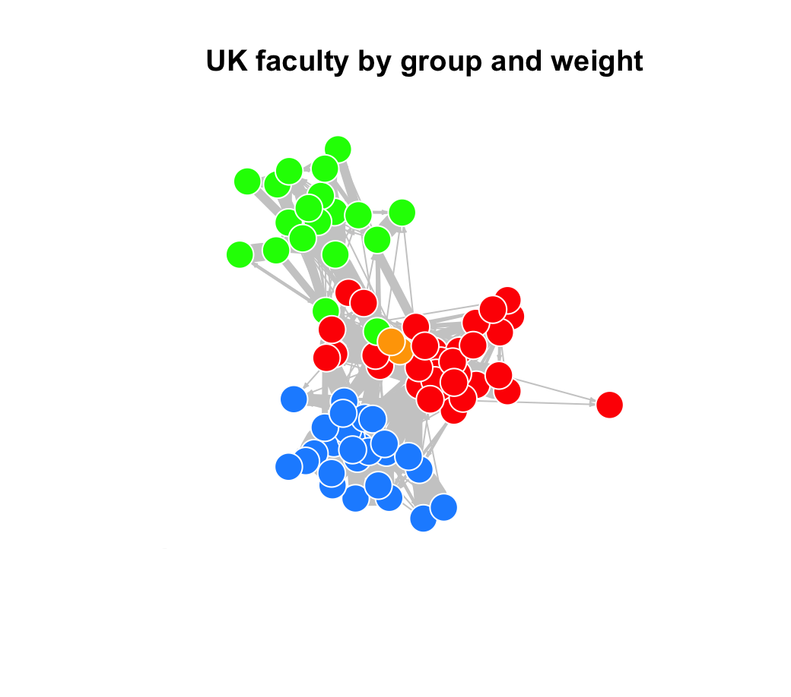
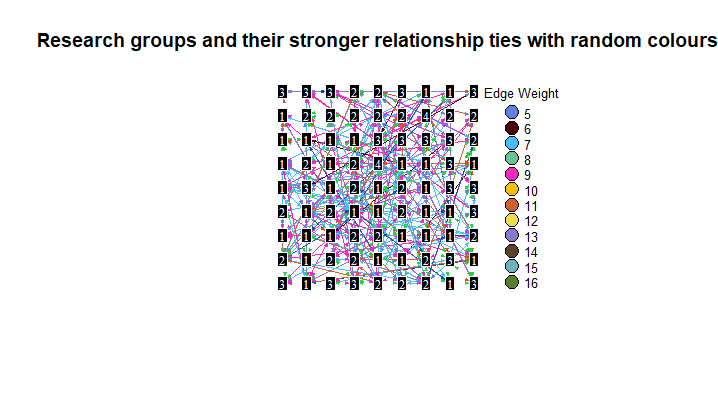
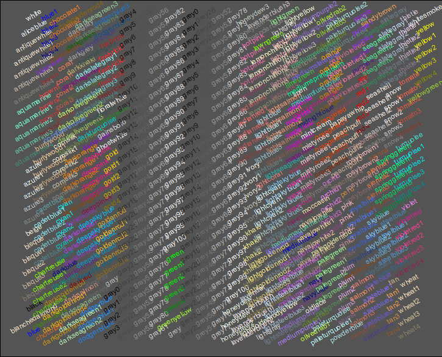

layout:false

background-image: url(assets/images/sna4ds_logo_140.png), url(assets/images/jads_logo_transparent.png), url(assets/images/network_people_7890_cropped2.png)
background-position: 100% 0%, 0% 10%, 0% 0%
background-size: 20%, 20%, cover
background-color: #000000

<br><br><br><br><br>
.full-width-screen-grey.center.fw9.font-250[
# .Orange-inline.f-shadows_into[`r rmarkdown::metadata$title`]
]

***

.full-width-screen-grey.center.fw9[.f-abel[.WhiteSmoke-inline[today's menu: ] .Orange-inline[`r rmarkdown::metadata$topic` .small-caps.font70[(lecture] .font70[`r rmarkdown::metadata$lecture_no`)]]]
  ]

<br>
.f-abel.White-inline[Your lecturer: `r rmarkdown::metadata$author`]<br>
.f-abel.White-inline[Playdate: `r rmarkdown::metadata$playdate`]


<!-- setup options start -->
```{r setup, include=FALSE}
knitr::opts_chunk$set(echo = FALSE,
                  out.width = "90%",
                  fig.height = 6,
                  fig.path = "assets/images/",
                  fig.retina = 2,
                  dev = "svg",
                  message = FALSE,
                  warning = FALSE)
# library(htmlwidgets, quietly = TRUE, verbose = FALSE, warn.conflicts = FALSE)
# library(countdown, quietly = TRUE, verbose = FALSE, warn.conflicts = FALSE)

knitr::opts_knit$set(global.par = TRUE)  # anders worden de margin settings niet overal doorgevoerd
```


```{r lecture_measures_01, include = FALSE}
par(mar = c(0,0,0,0) + .05) #it's important to have this in a separate chunk
```


```{r xaringanExtra_settings, include = FALSE}
xaringanExtra::use_xaringan_extra(c("tile_view"
                                    , "panelset"
                                    , "animate"
                                    , "tachyons"
                                    , "freezeframe"
                                    # , "broadcast"
                                    , "scribble"
                                    , "fit_screen"
                                    ))

# xaringanExtra::use_webcam(300 * 3.5, 300 / 4 * 3 * 3.5)
xaringanExtra::use_editable(expires = 1)
# xaringanExtra::use_search(show_icon = FALSE, case_sensitive = FALSE)
xaringanExtra::use_clipboard()

# htmltools::tagList(
#   xaringanExtra::use_clipboard(
#     button_text = "<i class=\"fa fa-clipboard\"></i>",
#     success_text = "<i class=\"fa fa-check\" style=\"color: #90BE6D\"></i>",
#     error_text = "<i class=\"fa fa-times-circle\" style=\"color: #F94144\"></i>"
#   ),
# rmarkdown::html_dependency_font_awesome()
# )
```


```{r xaringan-extra-styles, echo = FALSE}
xaringanExtra::use_extra_styles(
  hover_code_line = TRUE,         
  mute_unhighlighted_code = TRUE  
)
```

```{css echo=FALSE}
.highlight-last-item > ul > li, 
.highlight-last-item > ol > li {
  opacity: 0.5;
}

.highlight-last-item > ul > li:last-of-type,
.highlight-last-item > ol > li:last-of-type {
  opacity: 1;

.bold-last-item > ul > li:last-of-type,
.bold-last-item > ol > li:last-of-type {
  font-weight: bold;
}

.show-only-last-code-result pre + pre:not(:last-of-type) code[class="remark-code"] {
    display: none;
}
```


```{r some_handy_functions, echo = FALSE}
source("assets/R/components.R")
```


```{css}
.remark-inline-code {
  background: #F5F5F5;
  border-radius: 3px;
  padding: 4px;
}

.inverse-red, .inverse-red h1, .inverse-red h2, .inverse-red h3, .inverse-red a, inverse-red a > code {
	border-top: none;
	background-color: red;
	color: white; 
	background-image: "";
}

.inverse-orange, .inverse-orange h1, .inverse-orange h2, .inverse-orange h3, .inverse-orange a, inverse-orange a > code {
	border-top: none;
	background-color: orange;
	color: black; 
	background-image: "";
}

.tab{
  display: inline-block;
  margin-left: 40px;
}

.tab1{tab-size: 2;}
.tab2{tab-size: 4;}
.tab3{tab-size: 6;}
.tab4{tab-size: 8;}

```


```{css}
.grid-3-2a {
  display: grid;
  height: calc(90%);
  grid-template-columns: repeat(3, 1fr);
  grid-template-rows: 1fr 1fr;
  align-items: center;
  text-align: center;
  grid-gap: 1em;
  padding: 1em;
}
```

<!-- setup options end -->


---
class: course-logo
layout: true

---
name: Menu
description: Topics covered in today's lab
# Menu' for today
<br>
<br>
1. In the making of a viz
  1. What
  2. Why
  3. How
2. Homeplay
3. Tricks or treats
4. Final Remarks


---
<br>
<br>
<br>
<br>

> "As network researchers our biggest advantage in communicating our impact is the really pretty pictures we can make."  
\-  _Anonymous Network Scholar at a conference_

---
<br>
<br>
<br>
<br>
<br>
<br>
<br>
# 1. In the making of a viz
---
name: Thinking_Viz
description: How to conceptualize visualizations before plotting them
# What's a viz?

.center[]
---
# What's a viz?

<br>
<br>
<br>
## VISUALIZATION = MESSAGE
<br>
### Metaphor for some parts of reality or concepts that we are explaining

---
# Anatomy of a visualization 
<br>
## **What** are you working with?
<br>
## **Why** are you making the viz?
<br>
## **How** can you best achieve this goal?


.footnote[Excellent book on visualizations: Munzner, T. (2015). Visualization analysis & design. CRC Press. https://doi.org/10.1201/b17511 ]

---
# What are you working with?

---
# What are you working with?
<br>
## Taking stock of your resources

---
# What are you working with?
<br>
## Taking stock of your resources

## You have a network

---
# What are you working with?
<br>
## Taking stock of your resources

## You have a network

### What about attributes?
- Nodes/edges? 
- Categorical? Continuous? Ordinal? 
- Temporal stuff?
- Missing data?

---
# What are you working with?
<br>
<br>
<br>
<br>

## Taking stock of your raw materials is the foundation of the visualization process.

---
# Why are you making the visualization?
<br>
<br>
<br>
## What's the goal of the viz?
  
## What is the message you want to get across?
  
## Who is your audience?

---
# Why are you making the visualization?
<br>
<br>
<br>
## Discover? Present? Enjoy? 


---
# Why are you making the visualization?
<br>
<br>
<br>
## Discover? Present? Enjoy? 
## Compare? Identify? Summarize? 

---
# Why are you making the visualization?
<br>
<br>
<br>
## Discover? Present? Enjoy? 
## Compare? Identify? Summarize? 
<br>
<br>
## No right or wrong, just make sure you're clear on this.

---

# Some skin in the game: my visualizations


  

---
# **How** you can best achieve these goals?

<br>
## In this class it's `igraph`. Still, which `igraph` functions are most useful for your goals?

## Get to know your tool, make the most of it. 

---
# c. Does your strategy work with your data and with your tool? 
<br>

.center[]

 
---
background-image: url(assets/images/green_edges.jpg)
background-size: 350px
background-position: 50% 85%
# Example 1 
<br>
## You want to show passages in a network of football players.

### Since the football court is green you decide it would be impactful to use the color green for the edges (passages). 
    
 

.footnote[Match the idea with the reality of the tools you have: It is theoretically a nice, but impossible to read it.]


---
background-image: url(assets/images/curved_edges.jpg)
background-size: 350px
background-position: 50% 85%
# Example 2
<br>

## You are plotting a network of dancers and you decide that using curved edges is more romantic.

.footnote[Match the idea with the reality of the tools you have: You might be artistically right, but it gets really hard to see where the edges are going] 


---
# d. Fancy versus functional
<br>
<br>
## You want to insert too much information in a very elaborated way
   
- many colors
- weird node shapes
- labels on the nodes and edges
- ...
    
## Networks are a bit too powerful for their (your) own good.
  
---
# Tutorials plot: <br> What's the message? Is it clear?

.center[]


.footnote[Can you see social dynamics? Can you plot it better to show homophily?]

---
.center[]

---
# Better?

.center[]

---
<br>
<br>
<br>
<br>
<br>
<br>
<br>
# 2. Homeplay

---
name: homeplay
description: Discussing the homeplay
# What is this network about?

<br>
### Load the network “UKfaculty”

### 81 nodes

### 817 edges

### 1 nodes attribute (school affiliation)

### 1 edge attribute (how often they are in contact)

---
# Very simple story

<br>
### There are people working in a university and they are organized in three groups. 
[same as JADS: we have three units]

## Story/Goal

### You want to be able to show the pattern of contacts within groups and accross groups

---
# Plot 1 Instruction
<br>

### make a visualization using 

* one edge attribute

* one node attribute


### that are able to tell what is happening in this network. 

### Decide what is the best way to represent this story first and plot after.

---
<div style="
  display: grid;
  grid-template-columns: repeat(3, 1fr);
  gap: 10px;
  margin: 20px 0;
  justify-items: center;
">

  

  

  

  

  

  

</div>

---

## Too powerful for it's own good?


---
# Plot 2 Instruction
<br>

### Plot the same graph, but with


* a lattice layout (just for fun) 
* nodes with a rectangular shape
* black nodes
* white nodes labels
* a surprise element of your choice!


---

<!-- Container for the entire grid -->
<div style="width: 100%; margin: 0 auto;">

<div style="
  display: grid;
  grid-template-columns: repeat(3, 1fr);
  gap: 15px;
  margin: 20px 0;
  justify-items: center;
  align-items: center;
">

  

  

  

  

  

  

</div>


---
# Plot 2 from one of your former colleagues 

.center[]

---
# Plot 2 from some of last year's students ^_^

.center[]


---
background-image: url(assets/images/Homeplay_funnyPlot.jpg)
background-size: 500px
background-position: 50% 85%
# I'm funny and I know it!

---
<br>
<br>
<br>
<br>
<br>
<br>
<br>
# 3. Tricks or treats

---
# Storing the color in the graph

### In the tutorial: node color scale plot 

.scroll-box-18[
```{r viz 01, echo=TRUE}

# # Generate colors based on how often they hang out:
# colrs <- c("cadetblue", "dodgerblue", "dodgerblue3", "blue", "darkblue" )
# # create a new attribute with the color
# igraph::V(net)$color <- colrs[igraph::V(net)$Hang.Out] # we attribute each category to a colour
# 
# plot(net,
#      edge.arrow.size = .2, 
#      edge.color = "gray80",
#      vertex.frame.color = "#ffffff",#node perimeter
#      vertex.label = igraph::V(net)$gender, 
#      vertex.label.cex = 0.6,  # vertex label size
#      vertex.label.color = "black", 
#      vertex.size = igraph::V(net)$DS*2,
# ) 


```
]


---
name: Storing_plot_features
description: Alternative way of plotting with storing plot parameters in the graph
# Storing plot features BEFORE the function

In general, you can also set your preferences before the plot 

###  Add attributes with the parameter names the same way you would add columns to a data frame
In the second way parameters remain stored
.scroll-box-18[
```{r viz 02, echo=TRUE}
################################################################################
#                         As we did it so far
################################################################################
# 
# plot(UKfaculty,
#      vertex.shape="circle",
#      vertex.label = NA,
#      vertex.color = igraph::V(UKfaculty)$Group,
#      edge.width = igraph::E(UKfaculty)$weight*0.5,
#      edge.arrow.size = 0.1,
#      layout = igraph::layout_on_grid,
#      main= "Homophilic behavior by group")

################################################################################
#                          Alternative way
################################################################################
#
# igraph::V(UKfaculty)$color <-  igraph::V(UKfaculty)$Group
# igraph::E(UKfaculty)$width <-  igraph::E(UKfaculty)$weight*0.5
# igraph::graph_attr(UKfaculty, "layout") <- igraph::layout_on_grid
# 
# plot(UKfaculty,
#      vertex.shape="circle",
#      vertex.label = NA,
#      edge.arrow.size = 0.1,
#      main= "Homophilic behavior by group")


```
]

---
name: edge_as_color_scale
description: Plotting a color scale on the edges
# Storing the weight of the edges as color

.center[]

---
# DIY

.scroll-box-18[
```{r viz 03, echo=TRUE}

###### edge weight in color 

# table(igraph::E(UKfaculty)$weight)
# 
# 
# igraph::E(UKfaculty)$Ecolor <- ifelse(igraph::E(UKfaculty)$weight <= 5, "cadetblue",
#                                       ifelse(igraph::E(UKfaculty)$weight > 5 & igraph::E(UKfaculty)$weight <= 10, "dodgerblue",
#                                              ifelse(igraph::E(UKfaculty)$weight > 10 & igraph::E(UKfaculty)$weight <= 15, "blue",
#                                                     ifelse(igraph::E(UKfaculty)$weight > 15, "darkblue", NA))))
# 
#                                       
# table(igraph::E(UKfaculty)$Ecolor)
# 
# 
# plot(UKfaculty,
#      edge.arrow.size = .5, 
#      edge.size = 2,
#      edge.color = igraph::E(UKfaculty)$Ecolor,
#      vertex.color = igraph::V(UKfaculty)$Group, 
#      vertex.frame.color = "#ffffff",#node perimeter
#      vertex.label = NA, 
#      vertex.size = 6, 
#      layout = igraph::layout.fruchterman.reingold, 
#      main = "UKfaculty: Groups and relationships"
# ) 
# 
# colrs <- c("cadetblue", "dodgerblue", "blue", "darkblue")
# graphics::legend(x = -1.5, y = -1.1, c("below 5 times","between 5 and 10 times", 
#                  "between 10 and 15 times", "over 15 times"), pch = 21,
#                  col = "#777777", pt.bg = colrs, pt.cex = 2, cex = .8, bty = "n", ncol = 1)
# 
# 


```
]


---
name: layout_customization
description: How to manually customize a layout
background-image: url(assets/images/HomeplayplotLwfr.jpg)
background-size: 500px
background-position: 75% 85%
# Beyond the standard layout
<br>
<br>
## This can be improved! 
<br>
<br>
`igraph::layout_with_fr`

---
# How does the layout work?

```{r layout_options00, echo=FALSE}
data(UKfaculty, package = "igraphdata")
```

### The layout in igraph is defined in a matrix with 2 columns and a row for each node. 
<br>
- The first column indicates its x position
- the second its y position
```{r layout_options01, echo=TRUE}

l <-igraph::layout_with_fr(UKfaculty) 

head(l)
```

---
# Modify an existing layout
The scale is not relevant (it is always re-scaled to fit a -1 to 1 plotting area. 

You can get this layout before plotting by just calling the layout function on the graph:

```{r layout_options02, echo=TRUE}

l <- igraph::layout_on_grid(UKfaculty) 
 
l[1, ] <- c(-1, -1)
 
# plot(UKfaculty, 
#       vertex.shape="rectangle",
#       vertex.label.color = "white",
#       vertex.color = "black",
#       layout = l, 
#       main= "My plot")
```
---
# Beyond the layout

.center[]


---
name: tkplot
description: Usage of the manual layout function
# Move! 

This cannot work in the slides! 

```{r layout_options03, echo=TRUE}
# igraph::tkplot(UKfaculty)
 

```


---
name: Color_palette
description: Finding colors for plots in R
# Color palette

- hexadecimal color codes
- `demo("colors")` that are inbuilt in R `grDevices`
- several packages

.center[]


---
<br>
<br>
<br>
<br>
<br>
<br>
<br>
# 4. Final Remarks
---
# Your Book
<br>
### ... is plotting using `network` 

### that code won't work with `igraph` objects. 
<br>

### Still, the logic is very similar

### `snafun::to_igraph` & `snafun::plot` 

### OR you can always use `intergraph` and plot in `igraph`

### OR look up the corresponding paramenters and plot in `network`


---
name: Parameter_summary
description: A summary of the most useful parameters for plotting in igraph
## .red[Parameters RECAP] there are many more. These are the essentials

### vertex:
- `vertex.shape`
- `vertex.color`
- `vertex.label`
- `vertex.size`
- `vertex.frame.color`

### edge:
- `edge.arrow.size`
- `edge.color`
- `edge.width`

### overall:  `layout`


---
name: Viz2022Data
description: Visualization of 2022 cohort data
<br>
<br>
<br>
<br>
<br>
<br>
<br>
# Some more JADS students Viz!

.center[]

---
<br>
# The tutorial data is from 2 years ago! 
<br>
## Still...
<br>
## .center[.red[Let's take a look to JADS data!]]


---
# What does this image tell us?

.center[]

---
# What does this image tell us?

.center[]

---
# Etenstijd!

.center[]


