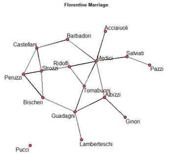
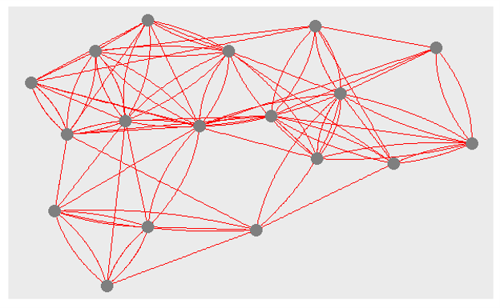
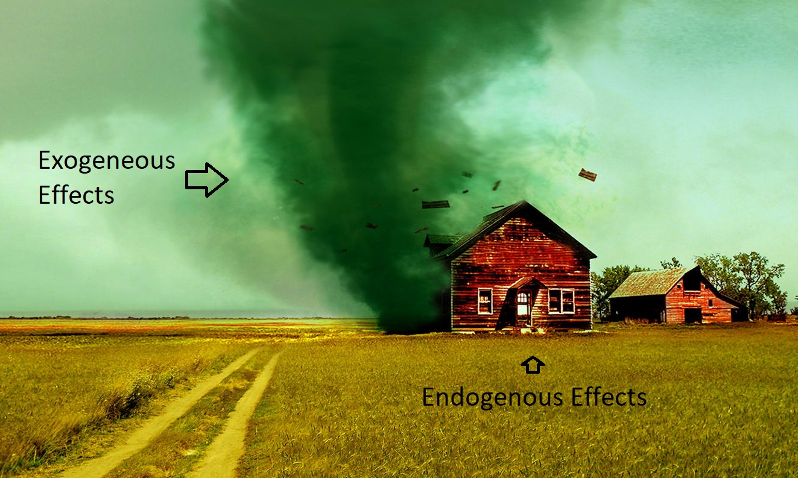
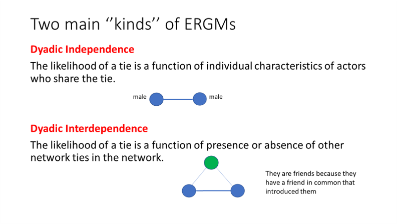
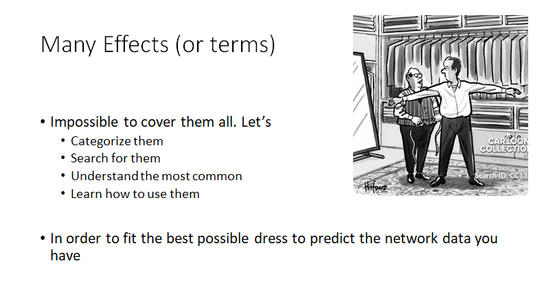
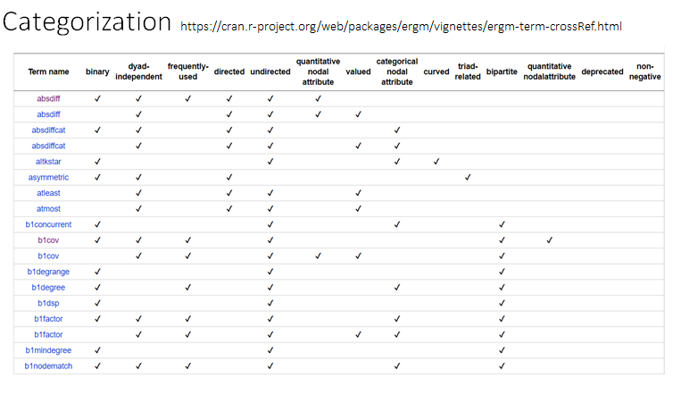
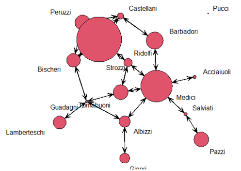

layout:false

background-image: url(assets/images/sna4ds_logo_140.png), url(assets/images/jads_logo_transparent.png), url(assets/images/network_people_7890_cropped2.png)
background-position: 100% 0%, 0% 10%, 0% 0%
background-size: 20%, 20%, cover
background-color: #000000

<br><br><br><br><br>
.full-width-screen-grey.center.fw9.font-250[
# .Orange-inline.f-shadows_into[`r rmarkdown::metadata$title`]
]

***

.full-width-screen-grey.center.fw9[.f-abel[.WhiteSmoke-inline[today's menu: ] .Orange-inline[`r rmarkdown::metadata$topic` .small-caps.font70[(lecture] .font70[`r rmarkdown::metadata$lecture_no`)]]]
  ]

<br>
.f-abel.White-inline[Your lecturer: `r rmarkdown::metadata$author`]<br>
.f-abel.White-inline[Playdate: `r rmarkdown::metadata$playdate`]


<!-- setup options start -->
```{r setup, include=FALSE}
knitr::opts_chunk$set(echo = FALSE,
                  out.width = "90%",
                  fig.height = 6,
                  fig.path = "assets/images/",
                  fig.retina = 2,
                  dev = "svg",
                  message = FALSE,
                  warning = FALSE)
# library(htmlwidgets, quietly = TRUE, verbose = FALSE, warn.conflicts = FALSE)
# library(countdown, quietly = TRUE, verbose = FALSE, warn.conflicts = FALSE)

knitr::opts_knit$set(global.par = TRUE)  # anders worden de margin settings niet overal doorgevoerd
```


```{r lecture_measures_01, include = FALSE}
par(mar = c(0,0,0,0) + .05) #it's important to have this in a separate chunk
```


```{r xaringanExtra_settings, include = FALSE}
xaringanExtra::use_xaringan_extra(c("tile_view"
                                    , "panelset"
                                    , "animate"
                                    , "tachyons"
                                    , "freezeframe"
                                    # , "broadcast"
                                    , "scribble"
                                    , "fit_screen"
                                    ))

# xaringanExtra::use_webcam(300 * 3.5, 300 / 4 * 3 * 3.5)
xaringanExtra::use_editable(expires = 1)
# xaringanExtra::use_search(show_icon = FALSE, case_sensitive = FALSE)
xaringanExtra::use_clipboard()

# htmltools::tagList(
#   xaringanExtra::use_clipboard(
#     button_text = "<i class=\"fa fa-clipboard\"></i>",
#     success_text = "<i class=\"fa fa-check\" style=\"color: #90BE6D\"></i>",
#     error_text = "<i class=\"fa fa-times-circle\" style=\"color: #F94144\"></i>"
#   ),
# rmarkdown::html_dependency_font_awesome()
# )
```


```{r xaringan-extra-styles, echo = FALSE}
xaringanExtra::use_extra_styles(
  hover_code_line = TRUE,         
  mute_unhighlighted_code = TRUE  
)
```

```{css echo=FALSE}
.highlight-last-item > ul > li, 
.highlight-last-item > ol > li {
  opacity: 0.5;
}

.highlight-last-item > ul > li:last-of-type,
.highlight-last-item > ol > li:last-of-type {
  opacity: 1;

.bold-last-item > ul > li:last-of-type,
.bold-last-item > ol > li:last-of-type {
  font-weight: bold;
}

.show-only-last-code-result pre + pre:not(:last-of-type) code[class="remark-code"] {
    display: none;
}
```


```{r some_handy_functions, echo = FALSE}
source("assets/R/components.R")
```


```{css}
.remark-inline-code {
  background: #F5F5F5;
  border-radius: 3px;
  padding: 4px;
}

.inverse-red, .inverse-red h1, .inverse-red h2, .inverse-red h3, .inverse-red a, inverse-red a > code {
	border-top: none;
	background-color: red;
	color: white; 
	background-image: "";
}

.inverse-orange, .inverse-orange h1, .inverse-orange h2, .inverse-orange h3, .inverse-orange a, inverse-orange a > code {
	border-top: none;
	background-color: orange;
	color: black; 
	background-image: "";
}

.tab{
  display: inline-block;
  margin-left: 40px;
}

.tab1{tab-size: 2;}
.tab2{tab-size: 4;}
.tab3{tab-size: 6;}
.tab4{tab-size: 8;}

```


```{css}
.grid-3-2a {
  display: grid;
  height: calc(90%);
  grid-template-columns: repeat(3, 1fr);
  grid-template-rows: 1fr 1fr;
  align-items: center;
  text-align: center;
  grid-gap: 1em;
  padding: 1em;
}
```


<!--scroll box set up -->
```{css}
./* Allow slides to show overflowing content */
.remark-slide-content {
  overflow: visible !important;
}

/* Scroll box */
.scroll-box-18 {
  display: block;           /* make it a block element */
  max-height: 18em;         /* height of scroll box */
  overflow-y: auto;         /* vertical scroll */
  padding: 0.5em;
  border: 1px solid #ccc;
  border-radius: 6px;
  background-color: #fafafa;
  box-sizing: border-box;   /* include padding in height */
}

/* Optional: nicer scrollbar */
.scroll-box-18::-webkit-scrollbar {
  width: 8px;
}

.scroll-box-18::-webkit-scrollbar-thumb {
  background: #888;
  border-radius: 4px;
}

.scroll-box-18::-webkit-scrollbar-thumb:hover {
  background: #555;
}


```

<!-- setup options end -->


---
class: course-logo
layout: true


---

# Disclaimer: The LLB conundrum
<br>
<br>
## Lectures + Labs + Books = Good preparation 
<br>

### I'm not covering the book in class

### The lab puts in practice what we do in class (including the tricks to run the models)

---
name: Menu
description: Topics we cover today
# Menu' for today
<br>
- Recap of the previous episode
- How to fit the models in R
- Classification of the types of effects
- Finding your way in the term/effect Jungle
- Fitting ERGMs with exogenous terms


---
name: ERGM_pronunciation
description: How to pronounce the name of these models 
background-image: url(assets/images/Dutch_speaker.jpg)
background-size: 500px
background-position: 90% 50%
# ERGM for a Dutch speaker

<br>
## Phonetic pronunciation for Dutch speakers

## "eurcoom" 

or

## "eurghum"

---
<br>
<br>
<br>
<br>
<br>
<br>
<br>
# Recap of the previous episode

---
name: Recap_ERGM1
description: Recap of the previous ERGM class
# Lecture ERGM 1
<br>
- ERGMs are models for causal inference - if you do not have Hypotheses to test they make no sense

- Inferential network analysis test Hypotheses about why an observed network is the way it is.

- Two types of effects:
    
    - Endogenous: structural - terms that predict the probability of observing a certain network structure
    
    - Exogenous: as in GLM - variables external to the network that predict the occurrence of ties
    
- ERGM with edges term (Erdos Renyi model)
- ERGM with edges + sender + receiver + mutual terms (P1 model)
- ERGM concepts and math 

---
<br>
<br>
<br>
<br>
<br>
<br>
<br>
# How to fit the models in R

---
# Data set: Florentine Families

### 16 Families - each node is a family that lived in Florence in the 15th century
Acciaiuoli - Albizzi - Barbadori - Bischeri - Castellani - Ginori - Guadagni - Lamberteschi - Medici - Pazzi - Peruzzi - Pucci - Ridolfi - Salviati - Strozzi - Tornabuoni


### Data collected by historian John Padgett. 

###Two networks: 1) business 2) marriage


Attributes: 
- Wealth (v/n): how reach
- Number Priorates (v/n): How many times a member of their family was Prior of Florence between 1282 and 1344
- Weight (e/n): number of times two families do business/marry to each other
---
name: Fitting_ER
description: Fitting an Erdos Renyi model
# ERGM with edges term (Erdos Renyi)

## Florentine Marriage 
- 16 nodes - 20 edges - UNDIRECTED
- We observe a marriage pattern (certain network structure). Is it random?
- RQ: Do these Florentine families get married in a random way? .red[Is love blind?]
- H1: Love is not blind in Renaissance Florence


.center[]


---

## RQ: Is love blind in Renaissance Florence? 

## H: Love is not blind in Renaissance Florence

```{r lecERGM201, echo=FALSE}

floIgraph <-SNA4DSData::florentine

floIm <- floIgraph$flomarriage

flomarriage <- intergraph::asNetwork(floIm)


```


```{r lecERGM202, echo=TRUE}

flomodel.01 <- ergm::ergm(flomarriage ~ edges)
summary(flomodel.01)

```

## Love has very good sight (The p-value is significant)

### negative coefficient in this case means that the network is sparse. 

---
# ERGM with the edge term (ER)

<br>
 
### Very simple model 

### We can use it to see whether the edges are random or if they exist for a reason

### You will insert the `edge` term in every model -always important

## We use it as the intercept of the model - still it has a meaning

### This will be the first term in every model you run


 
---
name: Fitting_P1
description: Fitting an ERGM with 4 terms - P1 model
# ERGM with 4 endogenous parameters (P1) 
## Holland and Leinhardt analyzed Sampson’s monks dataset 

- Ethnographic study of community structure in a New England monastery by Samuel F. Sampson 1968.
- Social relationships among a group of men (novices) who were preparing to join a monastic order.
- Simplified data set - 18 nodes - 88 edges - DIRECTED


.center[]

---
## Holland and Leinhardt analyzed Sampson’s monks dataset (P1 model)
<br>
## .red[RQ: Are the social relationships between these monks random or driven by specific social dynamics?]
## .red[H1: Monks are not friends with everyone (friendship between monks is not random) ]

looking at
- Probability of forming edges (ER model: edges are not random)
- probability of a monk wanting to be friends with another monk (sender)
- Probability that the other monks want to be friends with the first one  (receiver)
- Probability that the two monks mutually want to be each other's friends (mutual)


---
## Hypothesis testing on Sampson data with P1 formulation 

- NB: multiple terms for one hypothesis 
- Look at p-values to see whether we can discard the null Hypothesis
- Look at the coefficient to appraise the intensity of the effect
- Relate results of sender and receiver to the focal node only (!!!) 

```{r lecERGM203, echo=FALSE}

SampsonIgraphtot <- SNA4DSData::Sampson

SampsonLike1Ig <-SampsonIgraphtot$Sampson_like1

sampson <- intergraph::asNetwork(SampsonLike1Ig)

```

.scroll-box-18[
```{r lecERGM204, echo=TRUE}

p1 <- ergm::ergm(sampson ~ edges + sender + receiver + mutual) 

summary(p1)
```
]

---
# Individuals  VS network structure
<br>
## Sender and Receiver provide you with results about each node other than the focal one

## .red[They are an exception!]

## .center[most terms inform us about the network overall]

## .center[statistical models are  mostly about collective behavior]

## .center[rather than individual behavior]


---
<br>
<br>
<br>
<br>
<br>
<br>
<br>
# Classification of the types of terms/effects

---
name: ERGM_Effects
description: More about ERGM Effects and estimation
# Classification of the types of terms/effects

## classif. 1

.center[] 

---

# Classification of the types of terms/effects

## classif. 2

.center[] 


---
# Estimation VS Simulation

<br>
### .red[Independence]
- Mathematically tractable
- Solved by Maximum Likelihood Estimation MLE 
- (or other, it depends)

### .red[Interdependence] 
- Mathematically INtractable
- Solved with approximation via simulation using Markov Chains Monte Carlo MCMC 
- (or other, it depends)

---
# Example

## TERM Mutual

- endogenous  
- dyadic interdependent (or dependent)
- Mathematically INtractable: Solved with approximation via simulation using Markov Chains Monte Carlo MCMC

## TERMS edges/sender/receiver

- endogenous 
- dyadic independent
- Mathematically tractable: Solved by Maximum Likelihood Estimation MLE 


---
# Other classifications
 <br>
- Unipartite - Bipartite

- Directed - Undirected

   D:  istar - ostar 
    
   UND:  star

- Quadratic - Markovian

    triangles
    
    GWESP (geometrically weighted edgewise shared partners)
    
- Binary - Weighted

- ...

---
<br>
<br>
<br>
<br>
<br>
<br>
<br>
# Finding your way in the Term/Effect Jungle

---
name: Finding_Effects
description: How to find ERGM term/effects in the help files
# A term/effect Jungle
.center[]

---
# Use the help file!


.center[]

.footnote[https://cran.r-project.org/web/packages/ergm/vignettes/ergm-term-crossRef.html]


---
# Use the help file!

### `ergm::search.ergmTerms(keyword, net, categories, name)`

### Arguments

.red[search]: optional character search term to search for in the text of the term descriptions. Only matching terms will be returned. Matching is case insensitive.

.red[net]: a network object that the term would be applied to, used as template to determine directedness, bipartite, etc

.red[keywords]: optional character vector of keyword tags to use to restrict the results (i.e. 'curved', 'triad-related')

.red[name]: optional character name of a specific term to return

.red[packages]: optional character vector indicating the subset of packages in which to search


---
<br>
<br>
<br>
<br>
<br>
<br>
<br>
# Fitting ERGMs with exogenous terms


---
name: Fitting_ERGM_exogenous
description: Fitting ERGMs with exogenous terms
# Fitting an ergm with exo terms 

## So far, we only explored endogenous terms. Let's explore exogenous

- something that comes from the outside of the network structure

Wealth of the Florentine families. 


.center[]
Exogenous covariates make the ERG model equivalent to logistic regressions. no simulation (MCMC)


---
# One Exogenous Dyadic independent term

<br>

### Q: Are rich people more likely to get married?

### H1: The richer a family is, the more likely its members are to marry into other families 

### TERM: `nodecov()` Probability of a tie given the receiver having the similar attribute. 

<br>

```{r lecERGM205, echo=TRUE}

flo.wealth <- ergm::ergm(flomarriage ~ edges + nodecov("Wealth"))

```

---
# Results

- `edges` is (like) the intercept
- `nodecov("Wealth")` is like any other numeric variable in a Logistic regression
 

```{r lecERGM206, echo=TRUE}
summary(flo.wealth)
```

---
# Other option
<br>
## Likelihood to marry in general or to marry whom?

<br>
## RQ: Do families of equal wealth seek marital alliances with one another?
## H1: Families of equal wealth tend to form marital alliances with one another.
<br>

### TERM: `absdiff` - Probability of a tie given the similarity between sender and receiver. 

```{r lecERGM207, echo=TRUE}
flo.wealth1 <- ergm::ergm(flomarriage ~ edges  + absdiff("Wealth"))

```

---
# Results second hypothesis


```{r lecERGM207bis, echo=TRUE}
flo.wealth1 <- ergm::ergm(flomarriage ~ edges + absdiff("Wealth"))

summary(flo.wealth1)

```

---
# Final Model and Results

## Can we reject the two null Hypotheses? 

```{r lecERGM208, echo=TRUE}
flo.wealth2 <- ergm::ergm(flomarriage ~ edges + nodecov("Wealth") + absdiff("Wealth"))

summary(flo.wealth2)
```

---
# Model Comparison

```{r lecERGM209, echo=TRUE}
texreg::screenreg(list(flo.wealth,flo.wealth1, flo.wealth2))
```


---
background-image: url(assets/images/Sheldon.jpg)
background-size: 450px
background-position: 70% 70%
## Conclusions?

<br>
### Is love in the air? Or is money in the bank?

---
background-image: url(assets/images/ReadingResultsLogScale.png)
background-size: 750px
background-position: 50% 70%
# Reading Results -significance
<br>
## ERGMs results are interpreted the same way as logistic regressions' results.

## Is it significant?

---
# Reading Results -intensity
<br>
## If the effect is significant, move on checking the intensity. 

## Two options: 

- odds ratios .red[exp(coef)]
- probability .red[I'll give you the formula later :)]

---

# How to use ERGMs

## Multiple hypotheses to test

## Combine endogenous and exogenous terms (always)

## DO NOT FIT ERGM with Exogenous variables only (!!!) - in case it was not clear

## Check the combination of your terms

## Make hypotheses as sharp as possible (in this example either nodecov or absdiff)


---
# See you next week!

.center[]


---
