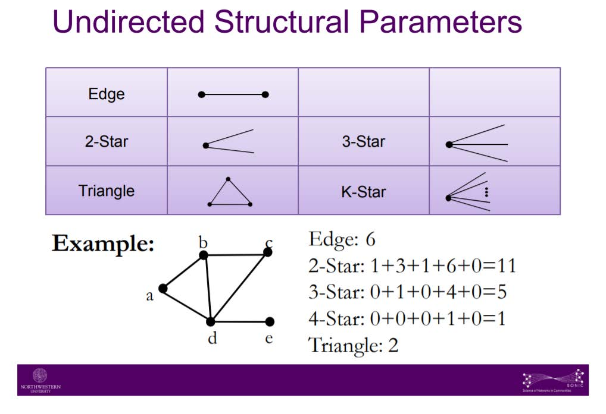
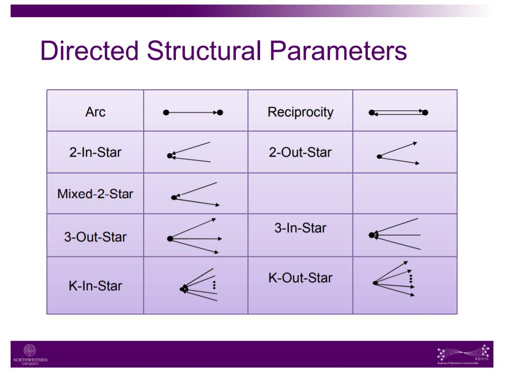
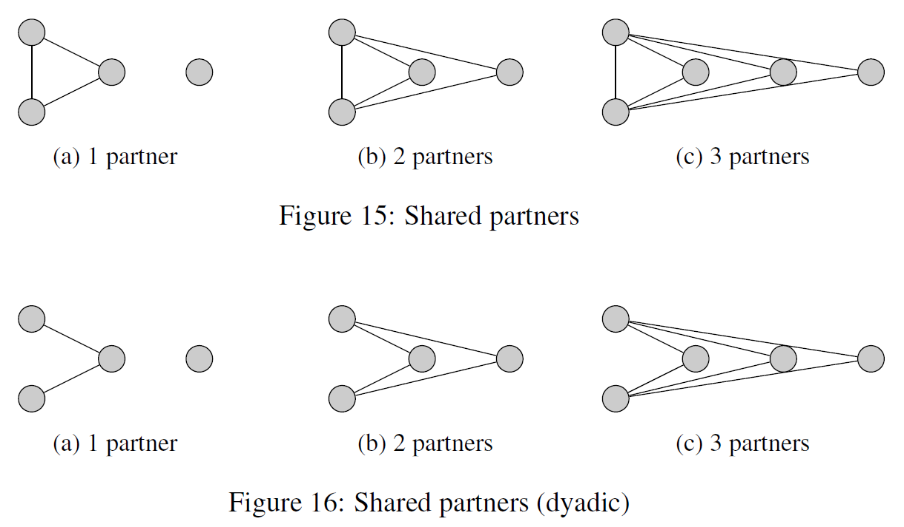
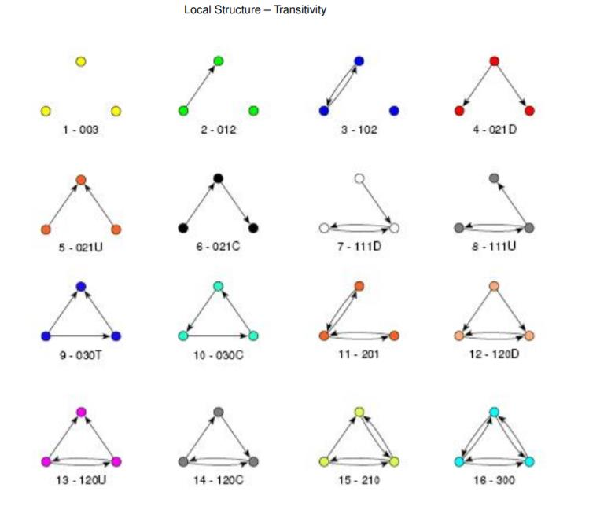
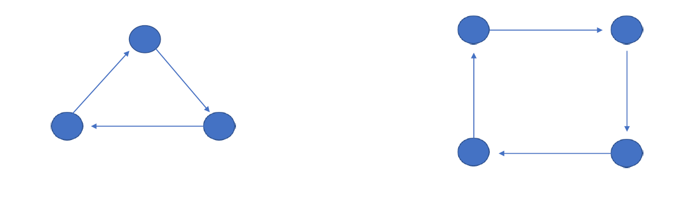

layout:false

background-image: url(assets/images/sna4ds_logo_140.png), url(assets/images/jads_logo_transparent.png), url(assets/images/network_people_7890_cropped2.png)
background-position: 100% 0%, 0% 10%, 0% 0%
background-size: 20%, 20%, cover
background-color: #000000

<br><br><br><br><br>
.full-width-screen-grey.center.fw9.font-250[
# .Orange-inline.f-shadows_into[`r rmarkdown::metadata$title`]
]

***

.full-width-screen-grey.center.fw9[.f-abel[.WhiteSmoke-inline[today's menu: ] .Orange-inline[`r rmarkdown::metadata$topic` .small-caps.font70[(lecture] .font70[`r rmarkdown::metadata$lecture_no`)]]]
  ]

<br>
.f-abel.White-inline[Your lecturer: `r rmarkdown::metadata$author`]<br>
.f-abel.White-inline[Playdate: `r rmarkdown::metadata$playdate`]


<!-- setup options start -->
```{r setup, include=FALSE}
knitr::opts_chunk$set(echo = FALSE,
                  out.width = "90%",
                  fig.height = 6,
                  fig.path = "assets/images/",
                  fig.retina = 2,
                  dev = "svg",
                  message = FALSE,
                  warning = FALSE)
# library(htmlwidgets, quietly = TRUE, verbose = FALSE, warn.conflicts = FALSE)
# library(countdown, quietly = TRUE, verbose = FALSE, warn.conflicts = FALSE)

knitr::opts_knit$set(global.par = TRUE)  # anders worden de margin settings niet overal doorgevoerd
```


```{r lecture_measures_01, include = FALSE}
par(mar = c(0,0,0,0) + .05) #it's important to have this in a separate chunk
```


```{r xaringanExtra_settings, include = FALSE}
xaringanExtra::use_xaringan_extra(c("tile_view"
                                    , "panelset"
                                    , "animate"
                                    , "tachyons"
                                    , "freezeframe"
                                    # , "broadcast"
                                    , "scribble"
                                    , "fit_screen"
                                    ))

# xaringanExtra::use_webcam(300 * 3.5, 300 / 4 * 3 * 3.5)
xaringanExtra::use_editable(expires = 1)
# xaringanExtra::use_search(show_icon = FALSE, case_sensitive = FALSE)
xaringanExtra::use_clipboard()

# htmltools::tagList(
#   xaringanExtra::use_clipboard(
#     button_text = "<i class=\"fa fa-clipboard\"></i>",
#     success_text = "<i class=\"fa fa-check\" style=\"color: #90BE6D\"></i>",
#     error_text = "<i class=\"fa fa-times-circle\" style=\"color: #F94144\"></i>"
#   ),
# rmarkdown::html_dependency_font_awesome()
# )
```


```{r xaringan-extra-styles, echo = FALSE}
xaringanExtra::use_extra_styles(
  hover_code_line = TRUE,         
  mute_unhighlighted_code = TRUE  
)
```

```{css echo=FALSE}
.highlight-last-item > ul > li, 
.highlight-last-item > ol > li {
  opacity: 0.5;
}

.highlight-last-item > ul > li:last-of-type,
.highlight-last-item > ol > li:last-of-type {
  opacity: 1;

.bold-last-item > ul > li:last-of-type,
.bold-last-item > ol > li:last-of-type {
  font-weight: bold;
}

.show-only-last-code-result pre + pre:not(:last-of-type) code[class="remark-code"] {
    display: none;
}
```


```{r some_handy_functions, echo = FALSE}
source("assets/R/components.R")
```


```{css}
.remark-inline-code {
  background: #F5F5F5;
  border-radius: 3px;
  padding: 4px;
}

.inverse-red, .inverse-red h1, .inverse-red h2, .inverse-red h3, .inverse-red a, inverse-red a > code {
	border-top: none;
	background-color: red;
	color: white; 
	background-image: "";
}

.inverse-orange, .inverse-orange h1, .inverse-orange h2, .inverse-orange h3, .inverse-orange a, inverse-orange a > code {
	border-top: none;
	background-color: orange;
	color: black; 
	background-image: "";
}

.tab{
  display: inline-block;
  margin-left: 40px;
}

.tab1{tab-size: 2;}
.tab2{tab-size: 4;}
.tab3{tab-size: 6;}
.tab4{tab-size: 8;}

```


```{css}
.grid-3-2a {
  display: grid;
  height: calc(90%);
  grid-template-columns: repeat(3, 1fr);
  grid-template-rows: 1fr 1fr;
  align-items: center;
  text-align: center;
  grid-gap: 1em;
  padding: 1em;
}
```


<!--scroll box set up -->
```{css}
./* Allow slides to show overflowing content */
.remark-slide-content {
  overflow: visible !important;
}

/* Scroll box */
.scroll-box-18 {
  display: block;           /* make it a block element */
  max-height: 18em;         /* height of scroll box */
  overflow-y: auto;         /* vertical scroll */
  padding: 0.5em;
  border: 1px solid #ccc;
  border-radius: 6px;
  background-color: #fafafa;
  box-sizing: border-box;   /* include padding in height */
}

/* Optional: nicer scrollbar */
.scroll-box-18::-webkit-scrollbar {
  width: 8px;
}

.scroll-box-18::-webkit-scrollbar-thumb {
  background: #888;
  border-radius: 4px;
}

.scroll-box-18::-webkit-scrollbar-thumb:hover {
  background: #555;
}


```


<!-- setup options end -->


---
class: course-logo
layout: true

---
name: menu
description: List of content for today's lab
# Menu'
<br>

- Homeplay Discussion
- Markovian Terms
- Exogenous Terms

---
<br>
<br>
<br>
<br>
<br>
<br>
<br>
# Homeplay Discussion

---
# Q1 -explore the network

Explore the network (N, E, attributes, D or U) and run the necessary descriptive statistics (remember to check the class and type of each attribute).


```{r labERGM1_03, echo=FALSE}
data <- data("Hookups", package = 'ina')
Hookups <- ina::Hookups
```

.scroll-box-18[
```{r labERGM1_04, echo=TRUE}

snafun::g_summary(Hookups)

```
]

---
# Q2: What are the hypotheses formulated in the book for this example?

---
# Q2: What are the hypotheses formulated in the book for this example?

<br>

1. Characters hookup with other characters of similar age
 
2. Characters hookup with other characters in the same job position
 
3. Characters hookup with other characters of the same race

4. Characters hookup with other characters of different sex
 
5. Younger characters have more hookups

6. Characters in the show for a short time had less opportunity for hookups

---
# Q2: What are the hypotheses formulated in the book for this example?

<br>

1. Characters hookup with other characters of similar age .red[absdiff]
 
2. Characters hookup with other characters in the same job position .red[nodematch]
 
3. Characters hookup with other characters of the same race .red[nodematch]

4. Characters hookup with other characters of different sex .red[nodematch]
 
5. Younger characters have more hookups .red[nodecov]

6. Characters in the show for a short time had less opportunity for hookups .red[nodecov]


---
# Q3

<br>
### Open page 73 and insert the terms specified in the example in a series of nested models. The model on page 73 is your final complete model—nest at least 3 of them to explore the effects of the terms one by one.

### 3a) which is the best model? 

### 3b) Can you tell whether each model is dyadic (inter)dependent or independent? 

### 3c) Is each of these variables exogenous or endogenous?

### 3d) Comment on the results. What is the substantive meaning of each of these terms? Are the hypotheses supported? Comment on the odd ratios too. 

### 3e) What is the difference between absdif and nodecov estimated on birthyear?

---
# Q4

## Formulate one additional hypothesis on the network’s structure and then nest another model, adding one variable to explore the network’s structure and test this final hypothesis.
---
<br>
<br>
<br>
<br>
<br>
<br>
<br>
# Markovian Terms
---
background-image: url(assets/images/MarkovGraph.png)
background-size: 350px
background-position: 85% 55%
name: markovian_graph
description: The effects in the neighborhood

# Markovian effects

<br>
### Effects in a Markov graph 

- It is hypothesized that only neighboring nodes impact <br> the odds of a link

- This level of dependence is also referred to as a <br> nearest-neighbors level of dependence

- or .red[dyadic dependence].

- we need to find all structures that are subject to a <br> Markov (or nearest-neighbor) level of dependence

- Key words: Markovian, structural, dyadic dependent, <br> structure of neighboring nodes

.footnote[Johannes van der Pol. Introduction to network modeling using Exponential Random Graph models
(ERGM). 2017. hal-01284994v2]
---
name: structural_undirected_terms
description: structural undirected terms
## Undirected structural/Markovian/endogenous/dyadic dependent terms
<br>
.center[]
.footnote[http://math.iisc.ernet.in/~imi/downloads/NBSSE/Noshir%20Contractor/Lecture%2007.pdf]

---
# Terms for undirected structural

<br>
Probability that that number of the observed undirected pattern is statistically significant
<br>

- `edges` - probability that the number of observed edges is statistically significant.
- `kstar(2)` - probability that the number of observed 2-stars is statistically significant.
- `kstar(3)` - probability that the number of observed 3-stars is statistically significant.
- `kstar(K)` - probability that the number of observed K-stars is statistically significant.
- `triangles` - probability that the number of observed triangles is statistically significant.

---
name: structural_directed_terms
description: Structural Directed terms
## Directed structural/Markovian/endogenous/dyadic dependent terms
<br>
.center[]


.footnote[http://math.iisc.ernet.in/~imi/downloads/NBSSE/Noshir%20Contractor/Lecture%2007.pdf]
---
# Terms for directed structural
<br>
Probability that that number of the observed directed pattern is statistically significant
<br>

- `asymmetric` <- arc - Probability that that number of the observed asymmetric dyads is statistically significant
- `mutual` <- reciprocity -  Probability that that number of the observed mutual dyads is statistically significant
- `istar(2)` <- 2 in star -  Probability that that number of the observed in 2 two stars  is statistically significant
- `ostar(2)` <- 2 out star - Probability that that number of the observed out 2 two stars is statistically significant
- `m2star` <- mixed 2 star - Probability that that number of the observed mixed 2 two stars is statistically significant
- `istar(k)` <- k in star - Probability that that number of the observed in K two stars is statistically significant
- `ostar(k)` <- k out star - Probability that that number of the observed out k two stars is statistically significant

---
name: shared_partners
description: Egdewise and dyadwise shared partners
# Edgewise and dyadwise shared partners 

<br>

.center[]


.footnote[Johannes van der Pol. Introduction to network modeling using Exponential Random Graph models
(ERGM). 2017. hal-01284994v2]

---
# Terms for shared partners 

### Edgewise shared partners 

- `esp` - undirected
- `desp` - directed (5 options) 1) outgoing two path, 2) incoming two path, 3) reciprocated 2 path 4) outgoing shared partner, 5) incoming shared partner.


### Absence of connections in a structure where these connections would be possible

- `nsp` - undirected edgewise NON-shared partners

- `dnsp` - directed edgewise NON-shared partners.

### Dyadwise shared partners

- `dsp` -  undirected dyadwise shared partner
- `ddsp` - directed dyadwise shared partner

---
name: terms_triads
description: Terms for triads 
# More about triangles: the triad census

3 digits [mutual][asymmetric][no-edge]

.center[]

.footnote[Davis and Leinhardt (1972) ]
---
# Undirected networks 

### 4 options (no edge or reciprocated edges)

- 003, 102, 201, 300
.center[]

---
# Terms for triads

- `triadcensus` - inserts all the 16 options in the model (rarely a good idea)
.center[]

---
# Terms for triads

- `ctriple` - 030C - Cyclic triples: defined as a set of edges of the form ( i→j ), (j→k ), (k→i)
.center[]

---
# Terms for triads


- `ttriple` - 030T - transitive triples: defined as a set of edges ( i→j ), (j→k ), (i→k)
.center[]

---
# Terms for triads

- `intransitive` - 111D, 201, 111U, 021C - Intransitive triads

.center[]

---
# Terms for triads


- `transitive` - 120D, 120U, 300, also 030T, 030C - Transitive triads
.center[]
---
# Terms for triads
- `balance` - 102, 300

.center[]


---
name: cycle
description: term for kcycle
# Cycles
<br>
`cycle(k)` <- k can be any number. 

`cycle(3)` == `ctriple`
<br>
<br>
.center[]

---
name: exogenous_effects
description: Terms for exogenous effects
<br>
<br>
<br>
<br>
<br>
<br>
<br>
# Exogenous Terms 


---
## Extent to which the attribute values influence edge formation so that <br> it is non-random under that condition. 

<br>
- `nodecov` - undirected - numeric var
- `nodeicov` - directed in - numeric var
- `nodeocov` - directed out - numeric var
<br>

Florentine family example:

The extent to which being wealthier increases the probability of getting married.

.red[same as in a logit model]

---
## The extent to which being in a certain category influences edge formation so that tie formation is non-random under that condition
<br>
- `nodefactor` - undirected - categorical var
- `nodeifactor` - directed in - categorical var
- `nodeofactor` - directed out - categorical var

<br>
.red[same as in a logit model]
---
## Extent to which common features measured in terms of distance similarity influence edge formation, so that edge formation is non-random under that condition. 
<br>
`absdiff` - numeric var
<br>

*Florentine family example:*

The extent to which being equally wealthy increases the probability of getting married.

- poor marry poor
- rich marry rich

This term implicitly attributes a weight to edges since the two connected nodes share the absolute difference

For this reason it is inserted in the model as a matrix rather than as a vector

(even if you don't see this happening)

---
## Extent to which nodes characterized by a specific category belonging to a certain attribute form ties with other node characterized by the same <br> category, so that tie formation under that condition is non-random

<br>

`nodematch` - categorical var

<br>

This term measures .red[homophily]. The probability of a tie due to similarity

- If the coefficient $\theta$ estimated in the model is negative it is measuring heterophily: the probability of a tie due to differences. 

Examples:

- friends in primary school, it is likely that girls are friend with girls (homophily due to sex)
- heterosexual romantic relationships a tie is due to heterophily in sex

---
## Extent to which nodes denoted by different categories of an attribute form <br> ties, so that tie formation under these circumstances is non-random. 
<br>
<br>
`nodemix` - disassortative mixing - categorical var

This term measures .red[heterophily]. The probability of a tie due to dissimilarity

- If the coefficient $\theta$ estimated in the model is negative it is measuring homophily: the probability of a tie due to similarity.

Same example as the previous slide


---
## Extent to which the ties formed in another context influence tie formation in the context of the current model, so that tie formation under that circumstances is non-random. 

<br>
`edgecov` - Matrix attribute. 
<br>

It can be used to insert edge attributes in the model. They need to be specified as a matrix 

E.g., how often two students study together can be inserted in the model as a weighted matrix
<br>
NOTE: using `edgecov` you can run a QAP logistic model using ERGMs!


---
name: mixing_matrix
description: Cross tabulation for variables and edges
## Cross tabulation between edge formation and attributes of interest


Mixing matrix. THIS IS NOT A MODEL TERM

`snafun::make_mixingmatrix()`


```{r labERGM1_01, echo=FALSE}

flo <- SNA4DSData::florentine
floI <- flo$flomarriage
floM <- intergraph::asNetwork(floI)

```


```{r labERGM1_02, echo=TRUE}

snafun::make_mixingmatrix(floM, "Wealth")

```

---
# BYe ByE
.center[]
