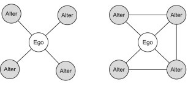

layout:false

background-image: url(assets/images/sna4ds_logo_140.png), url(assets/images/jads_logo_transparent.png), url(assets/images/network_people_7890_cropped2.png)
background-position: 100% 0%, 0% 10%, 0% 0%
background-size: 20%, 20%, cover
background-color: #000000

<br><br><br><br><br>
.full-width-screen-grey.center.fw9.font-250[
# .Orange-inline.f-shadows_into[`r rmarkdown::metadata$title`]
]

***

.full-width-screen-grey.center.fw9[.f-abel[.WhiteSmoke-inline[today's menu: ] .Orange-inline[`r rmarkdown::metadata$topic` .small-caps.font70[(lecture] .font70[`r rmarkdown::metadata$lecture_no`)]]]
  ]

<br>
.f-abel.White-inline[Your lecturer: `r rmarkdown::metadata$author`]<br>
.f-abel.White-inline[Playdate: `r rmarkdown::metadata$playdate`]


<!-- setup options start -->
```{r setup, include=FALSE}
knitr::opts_chunk$set(echo = FALSE,
                  out.width = "90%",
                  fig.height = 6,
                  fig.path = "assets/images/",
                  fig.retina = 2,
                  dev = "svg",
                  message = FALSE,
                  warning = FALSE)
# library(htmlwidgets, quietly = TRUE, verbose = FALSE, warn.conflicts = FALSE)
# library(countdown, quietly = TRUE, verbose = FALSE, warn.conflicts = FALSE)

knitr::opts_knit$set(global.par = TRUE)  # anders worden de margin settings niet overal doorgevoerd
```


```{r lecture_measures_01, include = FALSE}
par(mar = c(0,0,0,0) + .05) #it's important to have this in a separate chunk
```


```{r xaringanExtra_settings, include = FALSE}
xaringanExtra::use_xaringan_extra(c("tile_view"
                                    , "panelset"
                                    , "animate"
                                    , "tachyons"
                                    , "freezeframe"
                                    # , "broadcast"
                                    , "scribble"
                                    , "fit_screen"
                                    ))

# xaringanExtra::use_webcam(300 * 3.5, 300 / 4 * 3 * 3.5)
xaringanExtra::use_editable(expires = 1)
# xaringanExtra::use_search(show_icon = FALSE, case_sensitive = FALSE)
xaringanExtra::use_clipboard()

# htmltools::tagList(
#   xaringanExtra::use_clipboard(
#     button_text = "<i class=\"fa fa-clipboard\"></i>",
#     success_text = "<i class=\"fa fa-check\" style=\"color: #90BE6D\"></i>",
#     error_text = "<i class=\"fa fa-times-circle\" style=\"color: #F94144\"></i>"
#   ),
# rmarkdown::html_dependency_font_awesome()
# )
```


```{r xaringan-extra-styles, echo = FALSE}
xaringanExtra::use_extra_styles(
  hover_code_line = TRUE,         
  mute_unhighlighted_code = TRUE  
)
```

```{css echo=FALSE}
.highlight-last-item > ul > li, 
.highlight-last-item > ol > li {
  opacity: 0.5;
}

.highlight-last-item > ul > li:last-of-type,
.highlight-last-item > ol > li:last-of-type {
  opacity: 1;

.bold-last-item > ul > li:last-of-type,
.bold-last-item > ol > li:last-of-type {
  font-weight: bold;
}

.show-only-last-code-result pre + pre:not(:last-of-type) code[class="remark-code"] {
    display: none;
}
```


```{r some_handy_functions, echo = FALSE}
source("assets/R/components.R")
```


```{css}
.remark-inline-code {
  background: #F5F5F5;
  border-radius: 3px;
  padding: 4px;
}

.inverse-red, .inverse-red h1, .inverse-red h2, .inverse-red h3, .inverse-red a, inverse-red a > code {
	border-top: none;
	background-color: red;
	color: white; 
	background-image: "";
}

.inverse-orange, .inverse-orange h1, .inverse-orange h2, .inverse-orange h3, .inverse-orange a, inverse-orange a > code {
	border-top: none;
	background-color: orange;
	color: black; 
	background-image: "";
}

.tab{
  display: inline-block;
  margin-left: 40px;
}

.tab1{tab-size: 2;}
.tab2{tab-size: 4;}
.tab3{tab-size: 6;}
.tab4{tab-size: 8;}

```


```{css}
.grid-3-2a {
  display: grid;
  height: calc(90%);
  grid-template-columns: repeat(3, 1fr);
  grid-template-rows: 1fr 1fr;
  align-items: center;
  text-align: center;
  grid-gap: 1em;
  padding: 1em;
}
```


<!--scroll box set up -->
```{css}
./* Allow slides to show overflowing content */
.remark-slide-content {
  overflow: visible !important;
}

/* Scroll box */
.scroll-box-18 {
  display: block;           /* make it a block element */
  max-height: 18em;         /* height of scroll box */
  overflow-y: auto;         /* vertical scroll */
  padding: 0.5em;
  border: 1px solid #ccc;
  border-radius: 6px;
  background-color: #fafafa;
  box-sizing: border-box;   /* include padding in height */
}

/* Optional: nicer scrollbar */
.scroll-box-18::-webkit-scrollbar {
  width: 8px;
}

.scroll-box-18::-webkit-scrollbar-thumb {
  background: #888;
  border-radius: 4px;
}

.scroll-box-18::-webkit-scrollbar-thumb:hover {
  background: #555;
}


```

<!-- setup options end -->


---
class: course-logo
layout: true
---
background-image: url(assets/images/topo.jpg)
background-size: 450px
background-position: 50% 70%
# Let's collect some data!

<br>

canvas -> modules -> week 6 -> link

https://tilburghumanities.eu.qualtrics.com/jfe/form/SV_e9YKCcujyVw8iPA

---

# Agenda for today's lecture 
<br>

### 1) Think and Reflect on the Survey Questions

### 2) Explore network data collection strategies

### 3) Discuss how do you process newly collected data 


---
# This are the relationships in the cohort of three years ago


```{r L4_1, echo = FALSE}
# load("assets/data/FriendNetSNA4DS.RData")
FriendNetSNA4DS <- SNA4DSData::DSstudents

FriendNetSNA4DS <- igraph::upgrade_graph(FriendNetSNA4DS)
```

```{r L4_2, echo=FALSE, fig.height = 3.5}
# ggraph::ggraph(FriendNetSNA4DS) +
#   ggraph::geom_edge_link(width = 1) +
#   ggraph::geom_node_point(size = 6) +
#   # ggraph::geom_node_text(aes(label = name), size = 3, color = "gray50", repel = T) +
#   ggraph::geom_node_text(ggplot2::aes(label = year), size = 5, color = "black", repel = T) +
#   ggplot2::ggtitle("Basic Plot")
#   
#FriendNetSNA4DS <- igraph::upgrade_graph(FriendNetSNA4DS)
colrs <- c("gray50", "tomato", "gold")
igraph::V(FriendNetSNA4DS)$color <- colrs[igraph::V(FriendNetSNA4DS)$year]
deg <- igraph::degree(FriendNetSNA4DS, mode="all")
igraph::V(FriendNetSNA4DS)$size <- deg*3
# We could also use the audience size value:
igraph::V(FriendNetSNA4DS)$size <- igraph::V(FriendNetSNA4DS)$DS

# The labels are currently node IDs.
# Setting them to NA will render no labels:
igraph::V(FriendNetSNA4DS)$label <- NA

# Set edge width based on weight:
igraph::E(FriendNetSNA4DS)$width <- igraph::E(FriendNetSNA4DS)$frequency

#change arrow size and edge color:
igraph::E(FriendNetSNA4DS)$arrow.size <- .2
igraph::E(FriendNetSNA4DS)$edge.color <- "gray80"


plot(FriendNetSNA4DS)

```

---
<br>
<br>
<br>
<br>
<br>
<br>
<br>
# 1) Think and Reflect on the Survey Questions
---
# Think and Reflect

<br>

- Q1 Why are these questions suitable for collecting network data?

- Q2 Which question collects what kind of data?

- Q3 What could be a bias for this data collection? 

- Q4 What are the possible ethical concerns that might arise?

---
# Overview of the Survey questions 
<br>
### This survey is about understanding how to collect data
<br>
###- Can you please select your name from the list below? 
###- How much do you like data science?
###- Would you please select the name of the one coursemate with whom you interact the most?
###- How often do you interact?
---

background-image: url(assets/images/friendship2.jpg)
background-size: 250px
background-position: 85% 55%
# Q1 Why are these questions suitable for collecting network data?
<br>
---

background-image: url(assets/images/friendship2.jpg)
background-size: 250px
background-position: 85% 55%
# Q1 Why are these questions suitable for collecting network data?
<br>
.center[This questions are suitable for collecting network data about friendship]
.center[not every kind of network data]

<br>
- collecting info about friendship (RELATIONSHIP - network)
- collecting information about respondents (RESPONDENTS ATTRIBUTES)
- collecting information about the relationship between pair of respondents (RELATIONSHIP ATTRIBUTE)

### There is no universally valid questionnaire

---
background-size: 500px
background-position: 85% 55%

# Q2 Which question collects what data?

---
background-image: url(assets/images/)
background-size: 500px
background-position: 85% 55%

# Q2 Which question collects what data?

<br>
## Levels 

- network info 
- node attribute
- edge attribute

## Mentimeter! 
### 7268 6485
### www.menti.com
### https://www.menti.com/al3jcf1aiwgp
---
background-image: url(assets/images/small-example.png)
background-size: 600px
background-position: 90% 35%
name: DataTypes_slide
description: collect data about network, nodes and edge attributes
# "Types" of data
<br>

- Network Attribute 
    - respondent/ego
    - alter
- node Attribute: attributes of the respondent/ego
- edge Attribute: attributes of the relationship

<br>
<br>
### You collect what you need to answer your research question.

---
# Examples of research questions
## Which types of data you need?

---
# Examples of research questions
## Which types of data you need?

## .red[Does the gender affect the likelihood of pupils playing together in kindergarten?]


---
# Examples of research questions
## Which types of data you need?

## .red[Does the gender affect the likelihood of pupils playing together in kindergarten?]
### Network 
### Node attribute

---
# Examples of research questions
## Which types of data you need?

## .red[Does the gender affect the likelihood of pupils playing together in kindergarten?]
### Network 
### Node attribute

## .red[Are people that retweet each other more likely to have the same opinion?]

---
# Examples of research questions
## Which types of data you need?

## .red[Does the gender affect the likelihood of pupils playing together in kindergarten?]
### Network 
### Node attribute

## .red[Are people that retweet each other more likely to have the same opinion?]
### Network (retweet)
### Edge Attribute (opinion in the tweet - categorical)


---
# Q3 What could be a bias for this data collection? 
<br>
I left a few "problems" in the survey, let's see if you catch them


---
# Q3 What could be a bias for this data collection? 
<br>
I left a few "problems" in the survey, let's see if you catch them

## .red[The number of friends. ]
### Is 3 a good number? 


---
# Q3 What could be a bias for this data collection? 
<br>
I left a few "problems" in the survey, let's see if you catch them

## .red[The number of friends. ]
### Is 3 a good number? 

## .red[What is a friend?]
### Are these questions capturing 'friendship'? Is a colleague a friend?

"To what extent do you consider this person your friend compared to your friends outside uni?"
it could mean too many things

Maybe this is fine, but we need to make sure to define what we are measuring before
---
name: Design_Bias
description: how to make an unbiased study design

# Unbiased design
## .red[Think carefully]

### - Define your target relationship
### - Decide what is the right number of connections per respondent to collect
### - Make sure your research design is linked to the research question
### - Ask the questions in a specific way 
- make sure you do not ask two questions in one. 

### - Make sure that you end up with measurable answers 

- preferably use Likert scales with odd numbers of points (3, 5, 7, 11)

## .red[Remember: A fully unbiased study does not exist!]

---
name: Sampling_Bias
description: Decide on the right approach for your sample

# Sampling 
## - Do you have access to the entire population?
### yes? Run a survey like the one we used 

- targeted a group with a boundary (SNA4DS students)
- Not everyone responded, but this is simply .red[missing data]


### No? You need to use an egonet approach
You ask them to provide the name of their relationship since you might not even know how many are they

### entire sample: Roster with names
### egonet: "snowballing" data
.red[Access to the entire population with missing data DIFFERS from access to a sample]

---
name: egonets
description: example of egonets
# Egonets simple

- Who are your friends?
- Are they friends among each other?


.center[]

---
background-image: url(assets/images/egonet_weigth.png)
background-size: 750px
background-position: 50% 60%
# Egonets advanced design
- You can tailor the design to your needs

---
# Q4 What are the possible ethical <br> concerns that might arise?


---
# Q4 What are the possible ethical <br> concerns that might arise?


- .red[Anonyminity and confidentiality]
    - network data is particularly sensitive on this perspective
    - you need to anonymize it and store it properly


---
# Q4 What are the possible ethical <br> concerns that might arise?


- .red[Anonyminity and confidentiality]
    - network data is particularly sensitive on this perspective
    - you need to anonymize it and store it properly

- .red[Sensitive questions] 
    - such as gender, or medical information

---
# Q4 What are the possible ethical <br> concerns that might arise?


- .red[Anonyminity and confidentiality]
    - network data is particularly sensitive on this perspective
    - you need to anonymize it and store it properly

- .red[Sensitive questions] 
    - such as gender, or medical information

- .red[Be aware of your intended sample and protect it]
    - Are you recruiting a sensitive sample? Make sure no one is in danger (e.g. AIDS patients)
    - make sure no one is recognizable even 10 years later


---
name: ethical_issues
description: Designing an ethics compliant study
# Q4 What are the possible ethical <br> concerns that might arise?


- .red[Anonyminity and confidentiality]
    - network data is particularly sensitive on this perspective
    - you need to anonymize it and store it properly

- .red[Sensitive questions] 
    - such as gender, or medical information

- .red[Know who is your intended sample and protect it]
    - Are you recruiting a sensitive sample? Make sure no one is in danger (e.g. AIDS patients)
    - make sure no one is recognizable even 10 years later

- .red[GDPR]
    - Get consent and agreement 

---
name: collection_strategies
description: How to approach a data collection problem
<br>
<br>
<br>
<br>
<br>
<br>
<br>
# 2) Explore network data collection strategies

---
background-image: url(assets/images/sociogram-edges.png)
background-size: 550px
background-position: 50% 85%

# Sofware

For running a survey you can use regular platforms not specifically meant for 
networks (Qualtrics, Survey Monkey etc...)

But there are software specifically designed to collect network data. For instance .red[Network Canvas]

ego or entire sample


.footnote.DarkOrange-inline[M. Birkett, J. Melville, P. Janulis, G. Phillips, N. Contractor, B. Hogan,
Network Canvas: Key decisions in the design of an interviewer-assisted network data collection software suite, Social Networks, Volume 66, 2021, Pages 114-124.]

---
background-image: url(assets/images/fieldwork.jpg)
background-size: 550px
background-position: 80% 70%
# Data collection strategies for people: <br> online survey & fieldwork 

## .red[We explored the online Survey data collection]
A survey does not get you everywhere

kids?
elderly people? 

## You might need to do fieldwork

yes paper and pen! or Network canvas


---
# Data collection strategies for people: <br> online data
## Spotify: Scrape data. 

```{r L4_3, echo = FALSE}
load("assets/data/SpotifyExample.RData")
```

.scroll-box-18[
```{r L4_4, echo = TRUE}
# selected features
str(fsel)
```
]

---
# Spotify: Where is the network?

.scroll-box-18[
```{r L4_5, echo = TRUE}
# artist one

# ego
fsel$artist_name[1]

# alter (list nested into data frame)
str(fsel$artists[1])


```
]

## .red[You loop through to extract the information that you need]

### Other examples of online sources of network data: Twitter (old data), Instagram, Facebook, ...

---
background-image: url(assets/images/wearable-sensors.png)
background-size: 750px
background-position: 50% 70%
# Data collection strategies for alive creatures
Wearable sensors VS direct observation


.footnote.DarkOrange-inline[Gelardi V, Godard J, Paleressompoulle D, Claidiere N, Barrat A. 2020
Measuring social networks in primates: wearable sensors versus direct observations. Proc. R. Soc. A 476: 20190737. http://dx.doi.org/10.1098/rspa.2019.0737]
---
background-image: url(assets/images/service-networks.png)
background-size: 550px
background-position: 50% 80%
# Data collection strategies for not alive creatures
- Private info: Questionnaire (Service Networks)
- Public info: Observation (Dutch train line or internet network)

.footnote.DarkOrange-inline[Clarke, Z. et al., 2019, Needs Assessment: Substance Use, Blood Borne Virus & Sexual Health in Midlothian & East Lothian, NHS Lothians & MELDAP]

---
background-image: url(assets/images/Semantic_Net.png)
background-size: 550px
background-position: 50% 80%
# Data collection strategies for computational networks
Semantic networks (it does not "exist", it is a "theoretical" concept)


---
name: collection_strategies
description: How to approach a data collection problem
# Summary of data collection strategies

## .red[If possible:]
### Observe ---> public available data more or less hard to access
    [in order of complexity]
    - just observe something or someone
    - scrape
    - use text analysis
    - use sensors
    - ...
## .red[If NOT possible to observe:]    
### Ask questions ---> private information 
    [in order of complexity]
    - Online 
    - fieldwork (MOST COMPLEX AND EXPENSIVE STRATEGY OF THEM ALL)
    
---
# Data? Where to find it - 

<br>

## - Kaggle

## - Harvard DataVerse

## - SNAP Stanford

## - Pajek Dataset

## - UciNet Datasets

---
name: processing_data
description: How to turn into a network the data we collect
<br>
<br>
<br>
<br>
<br>
<br>
<br>


# 3) Discuss how do you process newly collected data 

---
# How do you process newly collected data?
<br>
## Your data looks like this (you want your data to look like this):
```{r L4_6, echo = FALSE}

survey <- data.frame(respondent = c('Anna', 'Ben', 'Cleo'),
                     alter1 = c('David', 'NA', 'Anna'),
                     alter2 = c('Luke', 'NA', 'David') ,
                     gender = c("F", "M", "O"), 
                     cinemaW1 = c(1, NA, 2),
                     cinemaW2 =c(0, NA, 2))

```


```{r L4_7, echo = TRUE}
survey
```

## To analyse it as a network we need to process it 

### Let's explore one way to do it

---
# Creating an edge list

### Let's do the process manually first 

- match: respondent -- alter 1

- match: respondent -- alter 2

- append them

```{r L4_8, echo = TRUE}
(EdgeList <- data.frame(rbind(cbind(survey$respondent, survey$alter1), 
                              cbind(survey$respondent, survey$alter2))))
```

## If you have many columns this could get nasty. Better to loop 

---
# Edge List via for loop

```{r L4_9, echo = TRUE}

col <- survey[ , 1:3] #<- select the columns respondent, alter1, alter2

EdgeList <- data.frame()
temp <- data.frame()

for (i in 2:ncol(col)) {
  temp <- cbind(col[, 1], col[, i])
  EdgeList <- rbind(EdgeList, temp)
}

EdgeList
```

### Are we done? We are definitely not. An edge list does not consider isolates. 

---
# Make a node list 

### Let's do the process manually: We need to make sure that all the nodes are included, but one time only


```{r L4_10, echo = TRUE}

(NodeList <- unique(c(survey$respondent, survey$alter1, survey$alter2)))

```


```{r L4_20, echo = FALSE}
NodeList[5] <- NA
```


```{r L4_210, echo = TRUE}

NodeList <- na.omit(NodeList) # always remove NAs

```

Unless we use also a node list, Ben would disappear from the sample

.red[A for loop would make your life better in this case too]

---
# So, now what?
<br>
## Now we turn it into a network
```{r L4_11, echo = FALSE}
EdgeList[2, 2] <- NA
EdgeList[5, 2] <- NA
```


```{r L4_12, echo = TRUE}

EdgeList <- na.omit(EdgeList)
surveynet <- igraph::graph_from_data_frame(EdgeList, NodeList, directed = TRUE)


```

<br>
### Disclaimer: there are many other ways, but this is a very useful one
<br>
### Still, explore the functions in `igraph` and `network` for creating networks
---
# Result

```{r L4_13, echo = TRUE, fig.height=2.5}


plot(surveynet)

```

And the attributes? Edge attributes are processed the same way as the edge list, while node attributes needs to be processed as vectors (consider that you will have missing data for the alters)


---
name: SNA4DS_dataprocessing
description: How to process survey data using `snafun`
# To spead up the process

```{r L4_14, echo = FALSE}
survey[2,2] <- NA
survey[2,3] <- NA
survey[2,5] <- NA
survey[2,6] <- NA

```

.scroll-box-18[
```{r L4_15, echo = TRUE}

# select columns with network info as df
net <- data.frame(survey[,1:3])

# select columns with edge attributes as df
eAttr <- data.frame(cbind(survey$cinemaW1, survey$cinemaW2))

# prepare a vector with node attribute
nAttr <- survey$gender

# Make the edge list
EdgeList <- snafun::make_edgelist(net, eAttr)
EdgeList <- na.omit(EdgeList)

# Make the node list 
NodeList <- snafun::make_nodelist(net, nAttr)

# turn it into a network
surveynet <- igraph::graph_from_data_frame(EdgeList, NodeList, directed = TRUE)
surveynet

```
]
---
background-image: url(assets/images/dogs_strings.jpg)
background-size: 700px
background-position: 50% 50%
# Enjoy your data hunt! 


---
background-image: url(assets/images/Copy-skates.jpg)
background-size: 750px
background-position: 50% 50%
# That's all folks!


