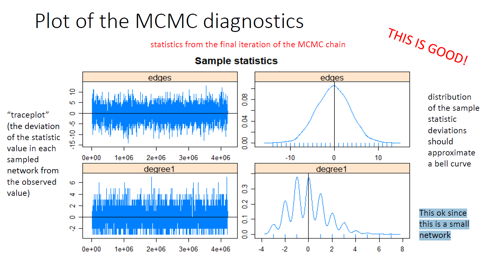
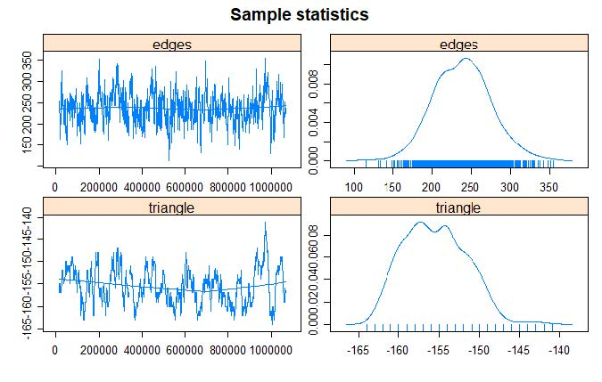
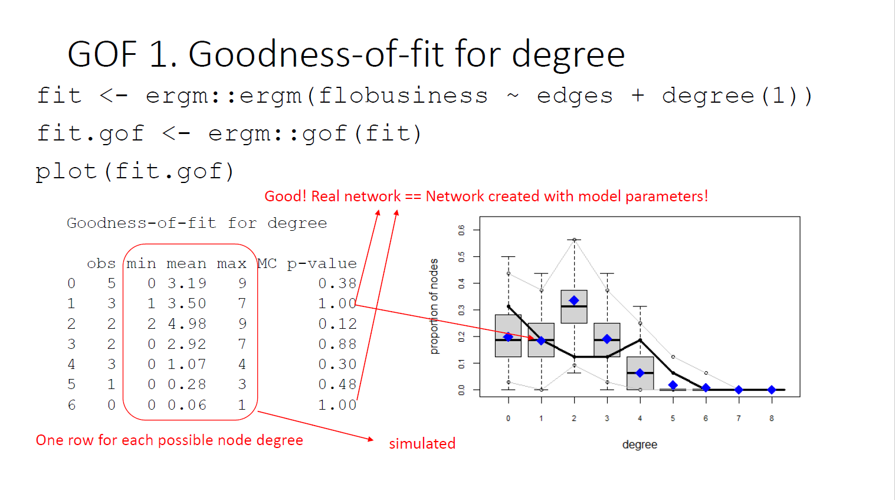
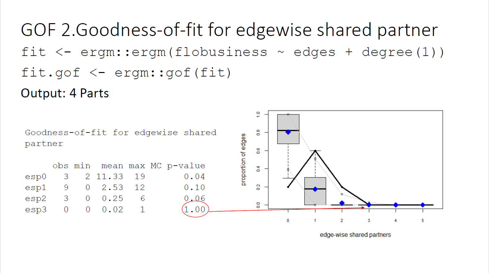
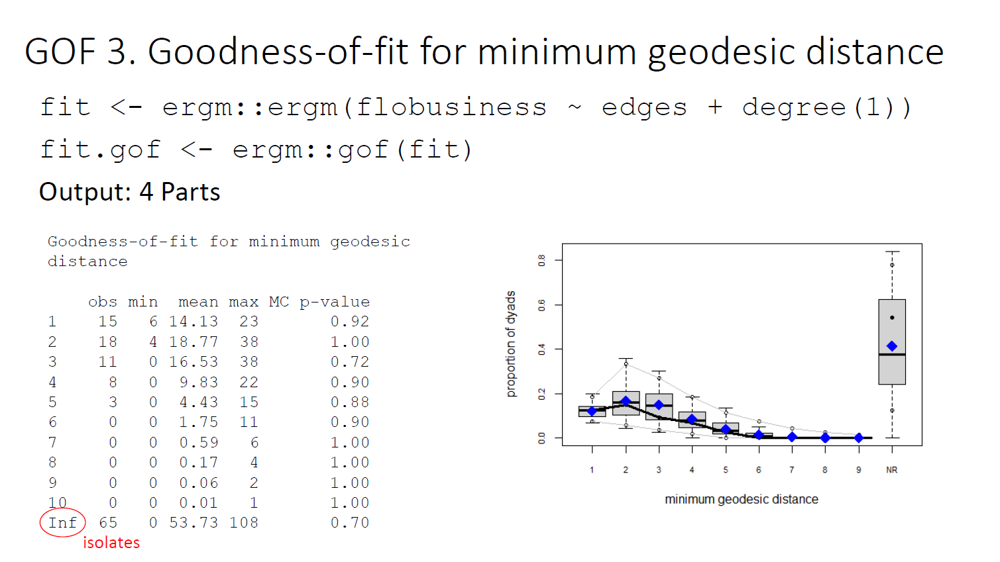
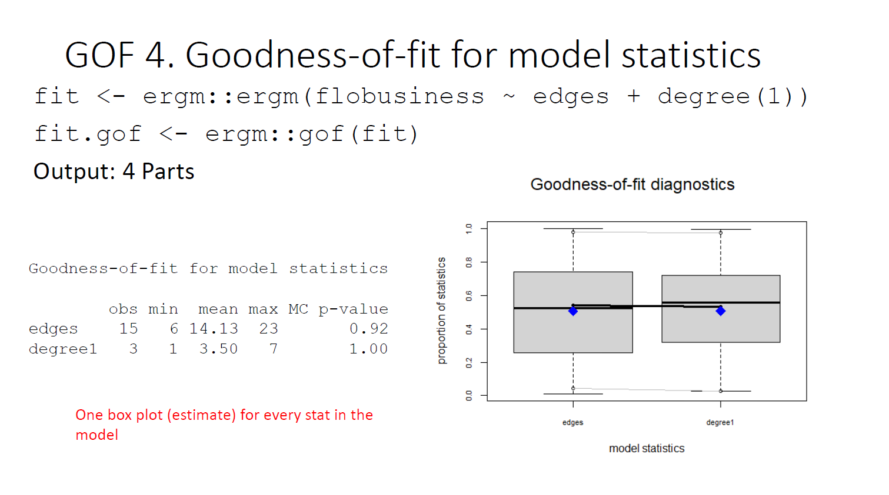

layout:false

background-image: url(assets/images/sna4ds_logo_140.png), url(assets/images/jads_logo_transparent.png), url(assets/images/network_people_7890_cropped2.png)
background-position: 100% 0%, 0% 10%, 0% 0%
background-size: 20%, 20%, cover
background-color: #000000

<br><br><br><br><br>
.full-width-screen-grey.center.fw9.font-250[
# .Orange-inline.f-shadows_into[`r rmarkdown::metadata$title`]
]

***

.full-width-screen-grey.center.fw9[.f-abel[.WhiteSmoke-inline[today's menu: ] .Orange-inline[`r rmarkdown::metadata$topic` .small-caps.font70[(lecture] .font70[`r rmarkdown::metadata$lecture_no`)]]]
  ]

<br>
.f-abel.White-inline[Your lecturer: `r rmarkdown::metadata$author`]<br>
.f-abel.White-inline[Playdate: `r rmarkdown::metadata$playdate`]


<!-- setup options start -->
```{r setup, include=FALSE}
knitr::opts_chunk$set(echo = FALSE,
                  out.width = "90%",
                  fig.height = 6,
                  fig.path = "assets/images/",
                  fig.retina = 2,
                  dev = "svg",
                  message = FALSE,
                  warning = FALSE)
# library(htmlwidgets, quietly = TRUE, verbose = FALSE, warn.conflicts = FALSE)
# library(countdown, quietly = TRUE, verbose = FALSE, warn.conflicts = FALSE)

knitr::opts_knit$set(global.par = TRUE)  # anders worden de margin settings niet overal doorgevoerd
```


```{r lecture_measures_01, include = FALSE}
par(mar = c(0,0,0,0) + .05) #it's important to have this in a separate chunk
```


```{r xaringanExtra_settings, include = FALSE}
xaringanExtra::use_xaringan_extra(c("tile_view"
                                    , "panelset"
                                    , "animate"
                                    , "tachyons"
                                    , "freezeframe"
                                    # , "broadcast"
                                    , "scribble"
                                    , "fit_screen"
                                    ))

# xaringanExtra::use_webcam(300 * 3.5, 300 / 4 * 3 * 3.5)
xaringanExtra::use_editable(expires = 1)
# xaringanExtra::use_search(show_icon = FALSE, case_sensitive = FALSE)
xaringanExtra::use_clipboard()

# htmltools::tagList(
#   xaringanExtra::use_clipboard(
#     button_text = "<i class=\"fa fa-clipboard\"></i>",
#     success_text = "<i class=\"fa fa-check\" style=\"color: #90BE6D\"></i>",
#     error_text = "<i class=\"fa fa-times-circle\" style=\"color: #F94144\"></i>"
#   ),
# rmarkdown::html_dependency_font_awesome()
# )
```


```{r xaringan-extra-styles, echo = FALSE}
xaringanExtra::use_extra_styles(
  hover_code_line = TRUE,         
  mute_unhighlighted_code = TRUE  
)
```

```{css echo=FALSE}
.highlight-last-item > ul > li, 
.highlight-last-item > ol > li {
  opacity: 0.5;
}

.highlight-last-item > ul > li:last-of-type,
.highlight-last-item > ol > li:last-of-type {
  opacity: 1;

.bold-last-item > ul > li:last-of-type,
.bold-last-item > ol > li:last-of-type {
  font-weight: bold;
}

.show-only-last-code-result pre + pre:not(:last-of-type) code[class="remark-code"] {
    display: none;
}
```


```{r some_handy_functions, echo = FALSE}
source("assets/R/components.R")
```


```{css}
.remark-inline-code {
  background: #F5F5F5;
  border-radius: 3px;
  padding: 4px;
}

.inverse-red, .inverse-red h1, .inverse-red h2, .inverse-red h3, .inverse-red a, inverse-red a > code {
	border-top: none;
	background-color: red;
	color: white; 
	background-image: "";
}

.inverse-orange, .inverse-orange h1, .inverse-orange h2, .inverse-orange h3, .inverse-orange a, inverse-orange a > code {
	border-top: none;
	background-color: orange;
	color: black; 
	background-image: "";
}

.tab{
  display: inline-block;
  margin-left: 40px;
}

.tab1{tab-size: 2;}
.tab2{tab-size: 4;}
.tab3{tab-size: 6;}
.tab4{tab-size: 8;}

```


```{css}
.grid-3-2a {
  display: grid;
  height: calc(90%);
  grid-template-columns: repeat(3, 1fr);
  grid-template-rows: 1fr 1fr;
  align-items: center;
  text-align: center;
  grid-gap: 1em;
  padding: 1em;
}
```

<!--scroll box set up -->
```{css}
./* Allow slides to show overflowing content */
.remark-slide-content {
  overflow: visible !important;
}

/* Scroll box */
.scroll-box-18 {
  display: block;           /* make it a block element */
  max-height: 18em;         /* height of scroll box */
  overflow-y: auto;         /* vertical scroll */
  padding: 0.5em;
  border: 1px solid #ccc;
  border-radius: 6px;
  background-color: #fafafa;
  box-sizing: border-box;   /* include padding in height */
}

/* Optional: nicer scrollbar */
.scroll-box-18::-webkit-scrollbar {
  width: 8px;
}

.scroll-box-18::-webkit-scrollbar-thumb {
  background: #888;
  border-radius: 4px;
}

.scroll-box-18::-webkit-scrollbar-thumb:hover {
  background: #555;
}


```


<!-- setup options end -->


---
class: course-logo
layout: true

---
name: menu
description: List of contents for today's lecture
# Menu'
<br>
<br>
<br>

- ERGMs Estimation

- Model diagnostics

- Curved Terms (to solve degeneracy problem)

- Goodness of fit


---
<br>
<br>
<br>
<br>
<br>
<br>
<br>
# ERGMs Estimation


---
name: ERGMestimation
description: An intuitive description of how the estimation works
# Estimation
<br>
<br>
## The estimation allows for the identification of the parameters that maximize the likelihood of a graph.

Finding the $\theta$ of the terms that maximize the probability of simulating graphs like the observed real one

- We discussed how to insert terms and how to specify the models

- We still need to check if the specification we inserted is doing its job

- Since the algorithm takes care of the estimation we need to understand it a bit better

---
# ERGM algorithms 
<br>
## .red[Dyadic independent ERGM]: estimated as a logit model with Maximum (pseudo) Likelihood Estimation (MLE or MPLE)

- We need to check the goodness of fit as we did with logit models 

- We do that using the `ergm::gof()` function

## .red[Dyadic (inter)dependent]: we need to estimate parameters using Markov chains Monte Carlo MCMC simulations

- We still need to check the goodness of fit but also we need to check whether the simulation worked as we wanted to. We need to check two indicators

    - `ergm::gof()`
    - `ergm::mcmc.diagnostics()`


---
# Intuitive estimation -Dyadic dependent 

## Explaining a Markov Chain Maximum Likelihood estimation 

- We simulate Markov Chains using a Monte Carlo (random) method.

- A Markov chain is a sequence of random variables such that the value taken by the random variable only depends upon the value taken by the previous variable.

- By switching the entries in the matrix representing the network (0-1) we generate a series of graphs that differ from each other only by one edge and that depend from the previous graph.

- This sequence of generated graphs is a Markov chain. 

- Within this generation of chains the Metropolis-Hastings algorithm or the Gibbs sampler decide which entries (0-1) change state. 

- These algorithms start picking a variable at random and change its state

- They retain the change of state only if the new graph increases the likelihood

- Finally the Robbins-Monroe algorithm estimates the parameters in the model. 

---
name: ERGMmath
description: How the math of ERGM estimation works
background-image: url(assets/images/ERGM_math_class_slides/ERGM_math_class_slides-01.jpg)
background-size: 1000px
background-position: 50% 50%


---

background-image: url(assets/images/ERGM_math_class_slides/ERGM_math_class_slides-02.jpg)
background-size: 1000px
background-position: 50% 50%

---

background-image: url(assets/images/ERGM_math_class_slides/ERGM_math_class_slides-03.jpg)
background-size: 1000px
background-position: 50% 50%

---

background-image: url(assets/images/ERGM_math_class_slides/ERGM_math_class_slides-04.jpg)
background-size: 1000px
background-position: 50% 50%

---

background-image: url(assets/images/ERGM_math_class_slides/ERGM_math_class_slides-05.jpg)
background-size: 1000px
background-position: 50% 50%

---

background-image: url(assets/images/ERGM_math_class_slides/ERGM_math_class_slides-06.jpg)
background-size: 1000px
background-position: 50% 50%

---

background-image: url(assets/images/ERGM_math_class_slides/ERGM_math_class_slides-07.jpg)
background-size: 1000px
background-position: 50% 50%

---

background-image: url(assets/images/ERGM_math_class_slides/ERGM_math_class_slides-08.jpg)
background-size: 1000px
background-position: 50% 50%

---

background-image: url(assets/images/ERGM_math_class_slides/ERGM_math_class_slides-09.jpg)
background-size: 1000px
background-position: 50% 50%

---

background-image: url(assets/images/ERGM_math_class_slides/ERGM_math_class_slides-10.jpg)
background-size: 1000px
background-position: 50% 50%

---

background-image: url(assets/images/ERGM_math_class_slides/ERGM_math_class_slides-11.jpg)
background-size: 1000px
background-position: 50% 50%

---

background-image: url(assets/images/ERGM_math_class_slides/ERGM_math_class_slides-12.jpg)
background-size: 1000px
background-position: 50% 50%

---

background-image: url(assets/images/ERGM_math_class_slides/ERGM_math_class_slides-13.jpg)
background-size: 1000px
background-position: 50% 50%

---

background-image: url(assets/images/ERGM_math_class_slides/ERGM_math_class_slides-14.jpg)
background-size: 1000px
background-position: 50% 50%

---

background-image: url(assets/images/ERGM_math_class_slides/ERGM_math_class_slides-15.jpg)
background-size: 1000px
background-position: 50% 50%


---

background-image: url(assets/images/ERGM_math_class_slides/ERGM_math_class_slides-16.jpg)
background-size: 1000px
background-position: 50% 50%


---

background-image: url(assets/images/ERGM_math_class_slides/ERGM_math_class_slides-17.jpg)
background-size: 1000px
background-position: 50% 50%


---

background-image: url(assets/images/ERGM_math_class_slides/ERGM_math_class_slides-18.jpg)
background-size: 1000px
background-position: 50% 50%


---

background-image: url(assets/images/ERGM_math_class_slides/ERGM_math_class_slides-19.jpg)
background-size: 1000px
background-position: 50% 50%


---

background-image: url(assets/images/ERGM_math_class_slides/ERGM_math_class_slides-20.jpg)
background-size: 1000px
background-position: 50% 50%


---
name: convergence
description: What is the convergence of a model
# Convergence
 <br>
 <br>
 
- Chains should evolve toward increasing the likelihood of producing networks similar to the observed one.

- If the process goes according to plans, we say that the model .red[converged]

- If you look at the simulation output you will see a series of lines with different trends that chain after chain become similar and overlap (We will see it in a few minutes)

- If the model does .red[not converge] the chains never become similar and parallel universe continue to exist until the model fails (We will also see that in a few minutes)

---
name: burnin
description: What is the model burn-in
# Burn-in
<br>
<br>

- In the beginning, the model will have a time for the Metropolis-Hasting algorithm or the Gibbs sampler to increase the likelihood of the chains to resemble the real network

- This is the .red[burn-in]

- The burn-in represents the number of simulations that are removed from the MCMC in order to make the chain "forget" the (random) starting point


---
name: sample_size
description: What is the model sample size
# MCMC sample size
<br>
<br>

- If the model struggles at convergence it is a good idea to give it the opportunity to be more accurate. 

- Increasing the sample size, the Metropolis-Hasting algorithm or the Gibbs sampler can source more information about the previous chain and increase the accuracy of the following one.

- It does not always work. If your terms are not capturing the dynamics of the real network it will never work.

- It increases your computational time, so careful when you use it


---
<br>
<br>
<br>
<br>
<br>
<br>
<br>
# Model diagnostics

---
name: mcmc_diagnostics
description: How to perform and interpret mcmc diagnostics
## Checking the simulation in Dyadic dependent Models

```{r Les09_1, echo=FALSE}

flo <- SNA4DSData::florentine
floI <- flo$flobusiness

floB <- intergraph::asNetwork(floI)

```

<br>
### Model using Florentine Business network 
<br>

`fit <- ergm::ergm(floB ~ edges + degree(1))`

`ergm::mcmc.diagnostics(fit)`

<br>
This function outputs three things:

- Text that explains the diagnostics 
- A series of relevant measures
- Plots the MCMC diagnostics

---
## MCMC Diagnostics
.scroll-box-18[
```{r Les09_2, echo=TRUE}

fitFlo.01 <- ergm::ergm(floB ~ edges + degree(1), 
                     control = ergm::control.ergm(
                    MCMC.samplesize = 5000,
                    MCMC.burnin = 1000, 
                    MCMLE.maxit = 10,
                    parallel = 6,
                    parallel.type = "PSOCK"
                  ))

ergm::mcmc.diagnostics(fitFlo.01)

```
]

---

## Understanding the `mcmc.diagnostics` output
<br>
### You need to know that

- your diagnostic analyses the iterations of the last chain produced
- ERGMs, as OLS, is predicting mean values of parameters
- The mean in the diagostics should be 0
- the standard deviation should form a bell curve

### "Quantiles for each variable":  2.5% 25% 50% 75% 97.5%
-8, -2, 0, 2, 8 Would be an ideal scenario

### "Are sample statistics significantly different from observed?"
You want your p-value here to be as high as possible

---

.center[]


---
# Trace Plot shape: fuzzy caterpillar

.center[]

---
background-image: url(assets/images/faux.magnolia.high.jpg)
background-size: 450px
background-position: 50% 85%
# Bad model example

```{r Les09_3, echo=FALSE}

data(faux.magnolia.high, package = "ergm")

magnolia <- faux.magnolia.high
```

## Faux Magnolia High. Data simulated from an American High School

- Nodes: 1461

- Edges: 974

- Sparse

- Undirected

---
# Bad model example

Running this model we will get an error
```{r Les09_4, echo=TRUE}

# fitMag.01 <- ergm::ergm(magnolia ~ edges + triangles,
#                    control = ergm::control.ergm(
#                      MCMC.samplesize = 5000,
#                      MCMC.burnin = 1000, 
#                      MCMLE.maxit = 10,
#                      parallel = 6,
#                      parallel.type = "PSOCK"
#                    ))

```

`Error in ergm.MCMLE(init, nw, model, initialfit = (initialfit <- NULL),  :`

`Number of edges in a simulated network exceeds that in the observed by a factor of more than 20. This is a strong indicator of model degeneracy or a very poor starting parameter configuration. If you are reasonably certain that neither of these is the case, increase the MCMLE.density.guard control.ergm() parameter.`

## This is called model DEGENERACY
---
name: model_degeneracy
description: What is the model degeneracy
# The term `triangles` caused <br>Degeneracy


Instead of converging, the algorithm heads off into networks that
are much much more dense than the observed network. This is
such a clear indicator of a degenerate model specification that
the algorithm stops after 3 iterations, to avoid heading off into
areas that would cause memory issues.

We can run the model limiting the number of iterations so it will converge and we can see what are the problems
Since the 3rd iteration was the last one in the model output we stop it at 1

```{r Les09_5, echo=TRUE}

# fitMag.01 <- ergm::ergm(magnolia ~ edges + triangles,
#                    control = ergm::control.ergm(
#                      MCMC.samplesize = 5000,
#                      MCMC.burnin = 1000,
#                      MCMLE.maxit = 1,
#                      parallel = 6,
#                      parallel.type = "PSOCK")
#                    )
# 
# ergm::mcmc.diagnostics(fitMag.01)

```

Since sometimes this does not converge I'm not running the code in the slides
---
# Bad model trace plot (where is the 0?!)
Chains are not mixing well!

.center[]


---
<br>
<br>
<br>
<br>
<br>
<br>
<br>

# Curved Terms (to solve degeneracy problem)

---
name: curved_terms
description: Terms to improve model convergence and predictive power
# How do we make the model converge?

We substitute the Markovian term with a curved one

.scroll-box-18[
```{r Les09_6, echo=TRUE}

set.seed(000023)
Magfit.02 <- ergm::ergm(magnolia ~ edges + gwesp(0.25, fixed = TRUE),
                   control = ergm::control.ergm(
                     MCMC.samplesize = 5000,
                     MCMC.burnin = 1000,
                     MCMLE.maxit = 1,
                     parallel = 6,
                     parallel.type = "PSOCK")
                   )

ergm::mcmc.diagnostics(Magfit.02)

```
]

---
# Curved terms 
<br>

- do the same job as the Markovian terms
- but they have been mathematically improved to avoid degeneracy and improve model fit

<br>

When you use a Markovian term that does not work swap it for the curved equivalent.

- DISCLAIMER: Markovian terms will work only for very small and simple networks. 

Keep your Curved equivalent handy. 

---
# Most common Curved terms


- `gwesp(decay = 0.25, fixed = FALSE)` - it can be used in place of `triangles` or `esp`

- `gwdsp(decay = 1, fixed = FALSE)` - it can be used in place of  `dsp`

- `gwnsp(decay = 1, fixed = FALSE)` - it can be used in place of  `nsp`

- `gwdegree(decay = 0.5, fixed = FALSE)` - it can be used in place of `degree`, but careful, this is degree distribution.

- `gwidegree(decay = 0.5, fixed = FALSE)` - it can be used in place of `idegree`, but careful, this is degree distribution.

- `gwodegree(decay = 0.5, fixed = FALSE)` - it can be used in place of `odegree`, but careful, this is degree distribution.


- there are also curved terms that don't gave a direct correspondence to the Markovian one. E.g., `dgwdsp(decay, fixed=FALSE` - it can be used as a sum of `gwnsp` and `gwesp`

The optional argument fixed indicates whether the decay parameter is fixed at the given value, or is to be fit as a curved exponential family model. AKA: it uses different algorithms. At this stage, try both and keep the best one.

---
# How to find curved terms?

.scroll-box-18[
```{r Les09_7, echo=TRUE }
ergm::search.ergmTerms(search = "curved")
```
]

---
<br>
<br>
<br>
<br>
<br>
<br>
<br>
# Goodness of fit

---
name: gof
description: How to perform and interpret goodness of fit
# GOF

Let's get back to our pretty Florentine Business network

.scroll-box-18[
```{r Les09_8, echo=TRUE }
FloFit.01 <- ergm::ergm(floB ~ edges + degree(1))
fit.gof<- ergm::gof(FloFit.01)
fit.gof

snafun::stat_plot_gof(fit.gof)

```
]


---
# GOF output 
<br>
<br>
### Output: 4 Parts

1. Goodness of fit for degree (always)
2. Goodness of fit for edgewise shared partner (always)
3. Goodness of fit for minimum geodesic distance (always)
4. Goodness of fit for model statistics (changes with model specifications)

<br>

It is possible to customize some other parameters

---


.center[]


---

.center[]


---


.center[]

---

.center[]


---

.center[]

