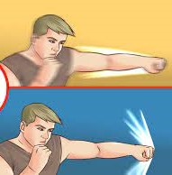

layout:false

background-image: url(assets/images/sna4ds_logo_140.png), url(assets/images/jads_logo_transparent.png), url(assets/images/network_people_7890_cropped2.png)
background-position: 100% 0%, 0% 10%, 0% 0%
background-size: 20%, 20%, cover
background-color: #000000

<br><br><br><br><br>
.full-width-screen-grey.center.fw9.font-250[
# .Orange-inline.f-shadows_into[`r rmarkdown::metadata$title`]
]

***

.full-width-screen-grey.center.fw9[.f-abel[.WhiteSmoke-inline[today's menu: ] .Orange-inline[`r rmarkdown::metadata$topic` .small-caps.font70[(lecture] .font70[`r rmarkdown::metadata$lecture_no`)]]]
  ]

<br>
.f-abel.White-inline[Your lecturer: `r rmarkdown::metadata$author`]<br>
.f-abel.White-inline[Playdate: `r rmarkdown::metadata$playdate`]


<!-- setup options start -->
```{r setup, include=FALSE}
knitr::opts_chunk$set(echo = FALSE,
                  comment = "",   # otherwise '##' is added in front of each output row
                  out.width = "90%",
                  fig.height = 6,
                  fig.path = "assets/images/",
                  fig.retina = 2,
                  dev = "svg",
                  message = FALSE,
                  warning = FALSE)
# library(htmlwidgets, quietly = TRUE, verbose = FALSE, warn.conflicts = FALSE)
# library(countdown, quietly = TRUE, verbose = FALSE, warn.conflicts = FALSE)

knitr::opts_knit$set(global.par = TRUE)  # anders worden de margin settings niet overal doorgevoerd

remedy::remedy_opts$set(name = paste0("stats_1", "_"))


edge_data <- c("a", "c", 
               "a", "d", 
               "a", "b", 
               "b", "c", 
               "b", "d", 
               "c", "e", 
               "d", "e", 
               "e", "f", 
               "f", "g", 
               "f", "h", 
               "g", "i", 
               "g", "j", 
               "h", "i", 
               "h", "j", 
               "i", "j")

el <- matrix(edge_data, ncol = 2, byrow = T)
net_igraph <- igraph::graph.edgelist(el, directed = F)
net_sna <- intergraph::asNetwork(net_igraph)
net_mat <- network::as.matrix.network.adjacency(net_sna)
net_mat[order(rownames(net_mat)), order(rownames(net_mat))]
diag(net_mat) <- 0
```


```{r marset, include = FALSE}
par(mar = c(0,0,0,0) + .05) #it's important to have this in a separate chunk
```


```{r xaringanExtra_settings, include = FALSE}
xaringanExtra::use_xaringan_extra(c("tile_view"
                                    , "panelset"
                                    , "animate"
                                    , "tachyons"
                                    , "freezeframe"
                                    , "broadcast"
                                    , "scribble"
                                    , "fit_screen"
                                    ))

xaringanExtra::use_webcam(50 * 3.5, 50 / 4 * 3 * 3.5)
xaringanExtra::use_editable(expires = 1)
xaringanExtra::use_search(show_icon = FALSE, case_sensitive = FALSE)
# xaringanExtra::use_clipboard()

htmltools::tagList(
  xaringanExtra::use_clipboard(
    button_text = "<i class=\"fa fa-clipboard\"></i>",
    success_text = "<i class=\"fa fa-check\" style=\"color: #90BE6D\"></i>",
    error_text = "<i class=\"fa fa-times-circle\" style=\"color: #F94144\"></i>"
  ),
  rmarkdown::html_dependency_font_awesome()
)
```


```{r xaringan-extra-styles, echo = FALSE}
xaringanExtra::use_extra_styles(
  hover_code_line = TRUE,         
  mute_unhighlighted_code = TRUE  
)
```

```{css echo=FALSE}
.highlight-last-item > ul > li, 
.highlight-last-item > ol > li {
  opacity: 0.5;
}

.highlight-last-item > ul > li:last-of-type,
.highlight-last-item > ol > li:last-of-type {
  opacity: 1;

.bold-last-item > ul > li:last-of-type,
.bold-last-item > ol > li:last-of-type {
  font-weight: bold;
}

.show-only-last-code-result pre + pre:not(:last-of-type) code[class="remark-code"] {
    display: none;
}
```

```{css}
.remark-inline-code {
  background: #F5F5F5;
  border-radius: 3px;
  padding: 4px;
}

.inverse-red, .inverse-red h1, .inverse-red h2, .inverse-red h3, .inverse-red a, inverse-red a > code {
	border-top: none;
	background-color: red;
	color: white; 
	background-image: "";
}

.inverse-orange, .inverse-orange h1, .inverse-orange h2, .inverse-orange h3, .inverse-orange a, inverse-orange a > code {
	border-top: none;
	background-color: orange;
	color: black; 
	background-image: "";
}
```


```{r some_handy_functions, echo = FALSE}
source("assets/R/components.R")
```


```{css}
.grid-3-1 {
  display: grid;
  height: calc(80%);
  grid-template-columns: repeat(3, 1fr);
  grid-template-rows: 1fr;
  align-items: center;
  text-align: center;
  grid-gap: 1em;
  padding: 1em;
}
```

<!-- setup options end -->

---
class: course-logo
layout: true

---
name: menu
description: List of contents for the lab
# Menu'
<br>
<br>
- TerMometer
- The Intensity of the Effects
- 7 steps Research Flow


---
# TerMometer
<br>

https://www.menti.com/alh367nr3ap3

code: 4163 0041

.center[]


---
<br>
<br>
<br>
<br>
<br>
<br>
<br>
# The Intensity of the Effects

---
name: Model_results
description: Interpreting model results
# Interpreting model results
<br>
<br>
<br>

1. $\theta$ > 0 and stat. signif. -> X increases P(1) and decreases P(0)
2. $\theta$ < 0 and stat. signif. -> X decreases P(1) and increases P(0)
3. $\theta$ not stat. signif. -> X does not affect P(1) and P(0)

---
# Binary 

## The sign of $\theta$ provides us with a binary interpretation:

### the probability of the edge forming
- Increases 
- Decreases

.center[]

---
# Ok, sure... How much!?

<br>
The number tells us "how much'' ---- Intensity

.center[]


---
# How much ... or "The extent to which..."

<br>
## x predicts y
<br>

- The odds that x predicts (y) edge formation
- The probability that x predicts (y) edge formation

---
name: Odds_ratios
description: Odds_ratios
# Odds ratios (Memo: Bootcamp!)

<br>

### ERGMs work with log scale, right? 

### Well, to interpret our coefficients we need to exponentiate it. Makes sense, doesn't it?

<br>

### When you exponentiate you estimate the odds of something to happen -- 

 .red[ODDS = probability of success]
 
### FORMULA

$OR = exp(\theta)$

---
# Odds Ratios meaning (Memo: Bootcamp!)

<br>

### If the coefficients are statistically significant it is possible to comment on the odds of the effect taking place

<br>
## Interpretation:

### An increase of 1 in $X_1$ increases the log odds with $\theta_1$ (log odds) and it makes the odds of the effect taking place $exp(\theta_1)$ times larger.

---
# Consider that...
<br>
<br>
## Odds Ratio is a measure of the strength of association with an exposure and an outcome.

<br>

1. OR > 1 means greater odds of association with the exposure and outcome.
2. OR = 1 means there is no association between exposure and outcome.
3. OR < 1 means there is a lower odds of association between the exposure and outcome.
---
name: Probabilities
description: Probabilities
# Probabilities
<br>
<br>
It measures the probability of an effect taking place
<br>
FORMULA:

$P = \frac{exp(\theta)}{1 + exp(\theta)}$

<br>

WARNING: if you want to use % the result needs to be multiplied by 100.

---
name: example_inter_res
description: Example for interpreting results
# Back to Florence

## Let's see the intensity of some effects

```{r lab11_01, echo = FALSE}
flo <-SNA4DSData::florentine
fflom <- flo$flomarriage
flom <- intergraph::asNetwork(fflom)
```

.center[]
---
# Dyadic independent model


```{r lab11_02, echo = TRUE}

m <- ergm::ergm(flom ~ edges + nodecov("Wealth"))

```

.center[]
---
# Coefficients 
$\theta$


```{r lab11_03, echo = TRUE}
summary(m)
```
---
# Coefficient interpretation
<br>
### Edges -2.595
$\theta$ < 0 and stat. signif. -> X decreases P(1) and increases P(0)

<br>
### Wealth 0.011

$\theta$ > 0 and stat. signif. -> X increases P(1) and decreases P(0)

<br>

## We still don't know anything about the intensity!!!
---
# Odds Ratios 

$exp(\theta)$


```{r lab11_04, echo = TRUE}
snafun::stat_ef_int(m, type = "odds")
```

### manually estimating edges odds ratios
```{r lab11_05, echo = TRUE}
exp(-2.594929)
```
---
# Odds Interpretation

### edges   0.075

An increase of 1 in .red[the number of edges] increases the log odds with $-2.595$ and it makes the odds of the effect taking place $0.075$ times larger.

OR < 1 means that the odds of forming edges in this network is small.

### nodecov.Wealth 0.011

An increase of 1 in .red[wealth] increases the log odds with $0.011$ and it makes the odds of the effect taking place $1.011$ times larger.

OR > 1 means that the odds of wealth influencing marriage are bigger

OR = 1 means there is little association between wealth influencing marriage.
---
# Probabilities 

$exp(\theta)/ (1 + exp(\theta))$

<br>
```{r lab11_06, echo = TRUE}
snafun::stat_ef_int(m, type = "prob")
```


## manually estimating edges probabilities
```{r lab11_08, echo = TRUE}

exp(-2.594929)/ (1 + exp(-2.594929))

```

---
# Probabilities Interpretation


```{r lab11_07, echo = TRUE}

0.069 * 100
0.503 * 100
```
<br>
### 6.9 % prob of forming edges

small prob, so it is consistent with the OR result
<br>
### 50.3 % prob that wealth predicts marriage

it's a bit more than 1/2 so it is consistent with the OR result


---
<br>
<br>
<br>
<br>
<br>
<br>
<br>
# 7 steps Research Flow

---
name: Research_flow
description: Approach to carry out research
# Let's organize our research in steps
<br>
1. Literature research/ Questions & Hypotheses (based on the literature) [- data collection]
2. Data Exploration + terms selection
3. Running models (baseline, exploratory models, final model)
4. MCMC diagnostics of the best selected model
5. Goodness of fit
6. Interpreting results
7. Write up about your research telling how this journey went

<br> 

.red[TIP: Rely on these steps for your report]

---
# See you on Wednesday!

<br>

.center[]


