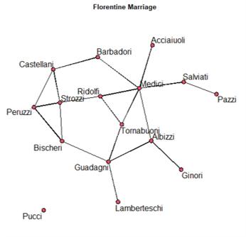
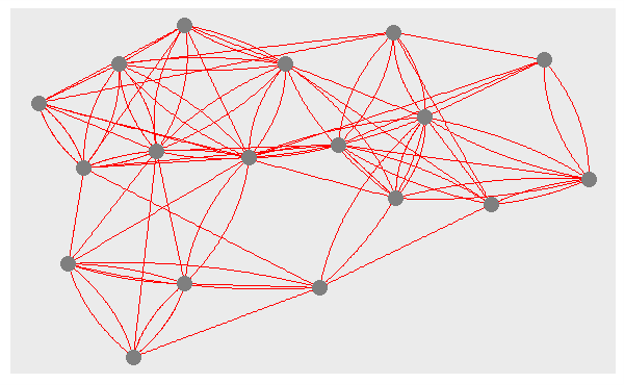
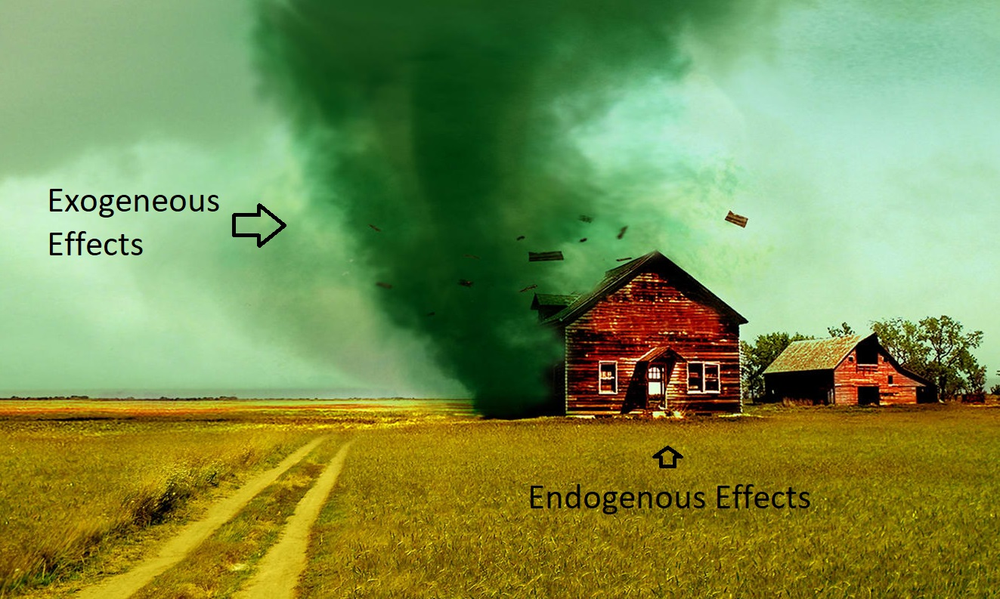
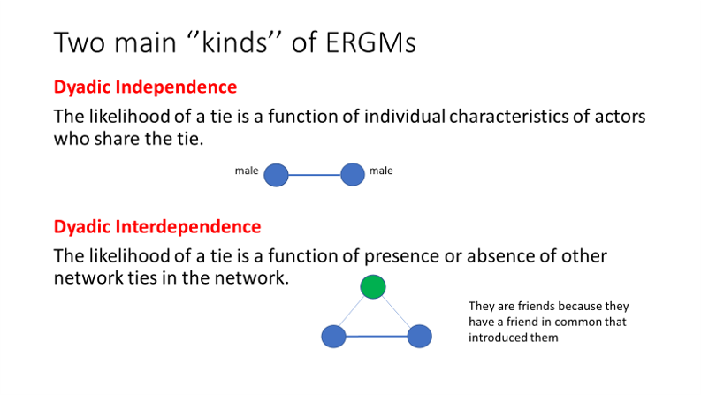
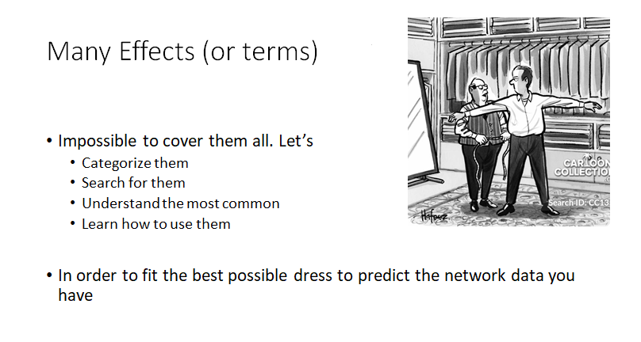
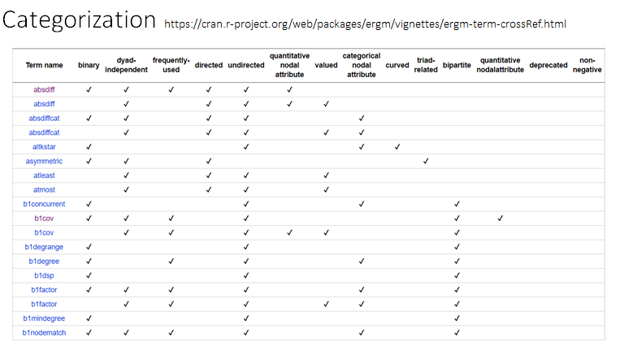
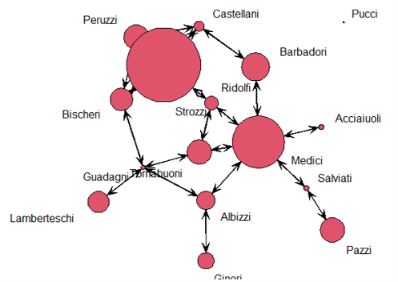
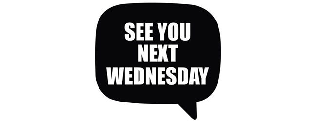

layout:false

background-image: url(assets/images/sna4ds_logo_140.png), url(assets/images/jads_logo_transparent.png), url(assets/images/network_people_7890_cropped2.png)
background-position: 100% 0%, 0% 10%, 0% 0%
background-size: 20%, 20%, cover
background-color: #000000

<br><br><br><br><br>
.full-width-screen-grey.center.fw9.font-250[
# .Orange-inline.f-shadows_into[`r rmarkdown::metadata$title`]
]

***

.full-width-screen-grey.center.fw9[.f-abel[.WhiteSmoke-inline[today's menu: ] .Orange-inline[`r rmarkdown::metadata$topic` .small-caps.font70[(lecture] .font70[`r rmarkdown::metadata$lecture_no`)]]]
  ]

<br>
.f-abel.White-inline[Your lecturer: `r rmarkdown::metadata$author`]<br>
.f-abel.White-inline[Playdate: `r rmarkdown::metadata$playdate`]


<!-- setup options start -->
```{r setup, include=FALSE}
knitr::opts_chunk$set(echo = FALSE,
                  out.width = "90%",
                  fig.height = 6,
                  fig.path = "assets/images/",
                  fig.retina = 2,
                  dev = "svg",
                  message = FALSE,
                  warning = FALSE)
# library(htmlwidgets, quietly = TRUE, verbose = FALSE, warn.conflicts = FALSE)
# library(countdown, quietly = TRUE, verbose = FALSE, warn.conflicts = FALSE)

knitr::opts_knit$set(global.par = TRUE)  # anders worden de margin settings niet overal doorgevoerd
```


```{r lecture_measures_01, include = FALSE}
par(mar = c(0,0,0,0) + .05) #it's important to have this in a separate chunk
```


```{r xaringanExtra_settings, include = FALSE}
xaringanExtra::use_xaringan_extra(c("tile_view"
                                    , "panelset"
                                    , "animate"
                                    , "tachyons"
                                    , "freezeframe"
                                    # , "broadcast"
                                    , "scribble"
                                    , "fit_screen"
                                    ))

# xaringanExtra::use_webcam(300 * 3.5, 300 / 4 * 3 * 3.5)
xaringanExtra::use_editable(expires = 1)
# xaringanExtra::use_search(show_icon = FALSE, case_sensitive = FALSE)
xaringanExtra::use_clipboard()

# htmltools::tagList(
#   xaringanExtra::use_clipboard(
#     button_text = "<i class=\"fa fa-clipboard\"></i>",
#     success_text = "<i class=\"fa fa-check\" style=\"color: #90BE6D\"></i>",
#     error_text = "<i class=\"fa fa-times-circle\" style=\"color: #F94144\"></i>"
#   ),
# rmarkdown::html_dependency_font_awesome()
# )
```


```{r xaringan-extra-styles, echo = FALSE}
xaringanExtra::use_extra_styles(
  hover_code_line = TRUE,         
  mute_unhighlighted_code = TRUE  
)
```

```{css echo=FALSE}
.highlight-last-item > ul > li, 
.highlight-last-item > ol > li {
  opacity: 0.5;
}

.highlight-last-item > ul > li:last-of-type,
.highlight-last-item > ol > li:last-of-type {
  opacity: 1;

.bold-last-item > ul > li:last-of-type,
.bold-last-item > ol > li:last-of-type {
  font-weight: bold;
}

.show-only-last-code-result pre + pre:not(:last-of-type) code[class="remark-code"] {
    display: none;
}
```


```{r some_handy_functions, echo = FALSE}
source("assets/R/components.R")
```


```{css}
.remark-inline-code {
  background: #F5F5F5;
  border-radius: 3px;
  padding: 4px;
}

.inverse-red, .inverse-red h1, .inverse-red h2, .inverse-red h3, .inverse-red a, inverse-red a > code {
	border-top: none;
	background-color: red;
	color: white; 
	background-image: "";
}

.inverse-orange, .inverse-orange h1, .inverse-orange h2, .inverse-orange h3, .inverse-orange a, inverse-orange a > code {
	border-top: none;
	background-color: orange;
	color: black; 
	background-image: "";
}

.tab{
  display: inline-block;
  margin-left: 40px;
}

.tab1{tab-size: 2;}
.tab2{tab-size: 4;}
.tab3{tab-size: 6;}
.tab4{tab-size: 8;}

```


```{css}
.grid-3-2a {
  display: grid;
  height: calc(90%);
  grid-template-columns: repeat(3, 1fr);
  grid-template-rows: 1fr 1fr;
  align-items: center;
  text-align: center;
  grid-gap: 1em;
  padding: 1em;
}
```

<!-- setup options end -->


---
class: course-logo
layout: true

---
# Announcements 
<br>
<br>
<br>
<br>


## Lab on Wednesday starts at 11 

---

# Disclaimer:
<br>
<br>
## lectures + labs + books = Good preparation 
<br>

### I'm not covering the book in class

### The lab puts in practice what we do in class (including the tricks to run the models)

---
name: Menu
description: Topics we cover today
# Menu' for today
<br>
- Recap of the previous episode
- How to fit the models in R
- Classification of the types of effects
- Finding your way in the Effect Jungle
- Fitting ERGMs with exogenous terms

---
<br>
<br>
<br>
<br>
<br>
<br>
<br>
# Recap of the previous episode

---
name: Recap_ERGM1
description: Recap of the previous ERGM class
# Lecture ERGM 1
<br>
- ERGMs are models for causal inference
- Inferential network analysis explains why an observed network is the way it is.
- Two types of effects:
    
    Endogenous: structural - terms that predict the probability of observing a certain network structure
    
    Exogenous: as in GLM - variables that predict the occurrence of ties
    
- ERGM with edges term (Erdos Renyi model)
- ERGM with edges + sender + receiver + mutual terms (P1 model)
- ERGM concept and math 

---
<br>
<br>
<br>
<br>
<br>
<br>
<br>
# How to fit the models in R

---
name: Fitting_ER
description: Fitting an Erdos Renyi model
# ERGM with edges term (Erdos Renyi)

## Florentine Marriage 
- 16 nodes - 20 edges - UNDIRECTED
- We observe a marriage pattern (certain network structure). Is it random?
- Do these Florentine families get married in a random way? .red[Is love blind?]


.center[]


---

# Is love blind in Renaissance Florence? 

## H: Love is not blind in Renaissance Florence

```{r lecERGM201, echo=FALSE}

floIgraph <-SNA4DSData::florentine

floIm <- floIgraph$flomarriage

flomarriage <- intergraph::asNetwork(floIm)


```


```{r lecERGM202, echo=TRUE}

flomodel.01 <- ergm::ergm(flomarriage ~ edges)
summary(flomodel.01)

```

## Love has very good sight (The p-value is significant)

### negative coefficient in this case means that the network is sparse. 

---
# ERGM with the edge term (ER)

<br>
 
### Very simple model 

### We can use it to see whether the edges are random or if they exist for a reason

### You will insert the `edge` term in every model -always important

### We use it as the intercept of the model - still it has a meaning


 
---
name: Fitting_P1
description: Fitting an ERGM with 4 terms - P1 model
# ERGM with 4 endogenous parameters (P1) 
## Holland and Leinhardt analyzed Sampson’s monks dataset 

- Ethnographic study of community structure in a New England monastery by Samuel F. Sampson.
- Social relationships among a group of men (novices) who were preparing to join a monastic order.
- Simplified data set - 18 nodes - 88 edges - DIRECTED


.center[]

---
# P1 model 
## Holland and Leinhardt analyzed Sampson’s monks dataset 
<br>
## .red[Are the social relationships between these monks random or driven by specific social dynamics?]

Example: A monk makes great beer --> everyone wants to be friend with him!

looking at
- Probability of forming edges (ER model)
- probability of wanting to be friends with another monk (sender)
- Probability that the other monks want to be friends with me (receiver)
- Probability that we mutually like each other (mutual)


---
# Is liking each other a random thing? 

## Friendship is not random, but driven by some social dynamic

- Look at p-values to see whether we can discard the null Hypothesis
- Look at the coefficient to appraise the intensity of the effect

### What can we conclude here?

```{r lecERGM203, echo=FALSE}

SampsonIgraphtot <- SNA4DSData::Sampson

SampsonLike1Ig <-SampsonIgraphtot$Sampson_like1

sampson <- intergraph::asNetwork(SampsonLike1Ig)

```

.scroll-box-18[
```{r lecERGM204, echo=TRUE}

p1 <- ergm::ergm(sampson ~ edges + sender + receiver + mutual) 

summary(p1)
```
]

---
# Individuals  VS network structure
<br>
## Sender and Receiver provide you with results about each node

## .red[They are an exception!]

## .center[most terms inform us about the network overall]

## .center[statistical models are  mostly about collective behavior]

## .center[rather than individual behavior]


---
<br>
<br>
<br>
<br>
<br>
<br>
<br>
# Classification of the types of effects

---
name: ERGM_Effects
description: More about ERGM Effects and estimation
# Classification of the types of effects

## classif. 1

.center[] 

---

# Classification of the types of effects

## classif. 2

.center[] 


---
# Estimation VS Simulation

<br>
### .red[Independence]
- Mathematically tractable
- Solved by Maximum Likelihood Estimation MLE 
- (or other, it depends)

### .red[Interdependence] 
- Mathematically INtractable
- Solved with approximation via simulation using Markov Chains Monte Carlo MCMC 
- (or other, it depends)

---
# Example

## TERM Mutual

- endogenous  
- dyadic dependent
- Mathematically INtractable: Solved with approximation via simulation using Markov Chains Monte Carlo MCMC

## TERMS sender/receiver

- endogenous 
- dyadic independent
- Mathematically tractable: Solved by Maximum Likelihood Estimation MLE 


---
# Other classifications
 <br>
- Unipartite - Bipartite

- Directed - Undirected

    istar - ostar 
    
    star

- Quadratic - Markovian

    triangles
    
    GWESP
    
- Binary - Weighted

- ...

---
<br>
<br>
<br>
<br>
<br>
<br>
<br>
# Finding your way in the Effects Jungle

---
name: Finding_Effects
description: How to find ERGM effects in the help files
# An effects Jungle
.center[]

---
# Use the help file!


.center[]

.footnote[https://cran.r-project.org/web/packages/ergm/vignettes/ergm-term-crossRef.html]


---
# Use the help file!

### `search.ergmTerms(keyword, net, categories, name)`

### Arguments

.red[search]: optional character search term to search for in the text of the term descriptions. Only matching terms will be returned. Matching is case insensitive.

.red[net]: a network object that the term would be applied to, used as template to determine directedness, bipartite, etc

.red[keywords]: optional character vector of keyword tags to use to restrict the results (i.e. 'curved', 'triad-related')

.red[name]: optional character name of a specific term to return

.red[packages]: optional character vector indicating the subset of packages in which to search


---
<br>
<br>
<br>
<br>
<br>
<br>
<br>
# Fitting ERGMs with exogenous terms


---
name: ERGM_pronunciation
description: How to pronounce the name of these models 
background-image: url(assets/images/Dutch_speaker.jpg)
background-size: 550px
background-position: 90% 50%
# ERGM for a Dutch speaker

## I noticed that for some of you it is hard to pronunce the name correctly

## Phonetical pronunciation for Dutch speakers

## "eurcoom" 

or

## "eurghum"


---
name: Fitting_ERGM_exogenous
description: Fitting ERGMs with exogenous terms
# Fitting an ergm with exo terms 

## So far, we only explored endogenous terms. Let's explore exogenous

- something that comes from the outside of the network structure

Wealth of the Florentine families. 


.center[]
Exogenous covariates are equivalent to logistic regressions. no MCMC


---
# One Exogenous Dyadic independent term

<br>

### Q: Are rich people more likely to get married?

### H: Being rich increases your probability of getting married (Love is not the reason)

### TERM: `nodecov()` Probability of a tie given the receiver having the similar attribute. 

<br>

```{r lecERGM205, echo=TRUE}

flo.wealth <- ergm::ergm(flomarriage ~ edges + nodecov("Wealth"))

```

---
# Results

- `edges` is (like) the intercept
- `nodecov("Wealth")` is like any other numeric variable in a Logistic regression
 

```{r lecERGM206, echo=TRUE}
summary(flo.wealth)
```

---
# Comments...
<br>
## It seems, that wealth predicts the likelihood to get married, but we want to be sure.

### Let's finetune the Hypothesis testing

<br>
## Is it maybe that equally rich families want to marry between each others? -No love then?
<br>

### TERM: `absdiff` - Probability of a tie given the similarity between sender and receiver. 

```{r lecERGM207, echo=TRUE}
flo.wealth1 <- ergm::ergm(flomarriage ~ edges + nodecov("Wealth") + absdiff("Wealth"))

```

---
# Results

## Can we reject the null Hypothesis? - there is no causal relationship between wealth and marriage

```{r lecERGM208, echo=TRUE}
summary(flo.wealth1)
```

---
# Model Comparison

```{r lecERGM209, echo=TRUE}
texreg::screenreg(list(flo.wealth,flo.wealth1))
```

---
# Results
<br>

### The model with `absdiff`  is performing less well than the one without

<br>

## We keep Model 1 and discard model 2.

<br>

## It is not always possible to change term like here. It depends on the H 

---
background-image: url(assets/images/Sheldon.jpg)
background-size: 450px
background-position: 70% 70%
## Oh Sheldon...

<br>

## It seems that rich families are more likely to get married and poorer are less likely, even among each others. 

### we can reject the null hypothesis...


---
background-image: url(assets/images/ReadingResultsLogScale.png)
background-size: 750px
background-position: 50% 70%
# Reading Results -significance
<br>
## ERGMs results are interpreted the same way as logistic regressions' results.

## Is it significant?

---
# Reading Results -intensity
<br>
## If the effect is significant, move on checking the intensity. 

## Two options: 

- odds ratios .red[exp(coef)]
- probability .red[I'll give you the formula later :)]

---

background-image: url(assets/images/FerrariToLidl.jpg)
background-size: 450px
background-position: 70% 70%
# ERGM with Exogenous variables only

## It would be a logistic regression

... Driving a Ferrari to Lidl and back home

## From next week we will explore more challenging cases

---


.center[]


---
