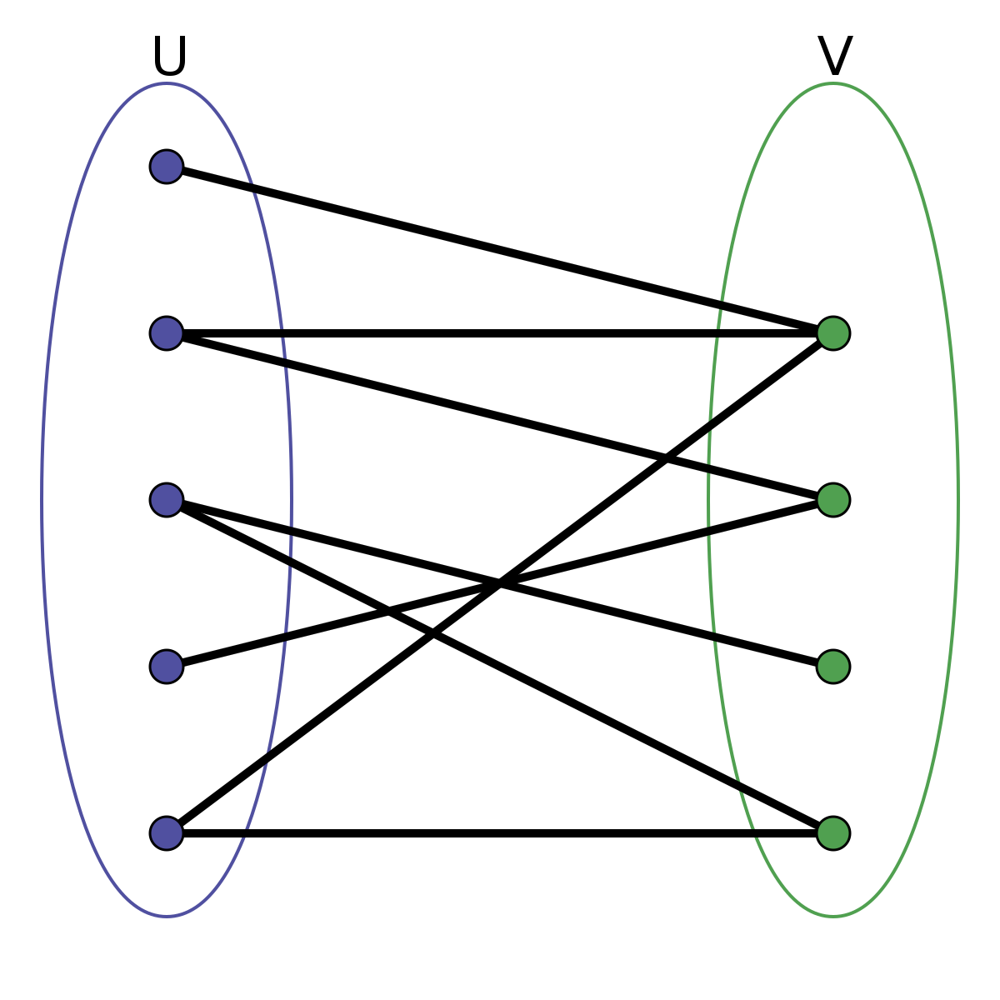
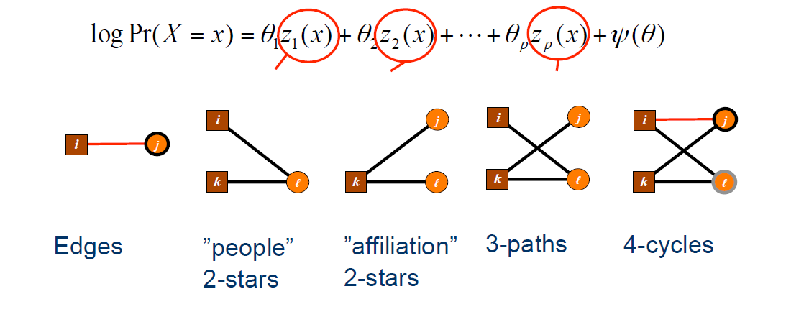
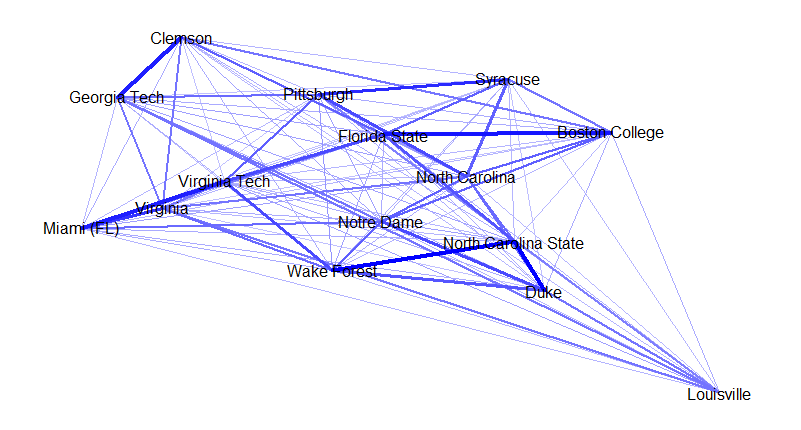
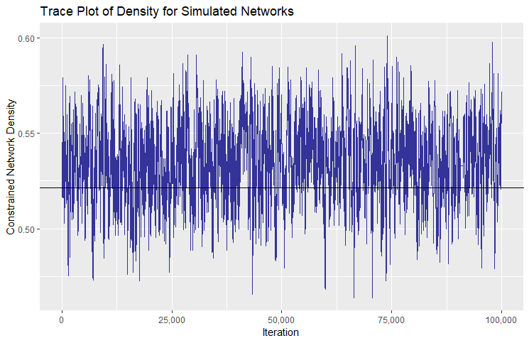
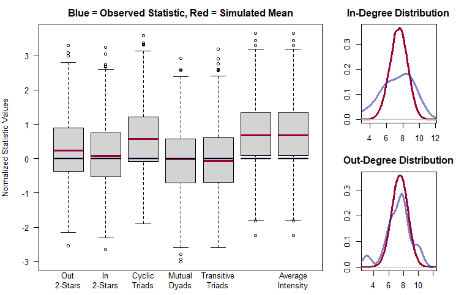
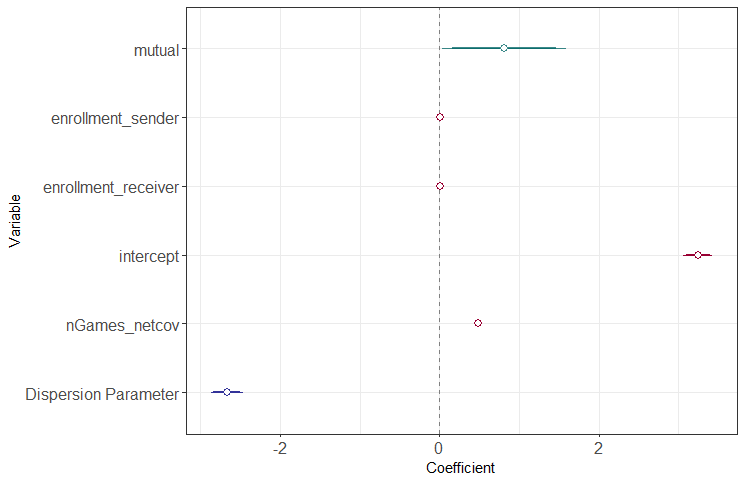

layout:false

background-image: url(assets/images/sna4ds_logo_140.png), url(assets/images/jads_logo_transparent.png), url(assets/images/network_people_7890_cropped2.png)
background-position: 100% 0%, 0% 10%, 0% 0%
background-size: 20%, 20%, cover
background-color: #000000

<br><br><br><br><br>
.full-width-screen-grey.center.fw9.font-250[
# .Orange-inline.f-shadows_into[`r rmarkdown::metadata$title`]
]

***

.full-width-screen-grey.center.fw9[.f-abel[.WhiteSmoke-inline[today's menu: ] .Orange-inline[`r rmarkdown::metadata$topic` .small-caps.font70[(lecture] .font70[`r rmarkdown::metadata$lecture_no`)]]]
  ]

<br>
.f-abel.White-inline[Your lecturer: `r rmarkdown::metadata$author`]<br>
.f-abel.White-inline[Playdate: `r rmarkdown::metadata$playdate`]


<!-- setup options start -->
```{r setup, include=FALSE}
knitr::opts_chunk$set(echo = FALSE,
                  out.width = "90%",
                  fig.height = 6,
                  fig.path = "assets/images/",
                  fig.retina = 2,
                  dev = "svg",
                  message = FALSE,
                  warning = FALSE)
# library(htmlwidgets, quietly = TRUE, verbose = FALSE, warn.conflicts = FALSE)
# library(countdown, quietly = TRUE, verbose = FALSE, warn.conflicts = FALSE)

knitr::opts_knit$set(global.par = TRUE)  # anders worden de margin settings niet overal doorgevoerd
```


```{r lecture_measures_01, include = FALSE}
par(mar = c(0,0,0,0) + .05) #it's important to have this in a separate chunk
```


```{r xaringanExtra_settings, include = FALSE}
xaringanExtra::use_xaringan_extra(c("tile_view"
                                    , "panelset"
                                    , "animate"
                                    , "tachyons"
                                    , "freezeframe"
                                    # , "broadcast"
                                    , "scribble"
                                    , "fit_screen"
                                    ))

# xaringanExtra::use_webcam(300 * 3.5, 300 / 4 * 3 * 3.5)
xaringanExtra::use_editable(expires = 1)
# xaringanExtra::use_search(show_icon = FALSE, case_sensitive = FALSE)
xaringanExtra::use_clipboard()

# htmltools::tagList(
#   xaringanExtra::use_clipboard(
#     button_text = "<i class=\"fa fa-clipboard\"></i>",
#     success_text = "<i class=\"fa fa-check\" style=\"color: #90BE6D\"></i>",
#     error_text = "<i class=\"fa fa-times-circle\" style=\"color: #F94144\"></i>"
#   ),
# rmarkdown::html_dependency_font_awesome()
# )
```


```{r xaringan-extra-styles, echo = FALSE}
xaringanExtra::use_extra_styles(
  hover_code_line = TRUE,         
  mute_unhighlighted_code = TRUE  
)
```

```{css echo=FALSE}
.highlight-last-item > ul > li, 
.highlight-last-item > ol > li {
  opacity: 0.5;
}

.highlight-last-item > ul > li:last-of-type,
.highlight-last-item > ol > li:last-of-type {
  opacity: 1;

.bold-last-item > ul > li:last-of-type,
.bold-last-item > ol > li:last-of-type {
  font-weight: bold;
}

.show-only-last-code-result pre + pre:not(:last-of-type) code[class="remark-code"] {
    display: none;
}
```


```{r some_handy_functions, echo = FALSE}
source("assets/R/components.R")
```


```{css}
.remark-inline-code {
  background: #F5F5F5;
  border-radius: 3px;
  padding: 4px;
}

.inverse-red, .inverse-red h1, .inverse-red h2, .inverse-red h3, .inverse-red a, inverse-red a > code {
	border-top: none;
	background-color: red;
	color: white; 
	background-image: "";
}

.inverse-orange, .inverse-orange h1, .inverse-orange h2, .inverse-orange h3, .inverse-orange a, inverse-orange a > code {
	border-top: none;
	background-color: orange;
	color: black; 
	background-image: "";
}

.tab{
  display: inline-block;
  margin-left: 40px;
}

.tab1{tab-size: 2;}
.tab2{tab-size: 4;}
.tab3{tab-size: 6;}
.tab4{tab-size: 8;}

```


```{css}
.grid-3-2a {
  display: grid;
  height: calc(90%);
  grid-template-columns: repeat(3, 1fr);
  grid-template-rows: 1fr 1fr;
  align-items: center;
  text-align: center;
  grid-gap: 1em;
  padding: 1em;
}
```

<!--scroll box set up -->
```{css}
./* Allow slides to show overflowing content */
.remark-slide-content {
  overflow: visible !important;
}

/* Scroll box */
.scroll-box-18 {
  display: block;           /* make it a block element */
  max-height: 18em;         /* height of scroll box */
  overflow-y: auto;         /* vertical scroll */
  padding: 0.5em;
  border: 1px solid #ccc;
  border-radius: 6px;
  background-color: #fafafa;
  box-sizing: border-box;   /* include padding in height */
}

/* Optional: nicer scrollbar */
.scroll-box-18::-webkit-scrollbar {
  width: 8px;
}

.scroll-box-18::-webkit-scrollbar-thumb {
  background: #888;
  border-radius: 4px;
}

.scroll-box-18::-webkit-scrollbar-thumb:hover {
  background: #555;
}


```


<!-- setup options end -->


---
class: course-logo
layout: true

---
name: menu
description: List of contents for today's lecture
# Menu'
<br>
<br>
<br>

- Bipartite ERGMs
- Weighted ERGMs


---
<br>
<br>
<br>
<br>
<br>
<br>
<br>
# Bipartite ERGMs

---
name: Bipartite_graph
description: Recap about bipartite graphs
# Recap: What's a bipartite graph?

- 2 sets of objects 
- connections are allowed across sets
- connections are forbidden within set


.center[]

---
# Classic Examples
<br>
## People --- Events
<br>
- Kids to birthday parties

- Men to knitting club meetings

- Women to football practices

- ...

---
# Less Common Examples
<br>
## Two groups of people 
<br>
- heterosexual relationships

- consultants and customers

- doctors and patients

- manager and employees 

- professors and students

## It is about connections that are forbidden or that make no sense for us in that moment
---
name: modelling_Bipartite_graph
description: Modelling bipartite graphs
# Unimodal (regular) ERGMs
<br>

### Deal with one set of nodes (each one can connect to each other)

to make it work for bipartite data you can project it 

- set 1 are the nodes and being pairwise connected to a node in set 2 creates an edge on this one projection
- set 2 are the nodes and being pairwise connected to a node in set 1 creates an edge on the other projection

### Both projections would be undirected by definition

(also, usually bipartite connections go in one direction only -- kinds --> parties)

If you don't want/can't project it, you can use Bipartite ERGMs
---
# Bipartite ERGMs
<br>

### Conceptually the same as the unimodal
- It works as a unimodal with constraints
- Same formula
- Special terms same concepts 

### They are cumbersome ergm

- It takes much longer to run
- You need to use the advanced options (control ergm) to make the model work

---
name: Bipartite_model_terms
description: Terms for bipartite models
# Bipartite terms


.center[]

4 cycle: Bi-cliques


---
# Bipartite terms
<br>
`ergm::search.ergmTerms(search = 'bipartite')`

Found  36  matching ergm terms

### Some examples

- `nodecov` --> `b1cov` & `b2cov`
- `nodefactor` --> `b1factor` & `b2factor`
- `nodematch` --> `b1nodematch` & `b2nodematch`
- `star(k)` --> `b1star(k)` &  `b2star(k)`
- `gwdsp()` --> `gwb1dsp()` & `gwb2dsp()` - no esp since triangles cannot close!
- etc., ...
---
background-image: url(assets/images/kids_toy_bip_example.jpg)
background-size: 450px
background-position: 90% 60%
name: Bipartite_model_example
description: Bipartite model example
# Toy Example

### convergence time is higher than the unimodal ERGM so, tiny data set for the slides

### Kids going to events 

- 7 kids 
- 3 events
- 6 edges 
- 1 attribute (clubs red and yellow)

Let's assume we already have 
- RQs
- Hs
- chosen model terms

Let's run 


---
# Baseline model

```{r w11_01, echo=FALSE}
setwd("/Users/czucca/Documents/SNA4DS_25-26/SNA4DSSlides")
load("kidsToyBipartData.RData")

network::set.vertex.attribute(kids, "bipartite", value = rep(TRUE, 3), v = 1:3)

```


.scroll-box-18[
```{r w11_02, echo=TRUE}
m0 <- ergm::ergm(kids ~ edges,
                 control = ergm::control.ergm(
                    MCMC.samplesize = 5000,
                    MCMC.burnin = 1000, 
                    MCMLE.maxit = 10,
                    parallel = 10,
                    parallel.type = "PSOCK"
                  ) )
summary(m0)

```
]
---
# Dyadic independent term

.scroll-box-18[
```{r w11_03, echo=TRUE}
m1 <- ergm::ergm(kids ~ edges  + b1factor("color", levels = -1),
                 control = ergm::control.ergm(
                    MCMC.samplesize = 5000,
                    MCMC.burnin = 1000, 
                    MCMLE.maxit = 10,
                    parallel = 10,
                    parallel.type = "PSOCK"
                  ) )
summary(m1)
```
]


---
# Dyadic dependent terms

.scroll-box-18[
```{r w11_04, echo=TRUE}
m2 <- ergm::ergm(kids ~ edges  + b1factor("color", levels = -1) + b1star(2),
                 control = ergm::control.ergm(
                    MCMC.samplesize = 5000,
                    MCMC.burnin = 1000, 
                    MCMLE.maxit = 10,
                    parallel = 10,
                    parallel.type = "PSOCK"
                  ) )
summary(m2)
```
]

---
# Are we done?

<br>
## We inserted all the terms, are we done? 
<br>
### In this toy example, we might, but in a real bipartite ergm, hardly.

The function `ergm::ergm` is set to run simulation on every possible combination (ignoring the forbidden ones)

But many more combinations are not possible here, then why not saving some computational time?

<br>
## We need to .red[constraint] the model 

---
name: Model_constraints
description: Model constraints 
# Constraints
<br>
`ergmConstraint -- Sample Space Constraints for Exponential-Family Random Graph Models`

p. 122, ergm user manual .link[https://cran.r-project.org/web/packages/ergm/ergm.pdf]
<br>
### Model the distribution telling to the simulation what needs to stay stable or vary 

- "+" increase the constraint

- "-" decrease the constraint 

Several options there. Example:

bd <- sets a min and a max for degree

---
# Constraining for degree 

- min 0 -- isolates
- max 7 -- number of nodes that can attend party


.scroll-box-18[
```{r w11_04_1, echo=TRUE}

# network::get.vertex.attribute(kids, "color")

m3 <- ergm::ergm(kids ~ edges  + b1factor("color", levels = -1) + b1star(2),
                 constraints= ~ bd(minout = 0, maxout = 10),
                 control = ergm::control.ergm(
                    MCMC.samplesize = 5000,
                    MCMC.burnin = 1000, 
                    MCMLE.maxit = 10,
                    parallel = 10,
                    parallel.type = "PSOCK"
                  ) )
summary(m3)
```
]

---
# Another approach - blocking connections
<br>

### Example: you want to model relationships between bosses and employees as a bipartite

- Connections not allowed within the same work category for your study purposes

- This is bipartite in nature

- Rather than model it as a bipartite though, you insert the network as a unimodal 

- Then you .red[constraint] for impossible relationships between bosses and employees

- you do that using the argument `blocks` e.g., `ergm::ergm(formula, constrainsts = ~ blocks(...)`


---
name: Offset
description: Offset a term in model specification
# Offset
<br>
## Another advanced option in ergm specification 

### You can use it to improve convergence. 

### Rather than removing a term that messes with your simulation, you fix its coefficient to something
<br>

Enclosing a model term in offset() fixes its value to one specified
in offset.coef. (A second argument—a logical or numeric index vector—can
be used to select which of the parameters within the term are offsets.)


---
name: Ergm_control
description: Function for control ergm 
# Control ergm
<br>

Since your simulation very likely is still clunky, you need to set up these parameters too

.scroll-box-18[
```{r w11_04_2, echo=TRUE}

# network::get.vertex.attribute(kids, "color")

m4 <- ergm::ergm(kids ~ edges  + b1factor("color", levels = -1) + b1star(2),
                 constraints= ~ bd(minout = 0, maxout = 10),
                 control = ergm::control.ergm(
                    MCMC.samplesize = 5000,
                    MCMC.burnin = 1000, 
                    MCMLE.maxit = 10,
                    parallel = 10,
                    parallel.type = "PSOCK"
                  ) )
summary(m4)
```
]


---
name: diagnostics_bipartite
description: diagnostics for bipartite 
# MCMC.diagnostics
<br>
### The usual way

.scroll-box-18[
```{r w11_05, echo=TRUE}
ergm::mcmc.diagnostics(m4)
```
]

---
name: gof_bipartite
description: goodness of fit for bipartite 
# GOF 
<br>
### The usual way
.scroll-box-18[
```{r w11_06, echo=TRUE}
ergm::gof(m4)
```
]

---
# Interpreting Results - Final model
<br>
The advanced `ergm` options improved the IAC and BIC
.scroll-box-18[
```{r w11_07, echo=TRUE}
texreg::screenreg(m4)
```
]

---
<br>
<br>
<br>
<br>
<br>
<br>
<br>
# Weighted ERGMs


---
name: weighted_networks
description: Recap Weighted networks
# Weighted Networks 
<br>
<br>
<br>
## A weighted network is a network where the edges express the weight or intensity of the relationship.
<br>
## It is still unimodal, but it contains more information.


---
# Different kinds of weight 
<br>

## Example 1: Friendship network 

### Built using two questions 
    
- Who are your closest friends? --> ties
    
- How many times per week do you see them? --> weight
    
In this case if you don't consider the weight you can still predict tie formation.

It makes sense. 

The weight is more like an attribute. 

An helpful but not essential extra info 

The network is not fully connected

---
# Different kinds of weight 
<br>

## Example 2: Financial Exhange Network

- Nodes: countries 
- Edges: whether money moves from one to the other

### This network is fully connected

### The weight ($$$) makes all the difference. 

---
# Type two
<br>
## How to ask causal questions (edge formation) on this type 2 weighted networks?

Option 1: You find a meaningful threshold and remove the weight. 

- Above N (dollars) -- edge between 2 countries 
- Below N (dollars) -- no edge between 2 countries 

It might work, but you are wasting lot of information

### The right thing to do would be explaining edge formation with a ERGM specifically designed for weighted data.


---
# Yes, How? 
<br>
### Mathematically, the weight adds complexity to the problem. 

### The ERGM formula needs to be expanded to include this new bit. 

### How?

It depends on how the problem is formulated in the first place 

## DUH!

---
name: weight_types
description: Types of Weighted networks 
# Get to know your weight!
<br>
## Variables.
<br>
### What kind of variable is your weight? 

- Count 

- Continuous (either bounded, bounded on one side, or unbouded )

---
name: weight_count
description: Weighted networks Count
# Count 

Sampson Monks, 3 networks: 

- Like each other in time 1 
- Like each other in time 2
- Like each other in time 3

"Like" can have 3 values (if connected at all)

- 1 liked at some point (so not much overall)
- 2 liked most of the time (likelihood with some issues)
- 3 real friendship (likelihood lasts over time)

### If you have a case like this you have a count weight [1,2,3, ..., N) -- bounded on one side

### May `statnet` be with you (`ergm.count` packages)

---
name: weight_continuous
description: Weighted networks continuous 
# Continuous 

### Financial exchange 

Continuous (...Dollars...) Unbounded. 

Any amount of money (also negative)

### This is a more general case that encompasses the one before as well. 

### `statnet` does not help us anymore 

We need a new environment to estimate the probability of forming "financial edges" between pairs of countries.

### We have the Generalized Exponential Random Graph Model (GERGM) 

[introduced by the authors of your text book]

.footnote[Desmarais, B. A., Cranmer, S.J. (2012), Statistical Inference for valued-edge networks: The Generalized Exponential Random Graph Model, PLOS ONE]


---
name: GERGM
description: package for weighted network ERGMs 
# GERGM
<br>
## Even if the analogy with the GLM is obvious, it is not really the same thing. 

In the GERGM the network is always a fully connected one. Hence it cannot handle every type of network as the name suggests. 

### A GERGM is defined by two equations respectively representing:

1. Effect of covariates on the edge formation together with the marginal distribution properties of the edges (the old familiar equation)
2. The relationships among the edges

The probability distribution is conditioned on two parameters $\theta$ and $\gamma$

---
name: weighted_network_math
description: GERGM mathematical specification
# GERGM Math
<br>
### Original ERGM equation 
### $P(N,\theta) = \frac{exp\{\theta^T h(N)\}}{\sum_{N^*\in \mathcal{N}} exp\{\theta^T h(N^*) \}^T}$


### GERGM
### $fX(x|\theta) = \frac{exp\{\theta^T h(x)\}}{\int_{[0,1]^m} exp(\theta^T h(z) )dz^T}$  

With $x \in [O,I]^m$ that represents the way the edges values relate to each other.

$\mathcal{N}$ does not denote anymore the adjancency matrix  since the network is fully connected. 

We refer at this network with $X$ instead. 


---
# GERGM Math: bonus equation 
<br>

Up to this point  we can handle 

- a fully connected network with weights bounded between 0 and 1
- parameters ranging from 0 and 1

We want more! Hence, here is your bonus equation!


### $f_Y(y | \theta, \gamma) = \frac{exp(\theta^T h(T(y | \gamma))}{\int_{[0,1]^m} exp(\theta^T h(z) )dz^T} \prod_{i,j} t_{i,j}(y_{i,j}| \gamma )$

This equation models the distribution of the edge weights and the parameters.

---
name: GERGM_package
description: A package for weighted network ERGMs 
# Nice to meet (see) you GERGM package
<br>
### Installation:
`remotes::install_github("matthewjdenny/GERGM", dependencies = TRUE)`

### User manual
`https://github.com/matthewjdenny/GERGM`

### Vignette

in the R console `browseVignettes("GERGM")`

---
name: GERGM_terms
description: Specification of GERGM terms 
# Intercept
<br>

## `edges` - same as in `ergm` - still used as intercept.

### More options available:

- edges(method = "endogenous") - to include the intercept as in a traditional ERGM

- edges(method = "regression") - to include an intercept in the lambda transformation of the network


---
name: GERGM_endogenous
description: Specification of endogenous GERGM terms 
# GERGM Endogenous model terms: 
<br>
- `twostars`, equivalent to `star(2)`
- `out2stars`, equivalent to `ostar(2)`
- `in2stars`, equivalent to `istar(2)`
- `ctriads`, same as in `ergm`
- `mutual`, same as in `ergm`
- `ttriads`, same as in `ergm`

### Convergence problems? Use exponential down-weighting

E.g., `out2stars(alpha = 0.25)` - default = 1

---
name: GERGM_exogenous
description: Specification of exogenous GERGM terms 
# GERGM Exogenous model terms: 
<br>

## Very similar to the `ergm` package

- `absdiff(covariate = "MyCov")`
- `sender(covariate = "MyCov")` -- != from `ergm` here attribute - nodeocov
- `receiver(covariate = "MyCov")` -- != from `ergm` here attribute - nodeicov
- `nodematch(covariate = "MyCov", base = "Ref.cat")`
- `nodemix(covariate = "MyCov", base = "Ref.cat")` 
- `netcov(network)` -- like `edgecov` in `ergm`


---
# GERGM example from your book

- nodes = Basketball teams

- edge-weight = N of points that $i$ scored to $j$ during the season

```{r w11_08, echo=FALSE}

data(ACCBasketball, package = "ina")

# GERGM::plot_network(adjacencyMatrix, white_background = TRUE, show_legend = FALSE)

```

.center[]


---
name: GERGM_data
description: Specification for data format in the GERGM package 
## Data Format

.red[NO NETWORK or IGRAPH class]

- adjacency weighted matrix
- data frame with attributes (all together)

.scroll-box-18[
```{r w11_09, echo=TRUE}

class(adjacencyMatrix) 
dim(adjacencyMatrix)
class(covariateData)
dim(covariateData)
colnames(covariateData)


```
]

---
name: GERGM_formula_specification
description: Specification of the formula in a GERGM model 
# Model Specification
<br>
###Let's assume that 

- we have our solid theory ready and we can specify the model already
- we run baseline models and other control models already

### We are running our final model

Nope! we specify the formula first!

.scroll-box-18[
```{r w11_10, echo=TRUE}

formula <- adjacencyMatrix ~ edges +
  sender("enrollment") + 
  receiver("enrollment") +
  netcov(nGames) + 
  mutual(alpha = .9) 

```
]

---
# Now we are running the model

.scroll-box-18[
```{r w11_11, echo=TRUE}

set.seed(5)

gergmResults <- GERGM::gergm(formula,
                             covariate_data = covariateData, # passing attributes on
                             number_of_networks_to_simulate = 100000,
                             MCMC_burnin = 10000,
                             thin = 1/10, # retaining only a small number of simulated Networks in the computer memory
                             transformation_type = "Cauchy", # it depends on the distribution of your weight
                             parallel = TRUE,
                             cores = 6)
```
]


---
name: GERGM_model_results
description: Exploring results in a GERGM model
# Now we are exploring the results 

`GERGM::Trace_Plot(gergmResults)`

.center[]

---
# Now we are exploring the results 
<br>
.center[]


---
# Now we are exploring the results 

`GERGM::Estimate_Plot(gergmResults)` 

.center[]


---
# Now we are exploring the results 

`GERGM::Trace_Plot(gergmResults)`

```{r w11_12, echo=TRUE}

(EstSE <- rbind(t(attributes(gergmResults)$theta.coef),
               t(attributes(gergmResults)$lambda.coef)))
```

---
.center[]


