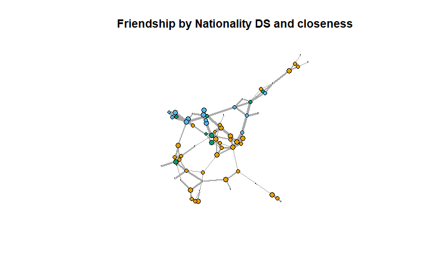
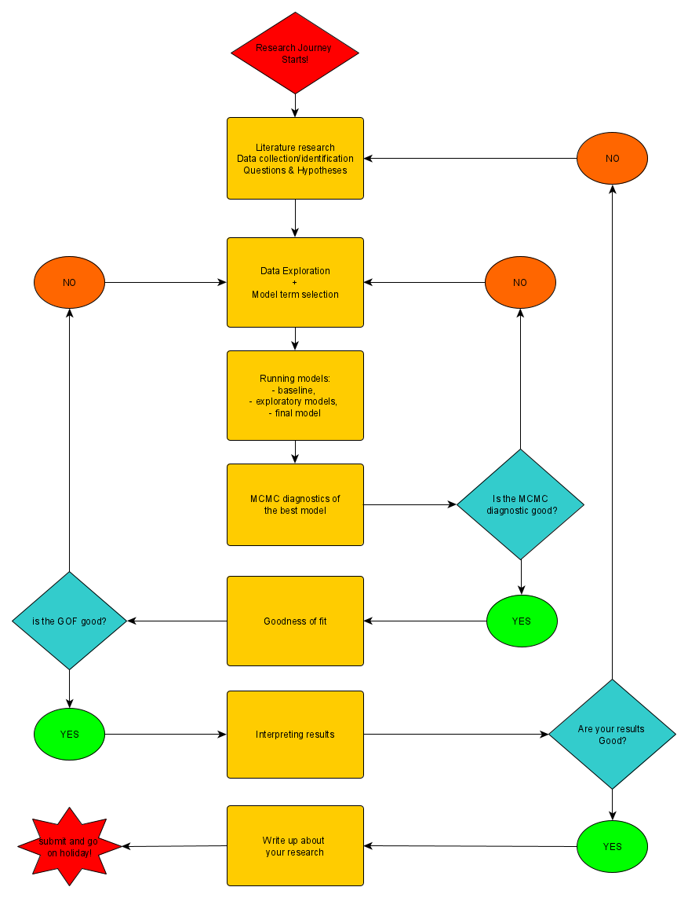
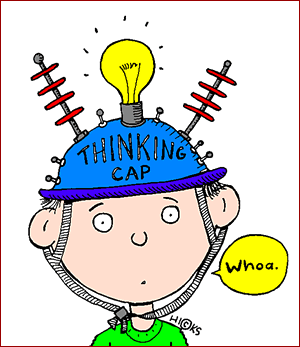
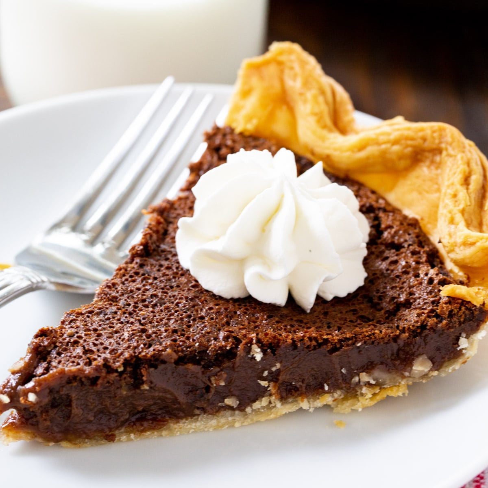

layout:false

background-image: url(assets/images/sna4ds_logo_140.png), url(assets/images/jads_logo_transparent.png), url(assets/images/network_people_7890_cropped2.png)
background-position: 100% 0%, 0% 10%, 0% 0%
background-size: 20%, 20%, cover
background-color: #000000

<br><br><br><br><br>
.full-width-screen-grey.center.fw9.font-250[
# .Orange-inline.f-shadows_into[`r rmarkdown::metadata$title`]
]

***

.full-width-screen-grey.center.fw9[.f-abel[.WhiteSmoke-inline[today's menu: ] .Orange-inline[`r rmarkdown::metadata$topic` .small-caps.font70[(lab] .font70[`r rmarkdown::metadata$lecture_no`)]]]
  ]

<br>
.f-abel.White-inline[Your lecturer: `r rmarkdown::metadata$author`]<br>
.f-abel.White-inline[Playdate: `r rmarkdown::metadata$playdate`]


<!-- setup options start -->
```{r setup, include=FALSE}
knitr::opts_chunk$set(echo = FALSE,
                  comment = "",   # otherwise '##' is added in front of each output row
                  out.width = "90%",
                  fig.height = 6,
                  fig.path = "assets/images/",
                  fig.retina = 2,
                  dev = "svg",
                  message = FALSE,
                  warning = FALSE)
# library(htmlwidgets, quietly = TRUE, verbose = FALSE, warn.conflicts = FALSE)
library(countdown, quietly = TRUE, verbose = FALSE, warn.conflicts = FALSE)

knitr::opts_knit$set(global.par = TRUE)  # anders worden de margin settings niet overal doorgevoerd

remedy::remedy_opts$set(name = paste0("stats_07", "_"))

data(louis, package = "SNA4DSData")
data(fifa2006, package = "SNA4DSData")
load("assets/data/nam_mods.Rdata")
load("assets/data/fifa_mods.Rdata")
```


```{r marset, include = FALSE}
par(mar = c(2,2,2,2) + .05) #it's important to have this in a separate chunk
```


```{r xaringanExtra_settings, include = FALSE}
xaringanExtra::use_xaringan_extra(c("tile_view"
                                    , "panelset"
                                    , "animate"
                                    , "tachyons"
                                    , "freezeframe"
                                    # , "broadcast"
                                    , "scribble"
                                    , "fit_screen"
                                    ))

xaringanExtra::use_webcam(200, 150)
xaringanExtra::use_editable(expires = 1)
xaringanExtra::use_search(show_icon = FALSE, case_sensitive = FALSE)
xaringanExtra::use_clipboard()

# htmltools::tagList(
#   xaringanExtra::use_clipboard(
#     button_text = "<i class=\"fa fa-clipboard\"></i>",
#     success_text = "<i class=\"fa fa-check\" style=\"color: #90BE6D\"></i>",
#     error_text = "<i class=\"fa fa-times-circle\" style=\"color: #F94144\"></i>"
#   ),
#   rmarkdown::html_dependency_font_awesome()
# )
```


```{r xaringan-extra-styles, echo = FALSE}
xaringanExtra::use_extra_styles(
  hover_code_line = TRUE,         
  mute_unhighlighted_code = TRUE  
)
```

```{css echo=FALSE}
.highlight-last-item > ul > li, 
.highlight-last-item > ol > li {
  opacity: 0.5;
}

.highlight-last-item > ul > li:last-of-type,
.highlight-last-item > ol > li:last-of-type {
  opacity: 1;

.bold-last-item > ul > li:last-of-type,
.bold-last-item > ol > li:last-of-type {
  font-weight: bold;
}

.show-only-last-code-result pre + pre:not(:last-of-type) code[class="remark-code"] {
    display: none;
}
```

```{css}
.remark-inline-code {
  background: #F5F5F5;
  border-radius: 3px;
  padding: 4px;
}

.inverse-red, .inverse-red h1, .inverse-red h2, .inverse-red h3, .inverse-red a, inverse-red a > code {
	border-top: none;
	background-color: red;
	color: white; 
	background-image: "";
}

.inverse-orange, .inverse-orange h1, .inverse-orange h2, .inverse-orange h3, .inverse-orange a, inverse-orange a > code {
	border-top: none;
	background-color: orange;
	color: black; 
	background-image: "";
}

.tab{
  display: inline-block;
  margin-left: 40px;
}

.tab1{tab-size: 2;}
.tab2{tab-size: 4;}
.tab3{tab-size: 6;}
.tab4{tab-size: 8;}

```


```{r some_handy_functions, echo = FALSE}
source("assets/R/components.R")
```


```{css}
.grid-2-2 {
  display: grid;
  height: calc(80%);
  grid-template-columns: repeat(2, 1fr);
  grid-template-rows: 1fr 1fr;
  align-items: center;
  text-align: center;
  grid-gap: 1em;
  padding: 1em;
}
```

<!-- setup options end -->

---

class: bg-Black course-logo

background-image: url(assets/images/chris-montgomery-smgTvepind4-unsplash-L.jpg)
background-position: 100% 0%
background-size: cover
background-color: #000000

### .White-inline.font350.b[<br>Turn your<br>cameras on!]


.footnote[[Credit](https://unsplash.com/@cwmonty)]

---
class: course-logo
layout: true

---

name: menu
description: List of contents for today's Lab
# Menu
<br>

- Super Lab - Real Time ERGM!
- Final Recommendations
- ERGMs Qs & As


---
<br>
<br>
<br>
<br>
<br>
<br>
<br>
<br>
# Real Time ERGM


---
# Let's Research JADS Data! :)

.center[]

```{r countdown_1, echo = FALSE, eval = TRUE}
countdown::countdown(
  minutes = 60,
  seconds = 0,
  # Fanfare when it's over
  play_sound = TRUE,
  warn_when = 30,
  color_border = "orange",
  bottom = 30,   # bottom right locationFf
  # padding = "50px",
  margin = "5%",
  font_size = "3em"
)
```

`setwd("C:/Users/...")`

`load("JADSmaster2022.Rdata")`


---
<br>
<br>
<br>
<br>
<br>
<br>
<br>
<br>
# Final Recomendations


---

# Remember
<br>
- Network outcome variable 
- Always use structural terms
- Handling large networks
- Handling complex cases 
- Seven step flow approach 

---
name: Net_out
description: The meaning of having a network as outcome variable
# Network outcome variable 

<br>

## You already know that ERGMs work with a network outcome variable. 
<br>
## Make sure you are developing your theory accordingly!

### Some examples

- Is it more likely that people of the same age are friends?
- Do more popular scholars prefer to collaborate with other popular scholars?
- Do companies want to trade with other companies in the same sector?

---
# Please NOTE:

## Is it more likely that people of the same age are friends?

- outcome: friendship
- predictor: age (numeric)

## Do more popular scholars prefer to collaborate with other popular scholars?

- outcome: collaboration 
- predictor: popularity (numeric/ordinal)

## Do companies want to trade with other companies in the same sector?
- outcome: trade
- predictor: sector (categorical)

---
name: Str_terms
description: The importance of including structural terms
# Always use structural terms
<br>

## Even if your hypotheses do not point you to structural terms, they still must be in the model.

<br>

### Two reasons

- Otherwise it is just like a logistic regression 
- The model won't work well

<br>

## ERGMs explain relationships.

Allow them to do their job


---
name: Large_nets
description: How to handle large networks
# Handling large networks
<br>
## Ideally, for this assignment, you should stay below 500 nodes


---
# Handling large networks
<br>
## Ideally, for this assignment, you should stay below 500 nodes

## .red[Why?]

---
# Handling large networks
<br>
## Ideally, for this assignment, you should stay below 500 nodes

## .red[Why?]

Just because it takes too much time to run these models and you have a tight deadline. 

---
# Handling large networks
<br>
## If your project requires large networks

1. use control ergm to optimize the simulation parameters
2. contraint the model so that the simulation gets a little faster
3. use simple models - Test a smaller number of hypotheses
4. run it on a server
5. parallelize

---
name: complex_cases
description: Handling complex cases
# Handling complex cases
<br>
## Some of you are re-constructing fairly complex networks
<br>
## Make sure that you know what the terms you insert in the model mean 

It is better to have a simple model (few straightforwardly interpretable terms) than super fancy specification that nobody can understand. 
<br>
### Also, make sure you don't do too many transformations with your data before putting them into the model.

---
name: Stat_signif
description: What is a good model
# SUPER DISCLAIMER
<br>
## WE DON'T CARE ABOUT STARS

- Significant effects + good MCMC diagnostics + good GOF = AWESOME

### BUT 

- Significant effects + bad MCMC diagnostics + bad GOF = bad mark

- NON-Significant effects + good MCMC diagnostics + good GOF = good mark (IF YOU CAN EXPLAIN WHY)


---
name: Seven_steps
description: Doing research in a nutshell


.center[]


---

<br>
<br>
<br>
<br>
<br>
<br>
<br>
<br>
# ERGMs Qs & As

---
name: Res_Qs
description: Think carefully about research questions
# Final point: Think carefully about your research questions! 

.center[]

---
# Good Luck backing your Projects!

.center[]

---


